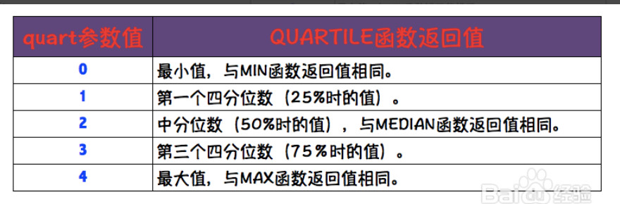

# 一、函数

## 1、清洗处理类

**trim(修剪、整理)**: =trim(单元格)

清除掉字符串两边的空格. MySQL有同名函数, Python有近似函数strip.     

concatenate/concat:=Concatenate(单元格1, 单元格2……)

合并单元格中的内容, 还有另一种合并方式是& . "我"&"很"&"帅" =我很帅. concatenate合并效率更快. 

MySQL有近似函数concat. 

Left／Right／Mid=Mid(指定字符串, 开始位置, 截取长度)

Find=Find(要查找字符, 指定字符串, 第几个字符)

## 2、关联匹配类

Lookup=Lookup(查找的值, 值所在的位置, 返回相应位置的值)或者=(查找的值, 要查找的范围和返回的范围)用英文半角下:连接. 

Vlookup=Vlookup(查找的值, 哪里找, 找哪个位置的值, 是否精准匹配)  false或0, 表示精确匹配; true或1, 表示近似匹配, 即若无准确值返回小于查找值的最大值. 

row=row(单元格)返回单元格所在的行数. 

## 3、逻辑运算类

布尔类型: 布尔类型对象可以被赋予文字值true或者false, 所对应的关系就是真与假的概念. 

布尔类型只有两个值, false 和 true, 通常用来判断条件是否成立. 如果变量值为 0 就是 false, 否则为 true,布尔变量只有这两个值. 

```
IF:= IF(logical_test,value_if_true,value_if_false)  if(and())用来表示多条件同时满足. 
```

## 4、计算统计类

Rank: 排序, 返回指定值在引用区域的排名, 重复值同一排名. SQL中有近似函数row_number() . 

Rand／Randbetween: 常用随机抽样, 前者返回0~1之间的随机值, 后者可以指定范围. MySQL中有同名函数. 

=rand(), 返回0~1之间的随机值; =randbetween(下限值, 上限值), 返回之间的任意整数. 

Quartile=Quartile(指定区域, 分位参数)计算四分位数



Stdev: 求标准差, 统计型函数. STDEV 基于样本估算标准偏差. 标准偏差反映数值相对于平均值(mean) 的离散程度. 

Substotal=Substotal(引用区域, 参数) 分类汇总型函数, 将平均值、计数、最大最小、相乘、标准差、求和、方差等参数化. 

1. AVERAGE 平均值
2. COUNT 计算包含数字的单元格数
3. COUNTA 计算非空白的单元格数
4. MAX 计算最大值
5. MIN 计算最小值
6. PRODUCT 计算所有参数的乘积
7. STDEV 估算基于给定样本的标准偏差
8. STDEVP 估算基于给定样本总体的标准偏差
9. SUM 求和
 Int／Round: 取整函数, int向下取整, round按小数位取数. 
round(3.1415,2) =3.14 ;
round(3.1415,1)=3.1

## 5、时间序列类

Weekday=Weekday(指定时间, 参数), 返回指定时间为一周中的第几天, 参数为1代表从星期日开始算作第一天, 参数为2代表从星期一开始算作第一天(中西方差异). 我们中国用2为参数即可. MySQL中有同名函数. 

Weeknum=Weeknum(指定时间, 参数), 返回一年中的第几个星期, 后面的参数类同weekday, 意思是从周日算还是周一. MySQL中有近似函数 week. 

Date=Date(年, 月, 日), 时间转换函数, 等于将year(), month(), day()合并. MySQL中有近似函数 date\_format. 

Datedif=Datedif(开始日期, 结束日期, 参数), 日期计算函数, 计算两日期的差. 参数决定返回的是年还是月等. MySQL中有近似函数 DateDiff. 