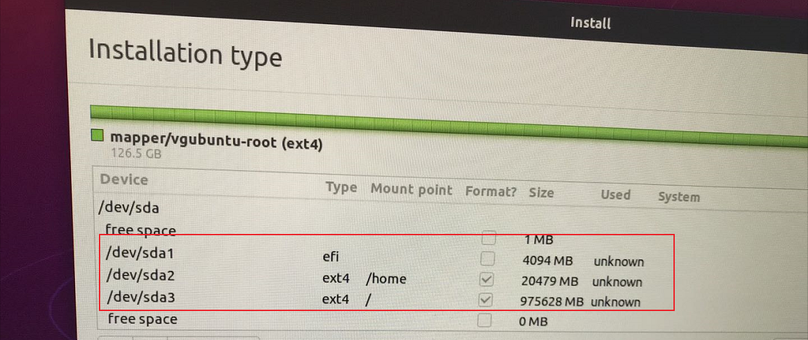
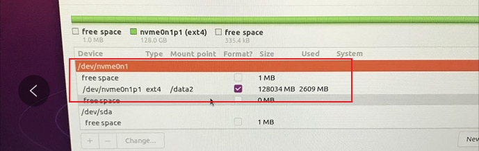
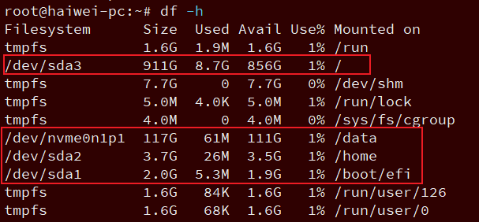

<!-- @import "[TOC]" {cmd="toc" depthFrom=1 depthTo=6 orderedList=false} -->

<!-- code_chunk_output -->

- [分区方案](#分区方案)
- [虚拟机](#虚拟机)
- [grub修改](#grub修改)
- [网络代理](#网络代理)
- [重要配置](#重要配置)

<!-- /code_chunk_output -->

# 分区方案

https://www.jianshu.com/p/fe4e3915495e

建议: 先创建 **EFI 系统分区**, 再创建 `/` 根分区, 最后是 `/home` 或其他分区, 这样**后续缩小分区**时候, 不会影响启动

分区方案:

1. 新建EFI系统分区，选中“逻辑分区(或主分区)”和“空间起始位置”，给512MB。重点！分配完之后去上边的列表里找一下，刚刚这个分区的盘符一会儿会用到哦

> 我分配了 2G, /dev/sda1, 作用类似于 /boot 分区

2. swap交换空间，这个也就是虚拟内存的地方，选择“逻辑分区”和“空间起始位置”。其大小最好和你的物理内存相等。

> 我没分配

3. 挂载“/”，类型为“EXT4日志文件系统”，选中“主分区”和“空间起始位置”。这个空间可以理解成共用空间，尽量大一些，因为有些软件是无法更改他的安装位置到自己的个人目录下的，只能放在这个空间里边。

> 其余空间全给了它

4. 挂载“/home”，类型为“EXT4日志文件系统”，选中“逻辑分区”和“空间起始位置”，这个相当于你的个人文件夹，类似Windows里的User，建议最好能分配稍微大点，因为你的图片、视频、下载内容、有些自定义的软件安装路径基本都在这里面，这些东西可不像在Win上面你想移动就能移动的。

> 我分配了 4G

5. nvme 盘我格式化为 ext4, 并挂在了 /data/ 下

> 主要是因为从固态盘启动有问题, 所以还是用了机械盘启动, nvme 当数据盘

6. 不要boot分区了

> /boot ：启动分区，系统的启动文件，大小一般分200M

> efi逻辑分区作用相当于/boot分区

如果经常重装系统, 也可以单独建立 boot 挂载点

7. 安装引导启动器的设备, 一定要选择刚才 EFI 分区的盘符

> 这里是 /dev/sda1

最终配置如下:








如果很少使用 root 用户, 那么建议 `/` 分区最少 `20G`, 以便后续重装系统或其他使用

很多坑见: https://zhuanlan.zhihu.com/p/90746103

# 虚拟机

系统盘 和 数据盘 一定要分开

系统盘 20G 即可

数据盘 50G 起步

# grub修改

修改 `/etc/default/grub`

```
GRUB_DEFAULT="0> 4"
GRUB_TIMEOUT_STYLE=menu
GRUB_TIMEOUT=10
GRUB_DISTRIBUTOR=`lsb_release -i -s 2> /dev/null || echo Debian`
GRUB_CMDLINE_LINUX_DEFAULT="quiet splash"
GRUB_CMDLINE_LINUX=""
```

然后更新 grub

```
update-grub
```


# 网络代理

https://blog.csdn.net/kan2016/article/details/90411137

其实在终端配置代理就可行了, 即通过 export 能解决大多数


# 重要配置

* `~/.bashrc`
* `~/.gitconfig`
* `~/XXrc`, 自定义代理配置

>export http_proxy=http://XXX.com:port
>export https_proxy=$http_proxy
>export ftp_proxy=
>export socks_proxy='http://XXX.com:port'
>export no_proxy='XXX.com,.XXX.com,localhost,127.0.0.1,10.0.0.0/8,192.168.0.0/16,172.16.0.0/12'

* `~/.ssh/config`, 
* `~/.tmux.conf` 和 `~/.tmux/*`
* `~/.cargo/config` 