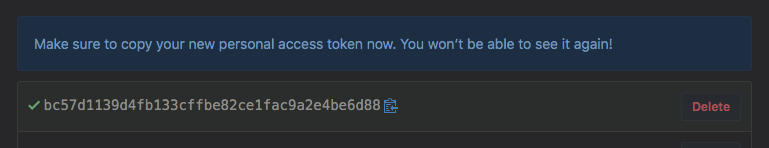

<!-- @import "[TOC]" {cmd="toc" depthFrom=1 depthTo=6 orderedList=false} -->

<!-- code_chunk_output -->

- [ 1 下载插件
](#1-下载插件)
- [ 2 配置
](#2-配置)
  - [ 2.1 基本设置
](#21-基本设置)
    - [ 2.1.1 修改语言
](#211-修改语言)
    - [ 2.1.2 修改字体
](#212-修改字体)
    - [ 2.1.3 颜色主题
](#213-颜色主题)
    - [ 2.1.4 文件图标主题
](#214-文件图标主题)
  - [ 2.2 万能入口
](#22-万能入口)
  - [ 2.3 自动保存
](#23-自动保存)
  - [ 2.4 自动换行
](#24-自动换行)
  - [ 2.5 更新设置
](#25-更新设置)
- [ 3 Markdown相关
](#3-markdown相关)
  - [ 3.1 原生自带
](#31-原生自带)
    - [ 3.1.1 配置
](#311-配置)
  - [ 3.2 Markdown Preview Enhanced插件(推荐)
](#32-markdown-preview-enhanced插件推荐)
    - [ 3.2.1 配置
](#321-配置)
- [ 4 Auto\-Git
](#4-auto-git)
- [ 5 Settings Sync
](#5-settings-sync)
  - [ 5.1 设置(新建)token
](#51-设置新建token)
  - [ 5.2 设置Gist ID
](#52-设置gist-id)
  - [ 5.3 设置
](#53-设置)
    - [ 5.3.1 Gist Settings
](#531-gist-settings)
    - [ 5.3.2 Global Settings
](#532-global-settings)
  - [ 5.4 上传配置
](#54-上传配置)
  - [ 5.5 同步下载配置
](#55-同步下载配置)
- [ 6 Paste Image
](#6-paste-image)
- [ 7 VS Code调试
](#7-vs-code调试)
  - [ 7.1 C/C\+\+调试
](#71-cc调试)
- [ 8 SFTP
](#8-sftp)
- [  最终的配置
](#最终的配置)
- [ 参考
](#参考)

<!-- /code_chunk_output -->

# 1 下载插件

- Bracket Pair Colorizer: 彩虹花括号
- Chinese (Simplified) Language Pack for Visual Studio Code: VS Code 提供本地化界面。
- Code Runner：右键即可编译运行单文件
- C/C\+\+: 工具
- C/C++ Clang Command Adapter：提供静态检测（Lint）
- Include Autocomplete：提供头文件名字的补全
- Markdown Preview Enhanced: markdown预览增强, https://shd101wyy.github.io/markdown-preview-enhanced/#/zh-cn/customize-css
- One Dark Pro：大概是VS Code安装量最高的主题
- Markdown Shortcuts: 提供MD编写快捷操作
- vscode\-icons: 图标
- Settings Sync: 使用GitHub Gist在多个机器同步VS Code的所有设置、主题、文件图标、按键映射、工作区和扩展程序等
- indent-rainbow: 用不同颜色交替着色文本前面的缩进
- Paste Image: 直接从剪切板复制图片
- Auto\-Git: 自动和远端库同步
- SFTP: 上传下载文件到服务器
- YAML: redhat提供对YAML语言的支持

不建议/不需要装的扩展：

- GBKtoUTF8：把GBK编码的文档转换成UTF8编码的。此扩展可能有严重的bug。
- C\+\+ Intellisense：用的是gtags，本文第一个版本的选择。效果非常非常一般。

重启VS Code

# 2 配置

使用Settings Sync就能实现部分设置同步, 所以先直接参见[5 Settings Sync](#5-settings-sync). 然后再确认其他设置.

快捷键获取见Tips

## 2.1 基本设置

### 2.1.1 修改语言

按F1快捷键或者Comm + Shift + P，切入到命令行模式。输入“Configure Language”（如果是中文版要切换到英文版输入“配置语言”）。

英文："en"

中文简体：“zh-CN”

### 2.1.2 修改字体

设置中: SauceCodePro Nerd Font Mono

### 2.1.3 颜色主题


选择"One Dark Pro"

### 2.1.4 文件图标主题


选择"vscode-icons"

## 2.2 万能入口

通过Com + shift + P可调出主命令框, 几乎所有功能可从这里获得

## 2.3 自动保存

文件 → 自动保存

也可以通过setting自定义自动保存选项

## 2.4 自动换行

设置

```
"editor.wordWrap": "on"
```

## 2.5 更新设置

左下角 → "设置" → "用户设置" → "应用程序" → "更新"


# 3 Markdown相关

截止这一步, 会有两个markdown预览功能, 也就对应两个配置, 推荐使用MPE.

## 3.1 原生自带

Visual Studio Code原生就支持Markdown语法和预览, 原生的预览可以通过右上角的图标"打开侧边预览"就能进入, 或者快捷键Com+K, 全部松开, 再按V即可


### 3.1.1 配置

打开配置文件, 

## 3.2 Markdown Preview Enhanced插件(推荐)

功能丰富, 极其强大, 推荐使用. 具体使用见 https://shd101wyy.github.io/markdown-preview-enhanced/#/.

安装了Markdown Preview Enhanced插件也会另外有个预览, 通过右上角的图标"Markdown Preview Enhanced"能进入, 或通过全局命令栏也能进入


### 3.2.1 配置

https://shd101wyy.github.io/markdown-preview-enhanced/#/.

先在键盘映射中删除原生的预览快捷键, 防止按键冲突. 然后修改默认按键, 改为Com+K, Com+V. 其余配置使用上面原生的配置.

打开"首选项" "设置" "Markdown Preview Enhanced"

将"Image Uploader"设为"sm.ms", 将"Image Folder Path"设为"./images"


但是目前复制图片不支持VS Code, 见官方文档.

MPE的设置如下

自定义CSS, CMD-Shift-P, 然后运行 `Markdown Preview Enhanced: Customize Css`, style.less会被打开, 可以编写样式:

>style.less文件位于\~/.mume/style.less

```
.markdown-preview.markdown-preview {
  // modify your style here
  background-color: rgb(217, 220, 224); 
  font-family: 'SauceCodePro Nerd Font Mono', 'Consolas', 'Courier New'; 
  //font-family: 'Courier New', Courier, monospace
  font-size: 14px;
  //color: darkslategray;
  h1, h2, h3, h4, h5, h6, pre, code {
    font-family: 'SauceCodePro Nerd Font Mono', 'Consolas', 'Courier New'; 
  }
}

.md-sidebar-toc.md-sidebar-toc {
  // 边栏目录样式
  font-family: 'SauceCodePro Nerd Font Mono', 'Consolas', 'Courier New'; 
}
```

注: 它的很多功能, 比如TOC功能必须打开preview窗口才可以

# 4 Auto\-Git

用于自动同步笔记, 注意, 这个不要用于其他项目, 这也是为什么我没有列在上面

https://marketplace.visualstudio.com/items?itemName=zeitnergmbh.auto-git

安装以后先禁用, 后面配置完成后再启用

使用git credential.helper来记录远程git的username和password

```
git config --global credential.helper osxkeychain
git config credential.helper osxkeychain
```

在当前的repo下面会有个目录, \.autogit, 可自定义配置, 目前, 已经将该repo的配置上传

建议将笔记repo单独放在一个工作区, 这样, 可以在启用该插件时候选择"启用(工作区)", 从而不会影响其他的工作区了

配置完成后, 需要通过Com + shift + P可调出主命令框, 搜索AutoGit, 然后restart生效

# 5 Settings Sync

主页: https://marketplace.visualstudio.com/itemdetails?itemName=Shan.code-settings-sync

安装完要重启VS Code

主要操作可以参考主页

提供了通过 github 的 Gist 完成配置同步的功能。但是由于它的教程不完整，导致同步起来会产生省问题。最常见的问题是无法下载配置，提示信息为：

```
Sync : Invalid / Expired GitHub Token. Please generate new token with scopes mentioned in readme. Exception Logged in Console.
```

Gist 可以保存上传的配置文件。拉取配置文件需要配置两个 id，一个是 Gist Id，一个是 Token Id。这两个 Id 前者标识配置文件，后者用于身份验证。我们无法下载的原因就是我们使用单单在 Sync:Download Settings 命令中使用了 Gist id，所以错误提示才是无效的 token。

所以关键点就是两个:

- 进行身份验证, 设置(新建)token
- 设置gist id

## 5.1 设置(新建)token

还是在 VSCode 中输入命令：Sync:Advanced Options，然后选择 Sync:Edit Extension Local Settings，编辑 syncLocalSettings.json 这个配置文件。这个文件中有一项 token 没有设置（或者是配置的就是以前的过期的token），这里就需要设置为 Token Id。你可以用之前上传配置文件时设置的 Token，也可以再新建一个 Token。创建步骤如下：

打开github,  Settings / Developer settings / Personal access tokens / Generate New Token

选择"gist"





>注意：这里重新生成之后，有关此gist id引用到的地方的token也需要同步更新，否则没办法使用。

## 5.2 设置Gist ID

gist ID也可以从gist.github.com获得, 如图:


## 5.3 设置

有两种类型的自定义设置.

### 5.3.1 Gist Settings

通过命令行的设置影响的就是这里

存在于VS Code的设置里面($HOME/Library/Application Support/Code/User/settings.json), 通过"CMD+Shift+P", 输入"setting", 打开"首选项: 打开设置(json)"即可打开

```
"sync.gist": "c6092de85c1b5fbdc834800397f1c4aa",
"sync.autoDownload": false,
"sync.autoUpload": false,
"sync.forceDownload": false,
"sync.quietSync": false,
"sync.askGistName": false,
"sync.removeExtensions": true,
"sync.syncExtensions": true
```

### 5.3.2 Global Settings

$HOME/Library/Application Support/Code/User/syncLocalSettings.json, 通过"CMD+Shift+P", 输入"sync", 打开"Sync: 高级选项"即可打开

```
{
    "ignoreUploadFiles": [
        "state.vscdb",
        "state.vscdb.backup",
        "syncLocalSettings.json",
        ".DS_Store",
        "sync.lock",
        "projects.json",
        "projects_cache_vscode.json",
        "projects_cache_git.json",
        "projects_cache_svn.json",
        "gpm_projects.json",
        "gpm-recentItems.json"
    ],
    "ignoreUploadFolders": [
        "workspaceStorage"
    ],
    "ignoreExtensions": [],
    "gistDescription": "Visual Studio Code Settings Sync Gist",
    "version": 328,
    "token": "ec22232ce57cef42c6c00ba18029e88b6e4e9301",
    "downloadPublicGist": false,
    "supportedFileExtensions": [
        "json",
        "code-snippets"
    ],
    "openTokenLink": true,
    "disableUpdateMessage": false,
    "lastUpload": "2019-04-09T02:57:55.349Z",
    "lastDownload": null,
    "githubEnterpriseUrl": null,
    "askGistName": false,
    "customFiles": {},
    "hostName": null
}
```

## 5.4 上传配置

在VS Code中, 通过"CMD+Shift+P", 输入"sync", 打开"Sync: 上传配置", 输入上面获得的token, 回车

打开设置, 就可以看到自己的token和git ID. 分别在上面的两个设置文件中.

gist ID很关键, 用于在其他电脑同步下载, 所以不能忘记

## 5.5 同步下载配置

在VS Code中, 通过"CMD+Shift+P", 输入"sync", 打开"Sync: 下载设置", 生成你的token, 输入token, 回车

输入上面的gist ID, 回车

 ## 5.6 重置设置

 在VS Code中, 通过"CMD+Shift+P", 输入"sync", 打开"Sync: 重置设置"

# 6 Paste Image

因为markdown preview enhanced的不给力, 所以需要这个

官方文档: https://marketplace.visualstudio.com/itemdetails?itemName=mushan.vscode-paste-image

打开"首选项" "设置"

```
    "pasteImage.path": "${currentFileDir}/images/",
    "pasteImage.forceUnixStyleSeparator": true,
    "pasteImage.prefix": "./",
    "pasteImage.insertPattern": "![${imageFileName}](${imageFilePath}${imageSyntaxSuffix}",
```

# 7 VS Code调试

官方: https://code.visualstudio.com/docs/editor/debugging

## 7.1 C/C\+\+调试

链接: https://github.com/Microsoft/vscode-cpptools/blob/master/launch.md

# 8 SFTP

配置

```
{
    "name": "10.121.2.124",
    "host": "10.121.2.124",
    "protocol": "sftp",
    "port": 22,
    "username": "root",
    "password": "Platform@123",
    "remotePath": "/home/gerry/AutoStack",
    "uploadOnSave": true,
    "ignore": [
        "**/.vscode/**",
        "**/.idea/**",
        "**/.git/**",
        "**/.DS_Store",
        "**/.git",
        "**/.vscode",
        "**/.gitignore"
    ]
}
```


#  最终的配置

打开"首选项" "设置"

```dict
{
    "editor.fontFamily": "SauceCodePro Nerd Font Mono, -apple-system",
    "editor.fontSize": 14,
    "editor.wordWrap": "on",
    "breadcrumbs.enabled": true,
    "extensions.autoUpdate": false,
    "telemetry.enableTelemetry": false,
    "telemetry.enableCrashReporter": false,
    "html.autoClosingTags": false,
    "markdown.preview.fontFamily": "SauceCodePro Nerd Font Mono, BlinkMacSystemFont, 'Segoe WPC', 'Segoe UI', 'Ubuntu', 'Droid Sans', sans-serif",
    "files.autoSave": "afterDelay",
    "workbench.activityBar.visible": true,
    "workbench.statusBar.visible": true,
    "workbench.colorTheme": "One Dark Pro",
    "sync.gist": "c6092de85c1b5fbdc834800397f1c4aa",
    "sync.autoDownload": false,
    "sync.autoUpload": false,
    "sync.forceDownload": false,
    "sync.quietSync": false,
    "sync.askGistName": false,
    "sync.removeExtensions": true,
    "sync.syncExtensions": true,
    "markdown-preview-enhanced.imageFolderPath": "./images",
    "markdown-preview-enhanced.imageUploader": "sm.ms",
    "markdown-preview-enhanced.automaticallyShowPreviewOfMarkdownBeingEdited": true,
    "pasteImage.path": "${currentFileDir}/images/",
    "pasteImage.forceUnixStyleSeparator": true,
    "pasteImage.prefix": "./",
    "pasteImage.insertPattern": "![${imageFileName}](${imageFilePath}${imageSyntaxSuffix}",
    "window.zoomLevel": 0,
    "update.enableWindowsBackgroundUpdates": false,
    "update.showReleaseNotes": false,
    "update.mode": "manual",
    "workbench.startupEditor": "welcomePage",
    "workbench.iconTheme": "vscode-icons"
}
```

# 参考

- Visual Studio Code 如何编写运行 C、C++ 程序？: https://www.zhihu.com/question/30315894