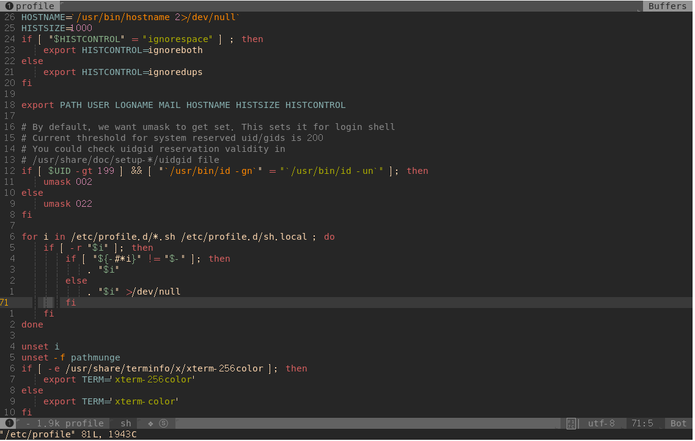
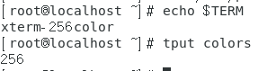
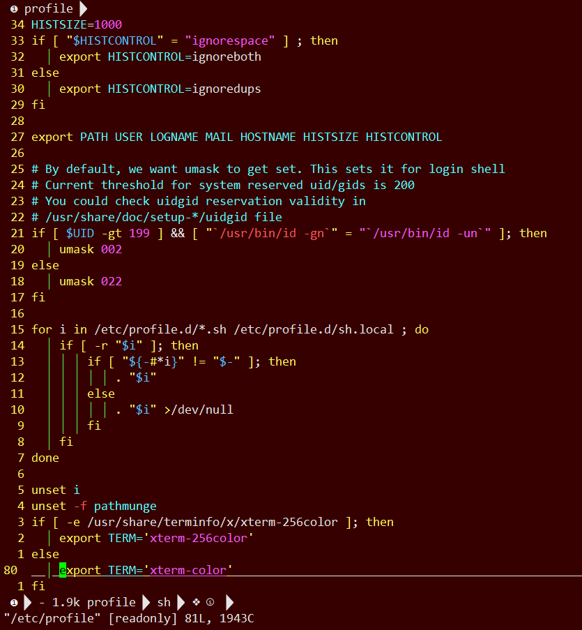
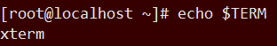

在正常的Linux中, spacevim是能正常显示的, 如图



所使用的终端类型和配色是



但是在xshell中, 不能正常显示, 如下



所使用的终端是



xshell默认的配色是8位的，土黑色，很不好看，我们可以用命令tput colors查看: 

```
[root@localhost ~]# tput colors
8
```

第一步, 修改/etc/profile 文件或者\~/.bashrc文件，再最后面添加如下代码: 

```c
if [ -e /usr/share/terminfo/x/xterm-256color ]; then
    export TERM='xterm-256color'
else
    export TERM='xterm-color'
fi
```

然后执行: 

source /etc/profile

或者

source \~/.bashrc

让修改生效. 

第二步, 修改vim配置文件，让vim支持256位颜色. 

打开\~/.vim/vimrc文件，添加:

```
set t_Co=256
```

好了，执行tput colors看一下吧，如果输出256，表示配置生效，可以尽情的使用vim下的配色方案了. 