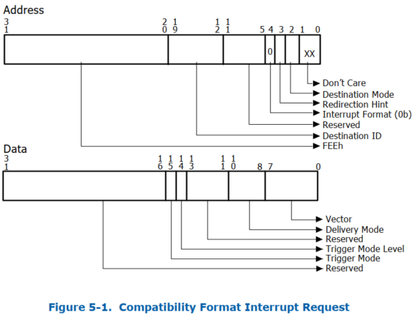
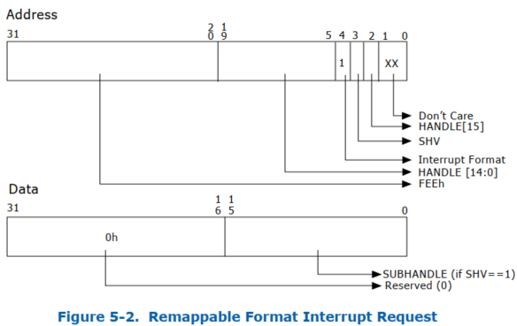

中断重映射架构使系统软件能够控制和审查所有来源产生的外部中断请求, 包括来自中断控制器 (I/OxAPIC),MSI/MSI-X 功能设备 (包括端点, 根端口和根复合体集成端点) 的中断请求.

重映射硬件​​本身产生的中断 (故障事件, 无效完成事件和页面请求事件) 不受中断重映射的影响.

中断请求对根复合体来说, 是上游 DWORD 大小的内存写入请求, 写入中断地址范围 FEEx_xxxxh. 由于中断请求以写入请求的形式到达根复合体, 因此中断重映射与重映射硬件​​单元位于同一位置. 中断重映射功能通过扩展功能寄存器报告.

# 识别中断请求的来源

为了支持域隔离使用, 平台硬件必须能够唯一地标识每个中断消息的请求者 (Source-Id). 平台中的中断源和这些请求中 source-id 的使用可分为以下几类:

* 来自 PCI Express 设备的消息信号中断

对于来自 PCI Express 设备的消息信号中断请求, source-id 是 PCI Express 事务头中的请求者标识符. 设备的 requester-id 由配置软件分配的 PCI 总线 / 设备 / 功能编号组成, 并唯一地标识发起 I/O 请求的硬件功能. 第 3.4.1 节说明了 PCI Express 规范定义的 requester-id. 第 3.12.5 节描述了使用幻像功能的 PCI Express 设备对 source-id 字段的使用.

* 来自 RC 集成设备的消息信号中断

对于来自 RC 集成 PCI 或 PCI Express 设备的消息信号中断请求, 源 ID 是其 PCI 请求者 ID.

* 来自 PCI Express 到 PCI/PCI-X Bridge 后面的设备的消息信号中断

对于来自 PCI Express 到 PCI/PCI-X Bridge 后面的设备的消息信号中断请求, 这些中断请求中的请求者标识符可能是中断设备的标识符或请求者 ID, 其总线号字段等于 Bridge 辅助接口的总线号, 设备和功能号字段值为零. 第 3.12.1 节描述了这些 Bridge 的传统行为. 由于这种别名, 中断重新映射硬件不会隔离来自此类 Bridge 后面的各个设备的中断.

* 来自传统 PCI Bridge 后面的设备的消息信号中断

对于来自传统 PCI Bridge 后面的设备的消息信号中断请求, 这些中断请求中的源 ID 是传统 Bridge 的请求者 ID. 第 3.12.2 节描述了这些 Bridge 的传统行为. 因此, 中断重新映射硬件不会隔离来自此类 Bridge 后面的各个设备的消息信号中断请求.

* 传统引脚中断

对于使用传统方法进行中断路由的设备(例如通过直接连接到 I/OxAPIC 输入引脚, 或通过 INTx 消息),I/OxAPIC 硬件会生成中断请求事务. 为了识别由
I/OxAPIC 生成的中断请求的来源, 中断重新映射硬件要求平台中的每个 I/OxAPIC(通过 ACPI 多 APIC 描述符表 (MADT) 枚举)在其请求中包含一个唯一的 16 位源 ID. BIOS 通过 ACPI
结构向系统软件报告这些 I/OxAPIC 的源 ID. 有关 I/OxAPIC 身份报告的更多详细信息, 请参阅第 8.3.1.1 节.

* 其他消息信号中断

对于任何其他无法通过 PCI 发现但能够生成消息信号中断请求的平台设备(例如集成的高精度事件计时器 - HPET 设备), 平台必须分配唯一的源 ID, 且该源 ID 不会与平台上的任何其他源 ID 冲突. BIOS 必须通过第 8.3.1.2 节中描述的 ACPI 结构报告这些设备的 16 位源 ID.

# 中断请求格式

Intel 64 平台上的中断重映射支持两种中断请求格式.

## 兼容格式

> Compatibility Format

图 5-1 说明了兼容格式的中断请求. 在兼容格式请求中, 中断格式字段 (Address Bit 4) 为清除. 有关兼容格式中断请求中其他字段的详细信息, 参阅 SDM. 没有中断重映射功能的平台仅支持兼容格式中断.

## 重映射格式

> Remapping Format

图 5-2 说明了可重映射中断请求格式. 中断格式字段 (Address Bit 4) 设置为可重映射格式的中断请求. 可重映射中断请求仅适用于支持中断重映射的平台.

**Address** 字段:

* `Bit 31:20`, 中断标识符. DWORD DMA 写入值为 FEEh 的请求被 Root-Complex 解码为中断请求。

* `Bit 19:5`, `Handle[14:0]`. 该字段与 bit 2 一起提供 16 位句柄。中断重映射硬件​​使用该句柄来识别中断请求。16 位的 Handle 为每个中断重映射硬件​​单元提供 64K 个唯一中断请求。

* `Bit 4`, Interrupt Format. 用来标志这个 Request 是 `Compatibility format` (`bit 4=0`) 还是 `Remapping format` (`bit 4=1`).

* `Bit 3`, SubHandle Valid (SHV). 此字段指定中断请求有效负载（数据）是否包含有效的 Subhandle。使用 Subhandle 可实现仅支持单个地址和多个数据值的 MSI 构造。

* `Bit 2`, `Handle[15]`. 该字段承载着 16 位 Handle 的最高有效位。

* `Bit 1:0`, 忽略.

**Data** 字段:

* `Bit 31:16`, 当中断请求地址中的 SHV == 1 时，该字段被硬件视为保留 (0); 当中断请求地址中的 SHV == 0 时，该字段被硬件忽略。

* `Bit 15:0`, Subhandle. 当中断请求地址中的 SHV == 1 时，该字段包含 16 位的 Subhandle; 当中断请求地址中的 SHV == 0 时，该字段被硬件忽略。

## 中断重映射表

中断重映射硬件​​使用驻留在内存中的一级表，称为中断重映射表。中断重映射表预计由系统软件设置，其基地址和大小通过中断重映射表地址寄存器指定。表中的每个条目大小为 128 位，称为中断重映射表条目 (IRTE)。第 9.9 节说明了 IRTE 格式。

对于可重映射格式的中断请求，中断重映射硬件​​计算“interrupt_index”，如下所示。根据可重映射中断格式，Handle、SHV 和 Subhandle 分别是来自中断地址和数据的字段。

