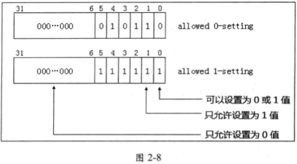

在表 2-2 里列举的**两组寄存器**（在 `IA32_VMX_BASIC[55] = 1` 时使用 **TRUE 寄存器**, 否则使用非 TRUE 寄存器），共 **8 个寄存器**，它们的**结构**和**使用方法**是**一致**的，结构如图 2-7 所示。


这些 64 位的寄存器**低 32 位**是 `allowed 0-setting`(**允许设置为 0**)位值，**高 32 位**是  `allowed 1-setting`（**允许设置为 1**) 位值。这**两组 32 位值**对应**一个 VMCS 区域**的 `control field`(**控制字段**)值，这些控制字段是 **32 位值**，用法如下所示。

* `bits 31:0` 的用法：只有当其中的位为 **0** 值时，**对应**的**控制字段相应的位**才允许为 **0** 值(并**不意味**着对应的位**必须为0**, 但是如果**其中位为1**, 则一定表明**不能为0, 只能为1**)。

> 为0, 可为0; 为1, 只能为1(并不意味着这个功能肯定可用, 取决于 bits 63:32)

* `bits 63:32` 的用法：只有当其中的位为 **1** 值时，对应的控制字段相应的位才**允许为 1 值**(并**不意味**着对应的位**必须为1**, 但是如果**其中位为0**, 则一定表明**不能为1, 只能为0**)。

> 为1, 可为1(功能可用); 为0, 只能为0

> 最终形成的控制字段是 32 位.

举个例子说明，在图 2-5 的运行结果里显示，`IA32_VMX_TRUE_PINBASED_CTLS` 的**低 32 位值**为 `00000016h`, **高 32 位**为 `0000003Fh`。它对应控制 `Pin-based control` 字段，那么表明：

(1) `00000016h`, `Pin-based control` 字段除了 `bit 1`、`bit 2` 以及 `bit 4`(值为 **16h**)**不能为 0 值**外(**因为位为1**)，其他位都可以设置为 0 值。

(2) `0000003Fh`, `Pin-based control` 字段**只**允许 `bit 0` 到 `bit 5` 位可以设置 **1** 值，**其余位必须为 0 值**(**因为位为0**)。

那么，形成 `Pin-based control` 字段的**设置要求**如图 2-8 所示



从上面的 `allowed 0-setting` 与 `allowed 1-setting` 的设置来看，`bit 0` **既可以为 0 值**，**也可以为 1 值**。而 `bit 1` **只允许为 1 值**。那么代表着 Pin-based control 字段的合法设置如下。

(1) `bit 0`、`bit 3` 以及 `bit 5` **可以设为 0 或 1 值**。

(2) `bit 1`、`bit 2` 以及 `bit 4` **只能设为 1 值**。

(3) `bits 31:6` **只能设为 0 值**。

推广开来，`表 2-2` 中的 **8 个寄存器**，都使用**相同的设置原理**，不同的是设置的目标字段不一样。我们看到对于一个控制字段的设置："某些位必须为 1, 某些位必须为 0"(它们属于**保留位**)。

> 注意：这些**必须为 0 值**的**保留位**被称为 “**default0**” 位，必须为 1 值的保留位被称为 "**default1**" 位。这与通常接触到的数据结构中的“保留位必须为 0 值”有些区别（例知 PTE 中的保留位）。

当**控制字段**的保留位**不符合**这些 **default0** 和 **default1** 值，**在 VM entry 操作时**，字段的检查会失败，从而导致 VM entry 失败。

# 决定 VMX 支持的功能

前面所述，控制字段中**必须为 0** 及**必须为 1** 值的位都是**保留位**。当一个位**可以设置为 1 值**时，表明处理器将**支持该项功能**，也就是**非保留位**指示支持该位对应的功能.

以 `Pin-based VM execution control` 字段为例，它的 `bit 6` 是“`activate VMX-preemption timer`” 功能，只有 `bit 6` **允许设置为 1 值**时，才代表处理器支持 `Vmx-preemption timer` 功能。在图 2-8 中，我们看到，bit 6 **只能设置为 0 值**。因此，这个处理器并**不支持这项功能**。

又如，该字段的 `bit 0` 为“external-interrupt exiting”功能位，而该位**可以设置为 0 或 1 值**，因而表明处理器支持该项功能。

# 控制字段设置算法

根据前面所述的 VMX 能力寄存器 `allowed 0-setting` 与 `allowed 1-setting` 位，对 **VMCS 区城**中相应的控制字段设置，可以分两步进行。

* 首先**根据自身的设计需求设置相应位**，这是一个**初始值**。
* 然后使用 `allowed 0-setting` 与 `allowed 1-setting` 位**合成最终值**。合成最终值的算法如下。

(1) Result1 = 初始值 "**OR**" `allowed 0-setting` 值

(2) Result2 = Result1 "**AND**" `allowed 1-setting` 值

这个 Result2 就是最终值，这个值确保**满足**在 `VM-entry` 时处理器对该控制字段的检查。下面的代码片段是对 Pin-based VM-execution control 字段的设置。

```x86asm
        ;;
        ;; 设置 Pin-based 控制域:
        ;; 1) [0]  - external-interrupt exiting: Yes
        ;; 2) [3]  - NMI exiting: Yes
        ;; 3) [5]  - Virtual NMIs: No
        ;; 4) [6]  - Activate VMX preemption timer: Yes
        ;; 5) [7]  - process posted interrupts: No
        ;;
        ;; 注意：
        ;; 1) 如果 VMB.VmxTimerValue = 0 时，不使用 VMX-preemption timer
        ;;
        
        mov ebx, EXTERNAL_INTERRUPT_EXITING | NMI_EXITING
        mov eax, EXTERNAL_INTERRUPT_EXITING | NMI_EXITING | ACTIVATE_VMX_PREEMPTION_TIMER        
        
        cmp DWORD [esi + VMB.VmxTimerValue], 0
        cmove eax, ebx
        
        ;;
        ;; 注意，PCB.PinBasedCtls 的值在 stage1 阶段时已更新，它的值为：
        ;; 1) 当 IA32_VMX_BASIC[55] = 1 时，等于 IA32_VMX_TRUE_PINBASED_CTLS 寄存器
        ;; 2) 当 IA32_VMX_BASIC[55] = 0 时，等于 IA32_VMX_PINBASED_CTLS 寄存器
        ;; 
        
        ;;######################################################################################
        ;; PCB.PinBasedCtls 值说明：
        ;; 1) [31:0]  - allowed 0-setting 位
        ;;              当 bit 为 1 时，Pin-based VM-execution control 位为 0，则出错!
        ;;              当 bit 为 0 时，Pin-based VM-execution control 位可为 0 值。
        ;;     因此:    当 bit 为 1 时，Pin-based VM-execution control 必须为 1 值!!!    
        ;;              
        ;; 2) [63:32] - allowed 1-setting 位
        ;;              当 bit 为 0 时，Pin-based VM-execution control 位为 1，则出错！
        ;;              当 bit 为 1 时，Pin-based VM-execution control 位可为 1 值。
        ;;     因此:    当 bit 为 0 时，Pin-based VM-execution control 必须为 0 值!!!
        ;;
        ;; 3) 当 [31:0] 的位为 0，而 [63:32] 的相应位同时为 1 时，
        ;;    说明 Pin-based VM-execution control 位允许设置为 0 或 1 值
        ;;
        ;; 生成最终的 Pin-based VM-execution control 值说明：
        ;; 1) 当 eax 输入用户设置的值后，下面算法生成最终的值
        ;; 算法一：
        ;; 1) mask1 = (allowed 0-setting) AND (allowed 1-setting)：得出必须为 1 的 mask 值
        ;; 2) eax = (eax) OR (mask1)：置 1 值
        ;; 3) mask0 = (allowed 0-setting) OR (allowed 1-setting)：得出必须为 0 的 mask 值
        ;; 4) eax = (eax) AND (mask0)：清 0 值
        ;; 
        ;; 算法二：
        ;; 1) eax = (eax) OR (allowed 0-setting)
        ;; 2) eax = (eax) AND (allowed 1-setting)
        ;;
        ;; 算法二是算法一的简便实现，它们的结果是一样的！
        ;; 这是因为当前:
        ;;      1) allowed 0-setting = (allowed 0-setting) AND (allowed 1-setting)
        ;;      2) allowed 1-setting = (allowed 0-setting) OR (allowed 1-setting)
        ;;
        ;;######################################################################################
        
                       
        ;;
        ;; 使用算法二，生成最终的 Pin-based VM-execution control 值
        ;;
        or eax, [ebp + PCB.PinBasedCtls]                                ; OR  allowed 0-setting
        and eax, [ebp + PCB.PinBasedCtls + 4]                           ; AND allowed 1-setting

        ;;
        ;; 写入 Pin-based VM-execution control 值
        ;;        
        mov [ExecutionControlBufBase + EXECUTION_CONTROL.PinControl], eax
```

代码中对 `Pin-based Vm-execution control` 字段的初始值设为 **49H**(`01001001b`)，然后依据上面的算法合成最终值。这是必须进行的一步，否则在执行 `VM-entry` 操作时，将由于检查 `Pin-based VM-execution control` 字段 **default 位**不满足要求而失败。


疑问(以4bit为例):

* 低32: 0110
* 高32: 1001
