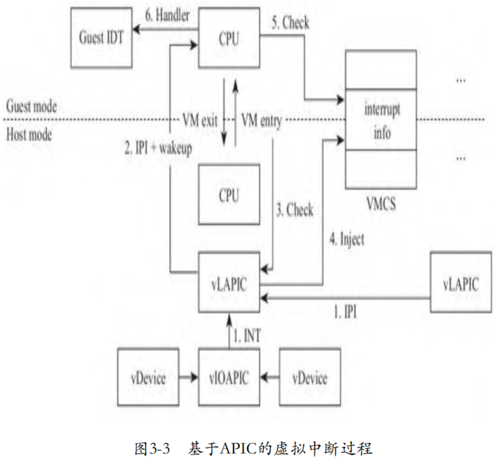
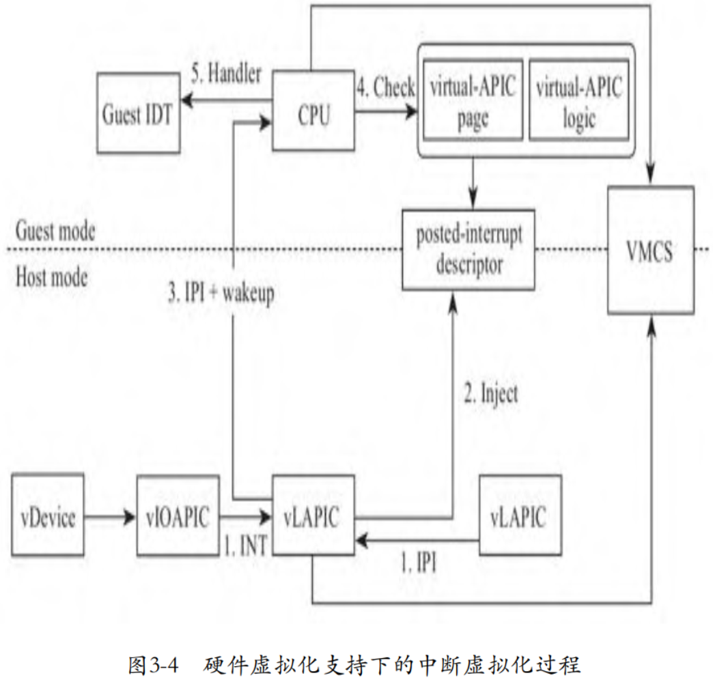

# 物理 CPU 处理中断

在探讨 Guest 模式的 CPU 处理中断前, 我们首先回顾一下**物理 CPU** 是如何**响应中断**的. 当**操作系统允许 CPU 响应中断**后, 每当**执行完一条指令**, **CPU** 都将检查**中断引脚是否有效**. 一旦有效, CPU 将**处理中断**, 然后再**执行下一条指令**, 如下图所示.

# 虚拟化

当有中断需要 CPU 处理时, **中断芯片**将**使连接 CPU 的 INTR 引脚有效**, 也就是说如果 INTR 是**高电平有效**, 那么**中断芯片拉高 INTR 引脚**的电平. **CPU** 在执行完一条指令后, 将**检查 INTR 引脚**.

类似的, **虚拟中断**也**效仿这种机制**, **使**与 CPU 的 INTR 引脚相连的“**引脚**”**有效**, 当然, 对于**软件虚拟**的**中断芯片**而言, “**引脚**”只是一个**变量**, 从**软件模拟**的角度就是**设置变量的值**了.

如果 **KVM** 发现**虚拟中断芯片**有**中断请求**, 则向 **VMCS** 中 `VM-entry control` 部分的 `VM-entry interruption-information field` 字段**写入中断信息**, 在**切入 Guest 模式**的一刻, **CPU** 将检查这个字段, 就**如同检查 CPU 管脚**, 如果有中断, 则进入**中断执行过程**.

## 单核使用 PIC

下图为**单核系统**使用 **PIC** 中断芯片下的虚拟中断过程.

具体步骤如下:

1) 虚拟设备向虚拟中断芯片 PIC 发送中断请求, 虚拟 PIC 记录虚拟设备的中断信息. 与物理的中断过程不同, 此时并不会触发虚拟 PIC 芯片的中断评估逻辑, 而是在 VM entry 时进行.

2) 如果虚拟 CPU 处于睡眠状态, 则唤醒虚拟 CPU, 即使虚拟 CPU 对应的线程进入了物理 CPU 的就绪任务队列.

3) 当虚拟 CPU 开始运行时, 在其切入 Guest 前一刻, **KVM** 模块将**检查虚拟 PIC 芯片**, 查看**是否有中断**需要处理. 此时, KVM 将触发虚拟 PIC 芯片的中断评估逻辑.

4) 一旦经过虚拟中断芯片计算得出有需要 Guest 处理的中断, 则将**中断信息**注入 **VMCS** 中的字段 `VM-entry interruption-information`.

5) 进入 **Guest** 模式**后**, **CPU** 检查 **VMCS** 中的**中断信息**.

6) 如果有中断需要处理, **CPU** 将调用 **Guest IDT** 中相应的**中断服务**处理中断.

## 多处理器使用 APIC

**PIC** 只能支持**单处理器系统**, 对于**多处理器系统**, 需要 **APIC** 支持. 对于虚拟化而言, 显然也需要**虚拟相应的 APIC**, 但是其本质上与 PIC 基本相同, 如下图所示.

与单处理器情况相比, 多处理器的虚拟中断主要有两点不同:

1) 在多处理器系统下, 不同 CPU 之间需要收发中断, 因此, 每个CPU需要分别关联一个独立的中断芯片, 这个中断芯片称为LAPIC. LAPIC不仅需要接收CPU之间的核间中断(Inter-Processor Interrupt, IPI), 还需要接收来自外设的中断. 外设的中断引脚不可能连接到每个LAPIC上, 因此, 有一个统一的 I/O APIC芯片负责连接外设, 如果一个I/O APIC引脚不够用, 系统中可以使用多个 I/O APIC. LAPIC和I/O APIC都接到总线上, 通过总线进行通信. 所以在虚拟化场景下, 需要虚拟LAPIC和I/O APIC两个组件.

2)在多处理器情况下, 仅仅是唤醒可能在睡眠的虚拟CPU线程还不够, 如果虚拟CPU是在另外一个物理CPU上运行于Guest模式, 此时还需要向其发送IPI, 使目的CPU从Guest模式退出到Host模式, 然后在下一次VM entry时, 进行中断注入.

Guest模式的CPU和虚拟中断芯片处于两个“世界”, 所以处于Guest模式的CPU不能检查虚拟中断芯片的引脚, 只能在VM entry时由KVM模块代为检查, 然后写入VMCS. 所以, 一旦有中断需要注入, 那么处于Guest模式的CPU一定需要通过VM exit退出到Host模式, 这是一个很大的开销.

为了去除VM exit的开销, Intel在硬件层面对中断虚拟化进行了支持. 典型的情况比如当Guest访问LAPIC的寄存器时, 将导致VM exit. 但是事实上, 某些访问过程并不需要VMM介入, 也就无须VM exit. 我们知道, 物理LAPIC设备上有一个页面大小的内存用于存储寄存器, 这个页面称为APIC page, 于是Intel实现了一个处于Guest模式的页面, 称为virtual-APIC page. 除此之外, Intel还在Guest模式下实现了部分中断芯片的逻辑, 比如中断评估, 我们将其称为虚拟中断逻辑. 如此, 在Guest模式下就有了状态和逻辑, 就可以模拟很多中断的行为, 比如访问中断寄存器、跟踪中断的状态以及向CPU递交中断等. 因此, 很多中断行为就无须VMM介入了, 从而大大地减少了VM exit的次数. 当然, 有些写中断寄存器的操作是具有副作用的, 比如通过写icr寄存器发送IPI, 此时仍然需要触发VM exit, 由本地 LAPIC 向目标LAPIC发送IPI.

在硬件虚拟化支持下, 当LAPIC收到中断时, 不必再等到下一次VM entry时被动执行中断评估, 而是主动向处于Guest模式的CPU告知信息, LAPIC首先将中断信息写入posted-interrupt descriptor. 然后, LAPIC通过一个特殊的核间中断posted-interrupt notification 通知目标CPU, 目标CPU在Guest模式下借助虚拟中断逻辑处理中断. 虚拟中断过程如下图所示.

