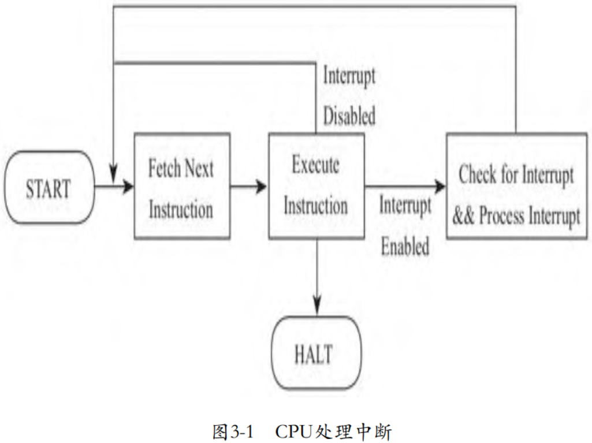
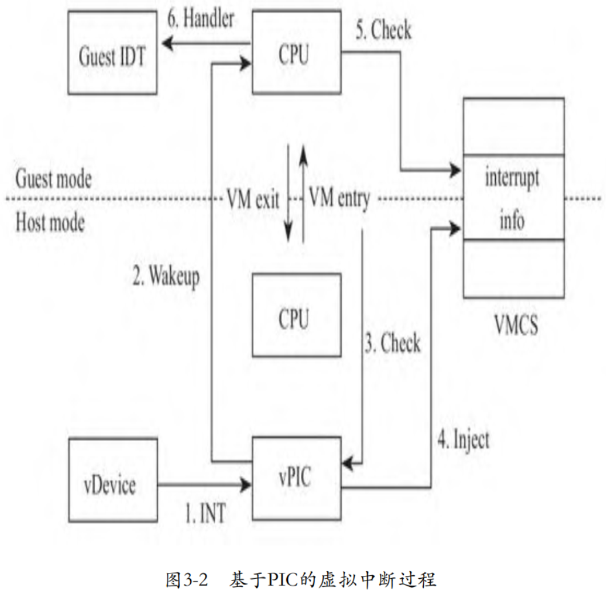

在探讨 Guest 模式的 CPU 处理中断前，我们首先回顾一下**物理 CPU** 是如何**响应中断**的。当**操作系统允许 CPU 响应中断**后，每当**执行完一条指令**，**CPU** 都将检查**中断引脚是否有效**。一旦有效，CPU 将**处理中断**，然后再**执行下一条指令**，如下图所示。

当有中断需要 CPU 处理时，**中断芯片**将**使连接 CPU 的 INTR 引脚有效**，也就是说如果 INTR 是**高电平有效**，那么**中断芯片拉高 INTR 引脚**的电平。**CPU** 在执行完一条指令后，将**检查 INTR 引脚**。类似的，**虚拟中断**也**效仿这种机制**，**使**与 CPU 的 INTR 引脚相连的“**引脚**”**有效**，当然，对于**软件虚拟**的**中断芯片**而言，“**引脚**”只是一个**变量**，从**软件模拟**的角度就是**设置变量的值**了。如果 **KVM** 发现**虚拟中断芯片**有**中断请求**，则向 **VMCS** 中 `VM-entry control` 部分的 `VM-entry interruption-information field` 字段**写入中断信息**，在**切入 Guest 模式**的一刻，**CPU** 将检查这个字段，就**如同检查 CPU 管脚**，如果有中断，则进入**中断执行过程**。图3-2为单核系统使用PIC中断芯片下的虚拟中断过程。

