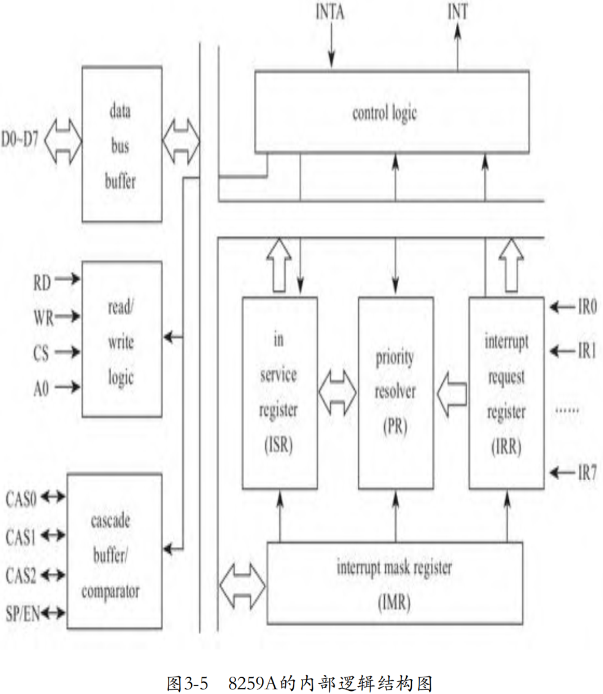
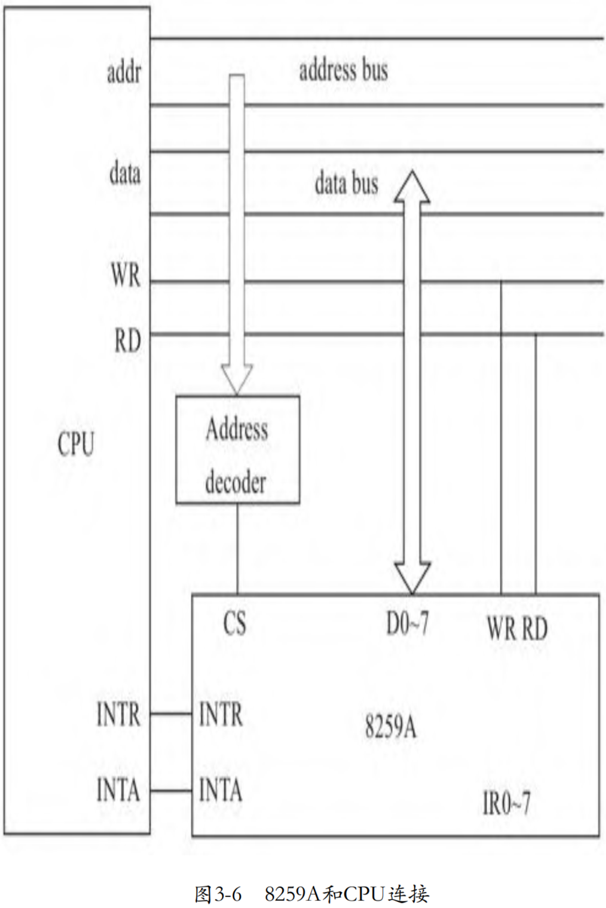

计算机系统有很多外设需要服务，显然，轮询的方式是非常浪费CPU的计算资源的，尤其是对于那些并不是频繁需要服务的设备。因此，工程师们设计了外设主动向CPU发起服务请求的方式，这种方式就是中断。采用中断方式后，在没有外设请求时，CPU可以继续其他计算任务，而不是进行很多不必要的轮询，极大地提高了系统的吞吐。在每个指令周期结束后，如果CPU的状态标志寄存器中的IF（interrupt flag）位为1，那么CPU会去检查是否有中断请求，如果有中断请求，则运行对应的中断服务程序，然后返回被中断的计算任务继续执行。

# 可编程中断控制器 8259A

CPU不可能为每个硬件都设计专门的管脚接收中断，管脚数量的限制、电路的复杂度、灵活度等方方面面都不允许，因此，计算机工程师们设计了一个专门管理中断的芯片，接收来自外围设备的请求，确定请求的优先级，并向CPU发出中断。1981年IBM推出的第一代个人电脑PC/XT使用了一个独立的8259A作为中断控制器，自此，8259A就成了单核时代中断芯片事实上的标准。因为中断控制器可以通过软件编程进行控制，比如当管脚收到设备信号时，可以编程控制其发出的中断向量号，所以中断控制器又称为可编程中断控制器（programmable interrupt controller），简称PIC。单片8259A可以连接8个外设的中断信号线，可以多片级联支持更多外设。

8259A 的内部逻辑结构如图3-5所示。



当中断源请求服务时，需要记录中断请求，8259A的中断请求寄存器IRR负责接收并锁存来自IR0～IR7的中断请求信号。

系统软件可以通过编程设置8259A的寄存器IMR来屏蔽中断，比如将IMR的第0位设置为1，那么8259A将不再响应IR0连接的外设的中断请求。与CPU通过cli命令关中断相比，这个屏蔽是彻底的屏蔽。当CPU通过cli命令关中断后，8259A还会将中断发送给CPU，只是CPU不处理中断而已，而如果设置了8259A屏蔽中断，那么8259A将忽略外设中断请求，更不会向CPU发送中断信号。

当CPU开始响应中断时，其将向8259A发送INTA信号，通知8259A中断处理开始了，8259A会在中断服务寄存器ISR中将CPU正在处理的中断记录下来。当CPU的中断服务程序处理完中断后，将向8259A发送EOI信号，告知8259A中断处理完毕，8259A会复位ISR中对应的位。8259A记录CPU正在服务的中断的目的之一是当后续收到新的中断时，8259A将比较新的中断和正在处理的中断的优先级，决定是否打断CPU正在服务的中断。如果8259A工作在AEOI模式，那么8259A会自动复位ISR。

在向CPU发送中断信号前，8259A需要从IRR中挑选出优先级最高的中断。如果CPU正在处理中断，那么还要与CPU正在处理的中断进行优先级比较。8259A中的中断优先级判别单元（priority resolver）负责完成以上任务。

8259A和CPU的连接如图3-6所示.



片选和地址译码器相连，当CPU准备访问8259A时，需要向地址总线发送8259A对应的地址，经过译码器后，译码器发现是8259A对应的地址，因此会拉低与8259A的CS连接的管脚的电平，从而选中8259A。

8259A的D0～7管脚与CPU的数据总线相连。从CPU向8259A发送ICW和OCW，以及从8259A向CPU传送8259A的状态以及中断向量号，都是通过数据总线传递的。

当CPU向8259A发送ICW、OCW时，在将数据送上数据总线后，需要通知8259A读数据，CPU通过拉低WR管脚的电平的方式通知8259A。当8259A的WR管脚收到低电平后，读取数据总线的数据。类似的，CPU准备好读取8259A的状态时，拉低RD管脚，通知8259A向处理器发送数据。

8259A的管脚INTR（interrupt request）和INTA（interrupt acknowledge）分别与处理器的INTR和INTA管脚相连。8259A通过管脚 INTR 向CPU发送中断请求，CPU通过管脚INTA向PIC发送中断确认，告诉 PIC 其收到中断并且开始处理了。

操作系统会将中断对应的服务程序地址等信息存储在一个数组中，数组中的每一个元素对应一个中断。在实模式下，这个数组称为IVT(interrupt vector table)。在保护模式下，这个数组称为IDT（Interrupt descriptor table）。在响应中断时，CPU使用中断向量从IVT/IDT中索引中断服务程序。但是，x86体系约定，前32个中断号（0～31）是留给处理器自己使用的，比如第0个中断号是处理器出现除0异常的，因此，外设的中断向量只能从32号中断开始。所以，在初始化8259A时，操作系统通常会设置8259A的中断向量从32号中断开始，因此当8259A收到管脚IR0的中断请求时，其将向CPU发出的中断向量是32，当收到管脚IR1的中断请求时，其将向CPU发出的中断向量是33，以此类推。在CPU初始化8259A时，通过第2个初始化命令字（ICW2）设置8259A起始中断向量号，下面代码中的变量irq_base记录的就是起始中断向量号：

```cpp
commit 85f455f7ddbed403b34b4d54b1eaf0e14126a126
KVM: Add support for in-kernel PIC emulation
linux.git/drivers/kvm/i8259.c
static void pic_ioport_write(void *opaque, u32 addr, u32 val)
{
    ...
		switch (s->init_state) {
        ...
		case 1:
			s->irq_base = val & 0xf8;
			s->init_state = 2;
			break;
        ...
        }
    ...
}
```

后来，随着 APIC 和 MSI 的出现，中断向量设置得更为灵活，可以为每个 PCI 设备设置其中断向量，这个中断向量存储在PCI设备的配置空间中。

内核中抽象了一个结构体 `kvm_kpic_state` 来记录每个 8259A 的状态:

```cpp
commit 85f455f7ddbed403b34b4d54b1eaf0e14126a126
KVM: Add support for in-kernel PIC emulation
linux.git/drivers/kvm/irq.h
struct kvm_kpic_state {
	u8 last_irr;	/* edge detection */
	u8 irr;		/* interrupt request register */
	u8 imr;		/* interrupt mask register */
	u8 isr;		/* interrupt service register */
    ...
};

struct kvm_pic {
	struct kvm_kpic_state pics[2]; /* 0 is master pic, 1 is slave pic */
	irq_request_func *irq_request;
	void *irq_request_opaque;
	int output;		/* intr from master PIC */
	struct kvm_io_device dev;
};
```

一片 8259A 只能连接最多 8 个外设，如果需要支持更多外设，需要多片 8259A 级联。在结构体 kvm_pic 中，我们看到有两片 `8259A:pic[0]` 和 `pic[1]`。KVM 定义了结构体 kvm_kpic_state 记录 8259A 的状态，其中
包括我们之前提到的 IRR、IMR、ISR 等。

# 虚拟设备向PIC发送中断请求

如同物理外设请求中断时拉高与8259A连接的管脚的电压一样，虚拟设备请求中断的方式是通过虚拟8259A芯片对外提供的一个API，以kvmtool中的virtio blk虚拟设备为例：

```cpp
commit 4155ba8cda055b7831489e4c4a412b073493115b
kvm: Fix virtio block device support some more
kvmtool.git/blk-virtio.c
static bool blk_virtio_out(struct kvm *self, uint16_t port, void *data, int size, uint32_t count)
{
    ...
	switch (offset) {
	case VIRTIO_PCI_QUEUE_NOTIFY: {
        ...
		while (queue->vring.avail->idx != queue->last_avail_idx) {
			if (!blk_virtio_read(self, queue))
				return false;
		}
		kvm__irq_line(self, VIRTIO_BLK_IRQ, 1);
        ...
    }
    ...
}
```

当Guest内核的块设备驱动需要从块设备读取数据时，其通过写 I/O 端口 VIRTIO_PCI_QUEUE_NOTIFY 触发 CPU 从 Guest 模式切换到Host模式，KVM中的块模拟设备开始I/O操作，上述代码中的while循环就是处理I/O的，函数blk_virtio_read从保存Guest文件系统的镜像文件中读取I/O数据。在这个提交中，块设备的I/O处理是同步的，也就是说，一直要等到虚拟设备I/O操作完成后，才会向Guest发送中断，返回Guest。显然，阻塞在这里是不合理的，更合理的方式是马上返回Guest，这样Guest可以执行其他任务，待虚拟设备完成I/O操作后，再通过中断通知Guest，kvmtool后来已经改进为异步的方式。

virtio blk在处理完I/O后，调用函数kvm__irq_line向虚拟8259A发送中断请求，其中VIRTIO BLK IRQ对应管脚号，第3个参数“1”代表高电平，其代码如下：

```cpp
commit 4155ba8cda055b7831489e4c4a412b073493115b
kvm: Fix virtio block device support some more
kvmtool.git/kvm.c
void kvm__irq_line(struct kvm *self, int irq, int level)
{
	struct kvm_irq_level irq_level;

	irq_level	= (struct kvm_irq_level) {
		{
			.irq		= irq,
		},
		.level		= level,
	};

	if (ioctl(self->vm_fd, KVM_IRQ_LINE, &irq_level) < 0)
		die_perror("KVM_IRQ_LINE failed");
}
```

函数 kvm__irq_line 将管脚号和管脚电平信息封装到结构体 kvm_irq_level 中，传递给内核中的KVM模块：

```cpp
commit 85f455f7ddbed403b34b4d54b1eaf0e14126a126
KVM: Add support for in-kernel PIC emulation
linux.git/drivers/kvm/kvm_main.c
static long kvm_vm_ioctl(struct file *filp,
			   unsigned int ioctl, unsigned long arg)
{
    ...
	switch (ioctl) {
	case KVM_IRQ_LINE: {
		struct kvm_irq_level irq_event;

		r = -EFAULT;
		if (copy_from_user(&irq_event, argp, sizeof irq_event))
			goto out;
		if (irqchip_in_kernel(kvm)) {
			if (irq_event.irq < 16)
				kvm_pic_set_irq(pic_irqchip(kvm),
					irq_event.irq,
					irq_event.level);
			/* TODO: IOAPIC */
			r = 0;
		}
		break;
	}
    ...
}
```

KVM 模块将 kvmtool 中组织的中断信息从用户空间复制到内核空间中，然后调用虚拟 8259A 的模块中提供的 API kvm_pic_set_irq，向 8259A 发出中断请求。

# 记录中断到 IRR

当中断到来时，CPU可能正在处理其他中断，或者多个中断同时到来，需要排队依次请求CPU处理，因此，当外设中断请求到来时，8259A首先需要将它们记录下来，这个寄存器就是IRR(Interrupt Request Register)，8259A用它来记录有哪些中断需要处理。

当KVM模块收到外设的请求，调用虚拟 8259A 的 API kvm_pic_set_irq时，其第一件事情就是将中断记录到IRR中：

```cpp
commit 85f455f7ddbed403b34b4d54b1eaf0e14126a126
KVM: Add support for in-kernel PIC emulation
linux.git/drivers/kvm/i8259.c
void kvm_pic_set_irq(void *opaque, int irq, int level)
{
	struct kvm_pic *s = opaque;

	pic_set_irq1(&s->pics[irq >> 3], irq & 7, level);
	pic_update_irq(s);
}

static inline void pic_set_irq1(struct kvm_kpic_state *s, int irq, int level)
{
	int mask;
	mask = 1 << irq;
	if (s->elcr & mask)	/* level triggered */
		if (level) {
			s->irr |= mask;
			s->last_irr |= mask;
		} else {
			s->irr &= ~mask;
			s->last_irr &= ~mask;
		}
	else	/* edge triggered */
		if (level) {
			if ((s->last_irr & mask) == 0)
				s->irr |= mask;
			s->last_irr |= mask;
		} else
			s->last_irr &= ~mask;
}
```

信号有边缘触发和水平触发，在物理上可以理解为，8329A在前一个周期检测到管脚信号是0，当前周期检测到管脚信号是1，如果是上升沿触发模式，那么8259A就认为外设有请求了，这种触发模式就是边缘触发。对于水平触发，以高电平触发为例，当8259A检测到管脚处于高电平，则认为外设来请求了。

在虚拟8259A的结构体kvm_kpic_state中，寄存器elcr是用来记录8259A被设置的触发模式的，我们以边缘触发为例进行讨论，即代码第16～22行。参数level即相当于硬件层面的电信号，0表示低电平，1表示高电平。当管脚收到一个低电平时，即level的值为0，代码进入else分支，即代码第21、22行，结构体kvm_kpic_state中的字段last_irr会清除该IRQ对应IRR的位，即相当于设置该中断管脚为低电平状态。当管脚收到高电平时，即level的值为1，代码进入if分支，即代码第17～20行，此时8259A将判断之前该管脚的状态，即代码第18行，也就是判断结构体kvm_kpic_state中的字段last_irr中该IRQ对应IRR的位，如果之前管脚为低电平，而现在管脚是高电平，那么显然管脚电平有一个跳变，说明中断源发出了中断请求，8259A在字段irr中记录下中断请求。当然，同时需要在字段last_irr记录下当前该管脚的状态。

# 设置待处理中断标识

当8259A将中断请求记录到IRR中后，下一步就是开启一个中断评估（evaluate）过程，包括评估中断是否被屏蔽、多个中断请求的优先级等，最后将通过管脚INTA通知CPU处理外部中断。与物理8259A主动发起中断不同，虚拟中断的发起方式不再是由虚拟中断芯片主动发起，而是在每次准备切入Guest时，KVM查询中断芯片，如果有待处理的中断，则执行中断注入。模拟8259A在将收到的中断请求记录到IRR后，将设置一个变量“output”，后面在切入Guest前KVM会查询这个变量：

```cpp
commit 85f455f7ddbed403b34b4d54b1eaf0e14126a126
KVM: Add support for in-kernel PIC emulation
linux.git/drivers/kvm/i8259.c
void kvm_pic_set_irq(void *opaque, int irq, int level)
{
	struct kvm_pic *s = opaque;

	pic_set_irq1(&s->pics[irq >> 3], irq & 7, level);
	pic_update_irq(s);
}

static void pic_update_irq(struct kvm_pic *s)
{
    ...
	irq = pic_get_irq(&s->pics[0]);
	if (irq >= 0)
		s->irq_request(s->irq_request_opaque, 1);
	else
		s->irq_request(s->irq_request_opaque, 0);
}

static void pic_irq_request(void *opaque, int level)
{
	struct kvm *kvm = opaque;

	pic_irqchip(kvm)->output = level;
}
```

在函数 vmx_vcpu_run 中，在准备切入 Guest 之前将调用函数 vmx_intr_assist 去检查虚拟中断芯片是否有等待处理的中断，相关代码如下：

```cpp
commit 85f455f7ddbed403b34b4d54b1eaf0e14126a126
KVM: Add support for in-kernel PIC emulation
linux.git/drivers/kvm/vmx.c
static int vmx_vcpu_run(struct kvm_vcpu *vcpu, struct kvm_run *kvm_run)
{
    ...
	if (irqchip_in_kernel(vcpu->kvm))
		vmx_intr_assist(vcpu);
    ...
}

static void vmx_intr_assist(struct kvm_vcpu *vcpu)
{
	...
	has_ext_irq = kvm_cpu_has_interrupt(vcpu);
    ...
	if (!has_ext_irq)
		return;
	interrupt_window_open =
		((vmcs_readl(GUEST_RFLAGS) & X86_EFLAGS_IF) &&
		 (vmcs_read32(GUEST_INTERRUPTIBILITY_INFO) & 3) == 0);
	if (interrupt_window_open)
		vmx_inject_irq(vcpu, kvm_cpu_get_interrupt(vcpu));
    ...
}
```

其中函数 kvm_cpu_has_interrupt 查询 8259A 设置的变量 output:

```cpp
commit 85f455f7ddbed403b34b4d54b1eaf0e14126a126
KVM: Add support for in-kernel PIC emulation
linux.git/drivers/kvm/irq.c
int kvm_cpu_has_interrupt(struct kvm_vcpu *v)
{
	struct kvm_pic *s = pic_irqchip(v->kvm);

	if (s->output)	/* PIC */
		return 1;
	/*
	 * TODO: APIC
	 */
	return 0;
}
```

如果变量 output 非 0，就说明有外部中断等待处理。然后接下来还需要判断 Guest 是否可以被中断，比如 Guest 是否正在执行一些不能被中断的指令，如果 Guest 可以被中断，则调用 `vmx_inject_irq` 完成中断的注入。其中，传递给函数 `vmx_inject_irq` 的第2个参数是函数 `kvm_cpu_get_interrupt` 返回的结果，该函数获取需要注入的中断。这个过程就是中断评估过程，我们下一节讨论。

# 中断评估

在上一节我们看到在执行注入前，vmx_inject_irq调用函数 `kvm_cpu_get_interrupt` 获取需要注入的中断。函数 `kvm_cpu_get_interrupt` 的核心逻辑就是中断评估，包括待处理的中断有没有被屏蔽？待处理的中断的优先级是否比CPU正在处理的中断优先级高？等等。代码如下：

```cpp
commit 85f455f7ddbed403b34b4d54b1eaf0e14126a126
KVM: Add support for in-kernel PIC emulation
linux.git/drivers/kvm/irq.c
int kvm_cpu_get_interrupt(struct kvm_vcpu *v)
{
	...
	vector = kvm_pic_read_irq(s);
	if (vector != -1)
		return vector;
	/*
	 * TODO: APIC
	 */
	return -1;
}

linux.git/drivers/kvm/i8259.c
int kvm_pic_read_irq(struct kvm_pic *s)
{
	int irq, irq2, intno;

	irq = pic_get_irq(&s->pics[0]);
	if (irq >= 0) {
		pic_intack(&s->pics[0], irq);
		if (irq == 2) {
			...
		} else
			intno = s->pics[0].irq_base + irq;
	} else {
		...
	}
	pic_update_irq(s);

	return intno;
}
```

kvm_pic_read_irq 调用函数pic_get_irq获取评估后的中断。根据由上面代码中黑体标识的部分，我们可以清楚地看到中断向量是在中断管脚的基础上叠加了一个irq_base。这个irq_base就是初始化 8259A 时通过ICW设置的，完成从IRn到中断向量的转换。

一个中断芯片通常连接多个外设，所以在某一个时刻，可能会有多个设备请求到来，这时就有一个优先处理哪个请求的问题，因此，中断就有了优先级的概念。8259A支持多种优先级模式，典型的有两种中断优先级模式：

1） 固定优先级（fixed priority），即优先级是固定的，从 IR0 到IR7依次降低，IR0的优先级永远最高，IR7的优先级永远最低。

2） 循环优先级（rotating priority），即当前处理完的 IRn 优先级调整为最低，当前处理的下一个，即IRn+1，调整为优先级最高。比如，当前处理的中断是irq2，那么紧接着irq3的优先级设置为最高，然后依次是irq4、irq5、irq6、irq7、irq1、irq2、irq3。假设此时irq5和irq2同时来了中断，那么irq5会被优先处理。然后irq6被设置为优先级最高，接下来依次是irq7、irq1、irq2、irq3、irq4、irq5。

理解了循环优先级算法后，从8259A中获取最高优先级请求的代码就很容易理解了：

```cpp
commit 85f455f7ddbed403b34b4d54b1eaf0e14126a126
KVM: Add support for in-kernel PIC emulation
linux.git/drivers/kvm/i8259.c
static int pic_get_irq(struct kvm_kpic_state *s)
{
	int mask, cur_priority, priority;

	mask = s->irr & ~s->imr;
	priority = get_priority(s, mask);
	if (priority == 8)
		return -1;
	/*
	 * compute current priority. If special fully nested mode on the
	 * master, the IRQ coming from the slave is not taken into account
	 * for the priority computation.
	 */
	mask = s->isr;
	if (s->special_fully_nested_mode && s == &s->pics_state->pics[0])
		mask &= ~(1 << 2);
	cur_priority = get_priority(s, mask);
	if (priority < cur_priority)
		/*
		 * higher priority found: an irq should be generated
		 */
		return (priority + s->priority_add) & 7;
	else
		return -1;
}

static inline int get_priority(struct kvm_kpic_state *s, int mask)
{
	int priority;
	if (mask == 0)
		return 8;
	priority = 0;
	while ((mask & (1 << ((priority + s->priority_add) & 7))) == 0)
		priority++;
	return priority;
}
```