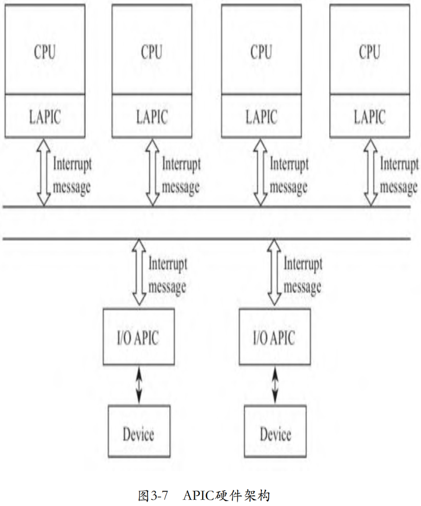
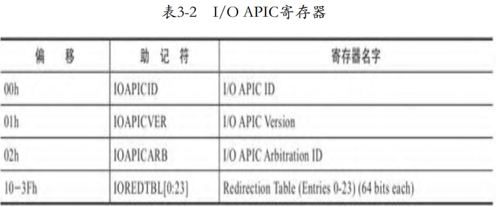
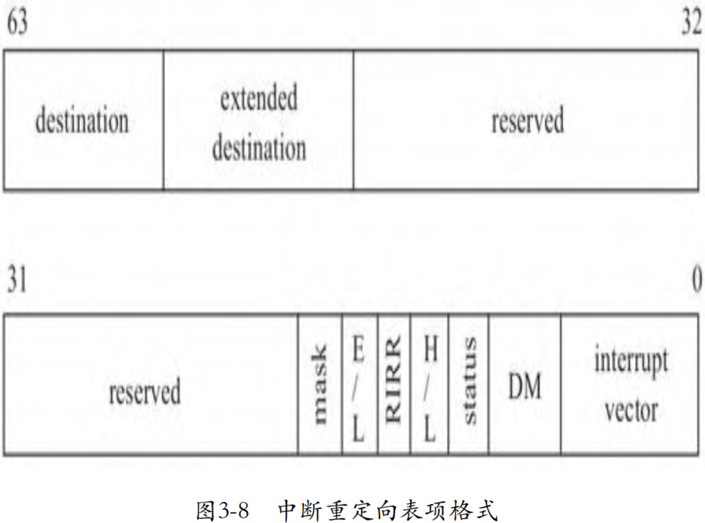
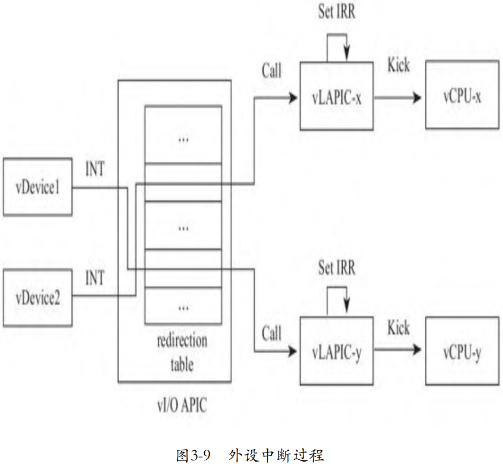

随着多核系统的出现，8259A不再能满足需求了。8259A只有一个INTR和INTA管脚，如果将其用在多处理器系统上，那么当中断发生时，中断将始终只能发送给一个处理器，并不能利用多处理器并发的优势。而且，CPU之间也需要发送中断。于是，随着多处理器系统的出现，为了充分利用多处理器的并行能力，Intel为SMP系统设计了APIC(Advanced Programmable Interrupt Controller)，其可以将接收到的中断按需分发给不同的处理器进行处理。比如对于一个支持多队列的网卡而言，其可以将网卡的每个多列的中断发送给不同的CPU，从而提高中断处理能力，提高网络吞吐。APIC的架构如图3-7所示。



APIC包含两个部分：LAPIC和I/O APIC。LAPIC即local APIC，位于处理器一侧，除接收来自I/O APIC的中断外，还用于处理器之间发送核间中断IPI（Inter Processor Interrupt)；I/O APIC一般位于南桥芯片上，响应来自外部设备的中断，并将中断发送给LAPIC，然后由LAPIC发送给对应的CPU。I/O APIC和LAPIC之间通过总线的方式通信，最初通过专用的总线连接，后来直接使用了系统总线，每增加一颗核，只是在总线上多挂一个LAPIC而已，不再受管脚数量的约束。

当I/O APIC收到设备的中断请求时，通过寄存器决定将中断发送给哪个LAPIC（CPU）。I/O APIC的寄存器如表3-2所示。



其中，地址0x10到0x3F处，有24个64位的寄存器，对应着I/O APIC的24个I/O APIC的中断管脚，其中记录着管脚相关的中断信息。这24个64位寄存器组成了中断重定向表（Redirection Table），每个表项的格式如图3-8所示。



其中destination表示中断发送目标CPU，目标CPU可能是一个，也可能是一组，我们在设置中断负载均衡（中断亲和性）时，设置的就是destination字段。另外一个重要的字段就是interrupt vector，这个在讨论PIC时我们已经介绍了，就是中断向量，用于在IDT中索引中断服务程序。重定向表使用管脚号作为索引，比如说接在IR0号管脚的对应于第1个重定向表项。当中断发生时，I/O APIC将查询这个重定向表，将中断发往操作系统预先设置的目的CPU。操作系统内核初始化时会对I/O APIC编程，设置重定向表的各个表项。当然也可以在系统运行时设置，通过proc文件系统设置中断的亲和性（affinity）时，也会更新重定向表。

# 外设中断过程

外设通过调用虚拟I/O APIC对外提供的接口向其发送中断请求。在收到外设的中断请求后，虚拟I/O APIC将以中断请求号为索引，查询中断重定向表，根据中断重定向表决定将中断分发给哪个或哪些CPU。确定了目标CPU后，向目标CPU对应的虚拟LAPIC转发中断请求。虚拟LAPIC也对外提供了接口，供虚拟I/O APIC向其发送中断。虚拟LAPIC与虚拟PIC非常相似，当收到来自虚拟I/O APIC转发过来的中断请求后，其首先设置IRR寄存器，然后或者唤醒正在睡眠的VCPU，或者触发正在运行的Guest退出到Host模式，然后在下一次VM entry时评估虚拟LAPIC中的中断，执行注入过程，整个过程如图3-9所示。

1. 中断重定向表

当I/O APIC的某一个管脚收到来自设备的中断信号时，I/O APIC需要查询中断重定向表，确定管脚的中断请求对应的中断向量，以及需要发送给哪个或哪些CPU。那么谁来负责填充这个表格呢？显然是I/O APIC的驱动。在系统初始化时，内核将调用I/O APIC的API设置中断重定向表。除了初始化时设置I/O APIC的中断重定向表外，用户也会在系统启动后动态地设置中断重定向表，比如典型的一个应用，在服务器启动后，用户会通过内核proc提供的接口将多队列网卡的每个队列的中断分别绑定一颗CPU，即设置网卡的中断亲和性。proc中的接口通过调用I/O APIC模块的接口更新中断重定向表。下面就是Guest内核填充重定向表的相关代码：



```cpp
commit 1fd4f2a5ed8f80cf6e23d2bdf78554f6a1ac7997
KVM: In-kernel I/O APIC model
linux.git/arch/x86/kernel/io_apic_64.c

static void
__ioapic_write_entry(int apic, int pin, struct IO_APIC_route_entry e)
{
	union entry_union eu;
	eu.entry = e;
	io_apic_write(apic, 0x11 + 2*pin, eu.w2);
	io_apic_write(apic, 0x10 + 2*pin, eu.w1);
}

static inline void io_apic_write(unsigned int apic, unsigned int reg, unsigned int value)
{
	struct io_apic __iomem *io_apic = io_apic_base(apic);
	writel(reg, &io_apic->index);
	writel(value, &io_apic->data);
}
```

函数io_apic_write的第2个参数是寄存器地址（相对于基址的偏移），第3个参数相当于写入的内容，eu.w1为entry的低32位，`eu.w2` 为entry的高32位。0x10正是I/O APIC重定向表开始的地方，对于第1个管脚，pin值为0，0x10、0x11恰好是第1个entry；对于第2个管脚，pin值为1，0x12、0x13对应第2个entry，以此类推。

I/O APIC的中断重定向表中的这些entry，或者说寄存器，都是间接访问的。这些寄存器并不允许外部直接访问，而是需要通过其他寄存器来间接访问。这2个寄存器是IOREGSEL（I/O Register Select）和IOWIN（I/O Window），它们通过内存映射的方式映射到CPU的地址空间，处理器可以直接访问。其中IOREGSEL用来指定访问的目标寄存器，比如说，在向IOREGSEL写入0x10后，接下来向寄存器IOWIN写入的值将被写到中断重定向表的第1个entry的低32位，因为地址0x10是中断重定向表的第1个entry的低32位的地址。上面的代码中，`io_apic->index` 对应的就是寄存器IOREGSEL，io_apic-＞data对应的就是寄存器IOWIN。

虚拟I/O APIC收到Guest内核I/O APIC填充中断重定向表的请求后，将中断向量、目标CPU、触发模式等中断信息记录到中断重定向表中，相关代码如下：

```cpp
commit 1fd4f2a5ed8f80cf6e23d2bdf78554f6a1ac7997
KVM: In-kernel I/O APIC model
linux.git/drivers/kvm/ioapic.c
static void ioapic_mmio_write(struct kvm_io_device *this, gpa_t addr, int len,
			      const void *val)
{
	...
	switch (addr) {
	case IOAPIC_REG_SELECT:
		ioapic->ioregsel = data;
		break;

	case IOAPIC_REG_WINDOW:
		ioapic_write_indirect(ioapic, data);
		break;
    ...
	}
}

static void ioapic_write_indirect(struct kvm_ioapic *ioapic, u32 val)
{
	unsigned index;

	switch (ioapic->ioregsel) {
	case IOAPIC_REG_VERSION:
		/* Writes are ignored. */
		break;
    ...
	default:
		index = (ioapic->ioregsel - 0x10) >> 1;
        ...
		if (ioapic->ioregsel & 1) {
			ioapic->redirtbl[index].bits &= 0xffffffff;
			ioapic->redirtbl[index].bits |= (u64) val << 32;
		} else {
			...
		}
		...
	}
}
```

2. 中断过程

虚拟 I/O APIC 将对外提供向其发送中断申请的接口，虚拟设备通过虚拟 I/O APIC 提供的对外接口向 I/O APIC 发送中断请求。虚拟 I/O APIC收到虚拟设备的中断请求后，以管脚号为索引，从中断重定表中索引具体的表项，从表项中提取中断向量、目的CPU、触发模式等，然后将这些信息分发给目的CPU，当然了，本质上是分发给目的CPU对应的虚拟LAPIC。类似的，虚拟LAPIC也对外提供了接口，供虚拟I/O APIC或者其他虚拟LAPIC调用。虚拟LAPIC与虚拟PIC的逻辑基本完全相同，通过寄存器记录中断的状态、实现向Guest的中断注入等。

对于在用户空间虚拟的设备，将通过ioctl接口向内核中的KVM模块发送KVM_IRQ_LINE请求：

```cpp
commit 8b1ff07e1f5e4f685492de9b34bec25662ae57cb
kvm: Virtio block device emulation
kvmtool.git/
```