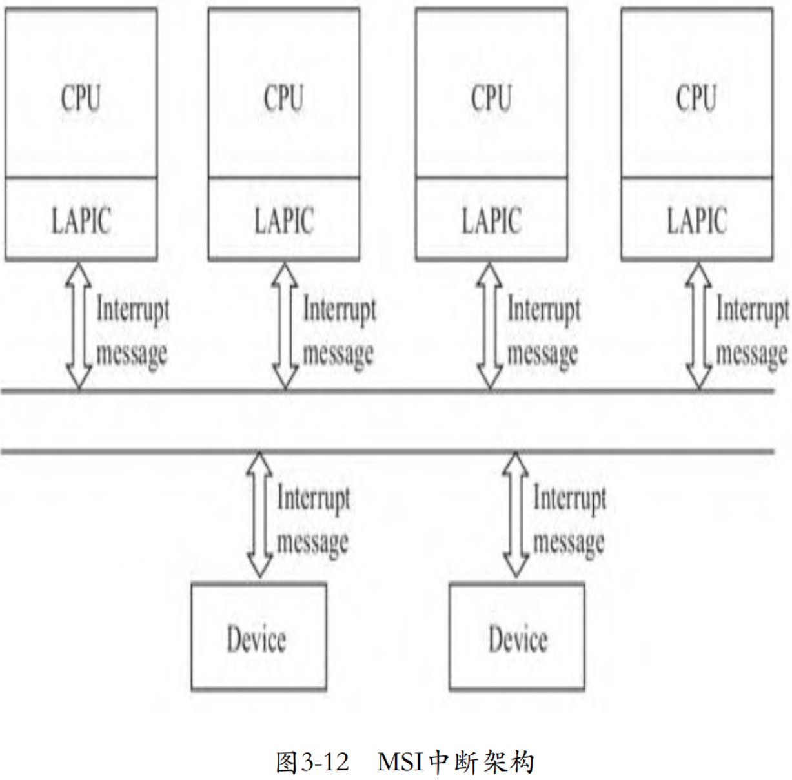
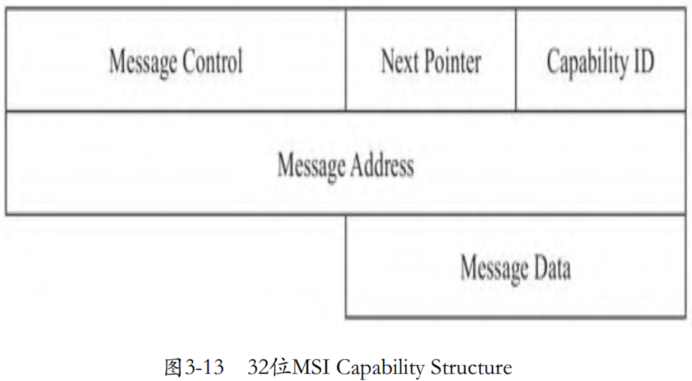
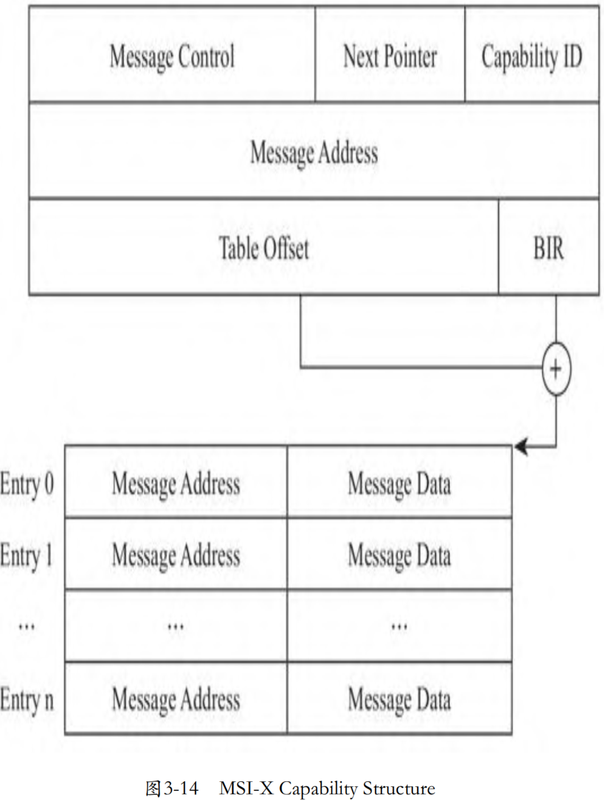

虽然APIC相比PIC更进了一步，但是我们看到，外设发出中断请求后，需要经过I/O APIC才能到达LAPIC(CPU)。如果中断请求可以从设备直接发送给LAPIC，而不是绕道I/O APIC，可以大大减少中断处理的延迟。事实上，在1999年PCI 2.2就引入了MSI。MSI全称是Message Signaled Interrupts，从名字就可以看出，第3代中断技术不再基于管脚，而是基于消息。在PCI 2.2时，MSI是设备的一个可选特性，到了2004年，PCIE规范发布，MSI就成为了PCIE设备强制要求的特性。在PCI 3.3时，又对MSI进行了一定的增强，称为MSI-X。相比MSI，MSI-X 的每个设备可以支持更多的中断，并且每个中断可以独立配置。

除了减少中断延迟外，因为不再存在管脚的概念了，所以之前因为管脚有限而共享管脚的问题自然就消失了。之前当某个管脚有信号时，操作系统需要逐个调用共享这个管脚的中断服务程序去试探是否可以处理这个中断，直到某个中断服务程序可以正确处理。同样的道理，不再受管脚的数量约束，MSI能够支持的中断数也大大增加了。支持MSI的设备绕过I/O APIC，直接与LAPIC通过系统总线相连，如图3-12所示。



从PCI 2.1开始，如果设备需要扩展某种特性，可以向配置空间中的 Capabilities List 中增加一个Capability，MSI利用的就是这个特性，将I/O APIC中的功能扩展到设备自身。MSI 的 Capability Structure 如图3-13所示。



为了支持多个中断，MSI-X的Capability Structure在MSI的基础上增加了table，其中字段Table Offset和BIR定义了table所在的位置，其中BIR为BAR Indicator Register，即指定使用哪个BAR寄存器，然后从指定的这个BAR寄存器中取出映射在CPU地址空间中的基址，加上Table Offset就定位了table的位置，如图3-14所示。



当外设准备发送中断消息时，其将从Capability Structure中提取相关信息。消息地址取自字段message address，其中bits 31-20是一个固定的值0FEEH。PCI总线根据消息地址，得知这是一个中断消息，会将其发送给Host-to-PCI桥，Host-to-PCI桥将其发送到目的CPU（LAPIC）。消息体取自message data，主要部分是中断向量。

# MSI（X）Capability 数据结构

在初始化设备时，如果设备支持MSI，并且设备配置为启用MSI支持，则内核中将组织MSI Capability数据结构，然后通过MMIO的方式写到PCI设备的配置空间中。内核中的PCI公共层为驱动提供了接口pci_enable_msix配置MSI Capability数据结构：

```cpp

```