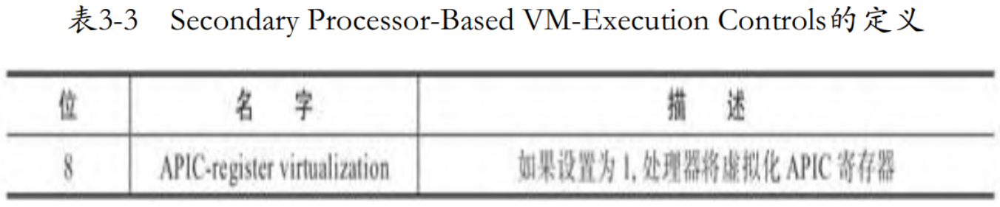
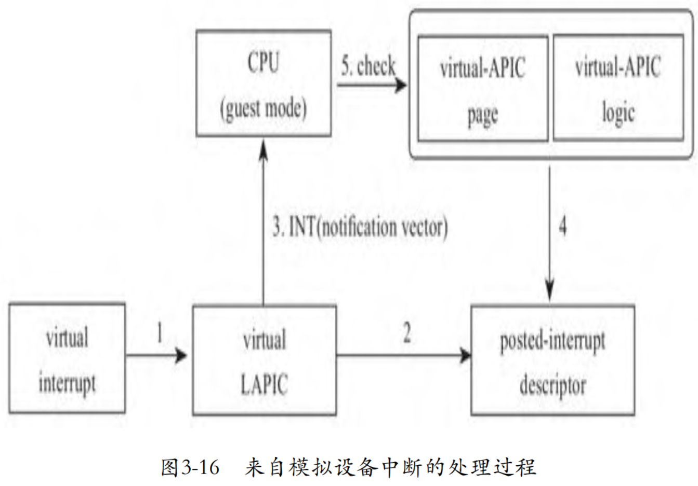
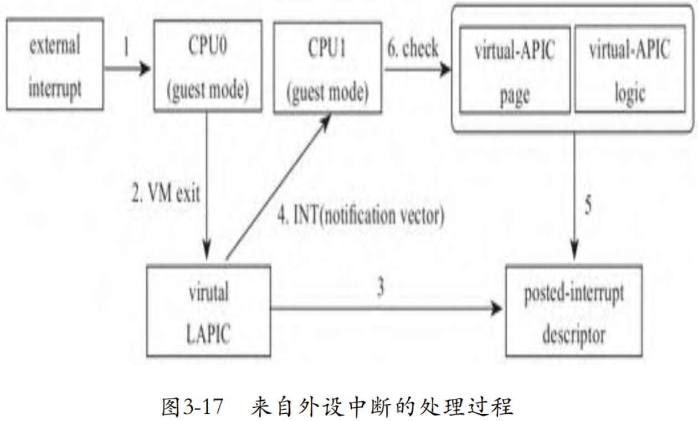
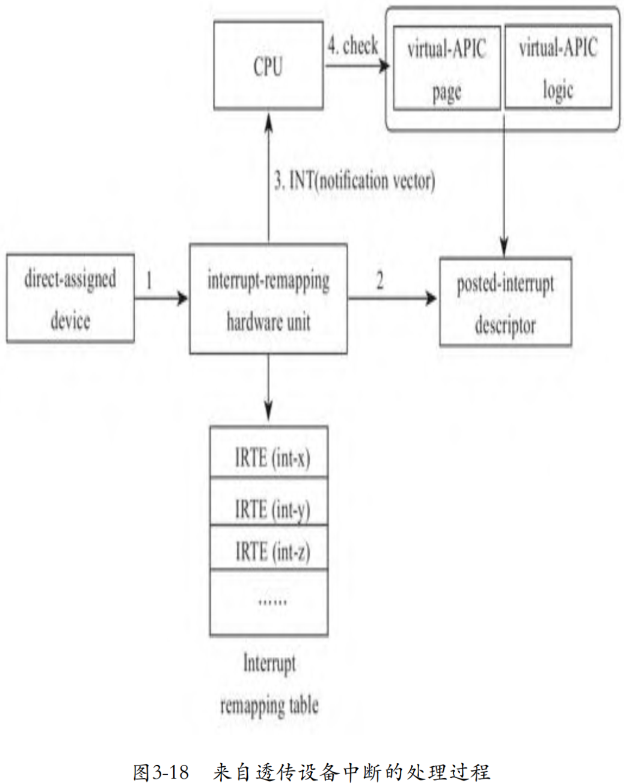

最初, 虚拟中断芯片是在用户空间实现的, 但是中断芯片密集地参与了整个计算机系统的运转过程, 因此, 为了减少内核空间和用户空间之间的上下文切换带来的开销, 后来, 中断芯片的虚拟实现在了内核空间. 为了进一步提高效率, Intel从硬件层面对虚拟化的方方面面进行了支持, 这一节, 我们就来讨论Intel在硬件层面对中断虚拟化的支持.

在前面讨论完全基于软件虚拟中断芯片的方案中, 我们看到, 向 Guest 注入中断的时机都是在VM entry那一刻, 因此, 如果要向 Guest 注入中断, 必须要触发一次VM exit, 这是中断虚拟化的主要开销. 因此, 为了避免这次Host模式和Guest模式的切换, Intel在硬件层面从如下3个方面进行了支持:

1）virtual-APIC page. 我们知道, 在物理上, LAPIC有一个 4KB 大小的页面APIC page, 用来保存寄存器的值. Intel在CPU的Guest模式下实现了一个用于存储中断寄存器的virtual-APIC page. 在 Guest 模式下有了状态, 后面Guest模式下还有了中断逻辑, 很多中断行为就无须VMM介入了, 从而大大地减少了VM exit的次数. 当然有些写中断寄存器的操作是具有副作用的, 比如通过写ICR寄存器发送IPI中断, 这时就需要触发VM exit.

2）Guest模式下的中断评估逻辑. Intel在Guest模式中实现了部分中断芯片的逻辑用于中断评估, 当有中断发生时, CPU不必再退出到Host模式, 而是直接在Guest模式下完成中断评估.

3）posted-interrupt processing. 在软件虚拟中断的方案中, 虚拟中断芯片收到中断请求后, 会将信息保存到虚拟中断芯片中, 在VM entry时, 触发虚拟中断芯片的中断评估逻辑, 根据记录在虚拟中断芯片中的信息进行中断评估. 但是当CPU支持在Guest模式下的中断评估逻辑后, 虚拟中断芯片可以在收到中断请求后, 将中断信息直接传递给处于Guest模式下的CPU, 由Guest模式下的中断芯片的逻辑在Guest模式中进行中断评估, 向Guest模式的CPU直接递交中断.

# 虚拟中断寄存器页面（virtual-APIC page）

在APIC中, 物理LAPIC有一个页面大小的内存用来存放各寄存器的值, Intel称这个页面为APIC-access page, CPU采用mmap的方式访问这些寄存器. 起初, 一旦Guest试图访问这个页面, CPU将从Guest模式切换到Host模式, KVM负责完成模拟, 将Guest写给LAPIC的值写入虚拟LAPIC的APIC page, 或者从虚拟LAPIC的APIC page读入值给Guest.

但是很快开发者就发现, 因为频繁地访问某些寄存器, 导致Guest和Host之间频繁的切换, 而这些大量的切换带来很大的性能损失. 为了减少VM exit, Intel设计了一个所谓的virtual-APIC page来替代APIC-access page. CPU在Guest模式下使用这个virtual-APIC page来维护寄存器的状态, 当Guest读寄存器时, 直接读virtual-APIC page, 不必再切换到Host模式. 但是因为在写某些寄存器时, 可能要伴随着一些副作用, 比如需要发送一个IPI, 所以在写寄存器时, 还需要触发CPU状态的切换.

那么Guest模式下的CPU从哪里找到virtual-APIC page呢?显然, 我们再次想到了VMCS. VMX在VMCS中设计了一个字段 VIRTUAL_APIC_PAGE_ADDR, 在切入Guest模式前, KVM需要将virtual APIC page的地址记录在VMCS的这个字段中:

```cpp
commit 83d4c286931c9d28c5be21bac3c73a2332cab681
x86, apicv: add APICv register virtualization support
linux.git/arch/x86/kvm/vmx.c
static int vmx_vcpu_reset(struct kvm_vcpu *vcpu)
{
    ...
    if (cpu_has_vmx_tpr_shadow()) {
        ...
        if (vm_need_tpr_shadow(vmx->vcpu.kvm))
            vmcs_write64(VIRTUAL_APIC_PAGE_ADDR,
                     __pa(vmx->vcpu.arch.apic->regs));
        ...
    }
    ...
}
```

这个特性需要配置VMCS中的相应开关, VMX定义如表所示.



```cpp
commit 83d4c286931c9d28c5be21bac3c73a2332cab681
x86, apicv: add APICv register virtualization support
linux.git/arch/x86/kvm/vmx.c
static __init int setup_vmcs_config(struct vmcs_config *vmcs_conf)
{
    ...
    if (_cpu_based_exec_control & CPU_BASED_ACTIVATE_SECONDARY_CONTROLS) {
        min2 = 0;
        opt2 = SECONDARY_EXEC_VIRTUALIZE_APIC_ACCESSES |
            ...
            SECONDARY_EXEC_APIC_REGISTER_VIRT;
    ...
}

linux.git/arch/x86/include/asm/vmx.h
#define SECONDARY_EXEC_APIC_REGISTER_VIRT       0x00000100
```

在开启这个特性之前, 所有的访问LAPIC寄存器的处理函数, 无论读和写都由函数handle_apic_access统一处理. 但是, 在打开这个特性后, 因为读操作不再触发VM exit, 只有写寄存器才会触发, 因此我们看到又新增了一个专门处理写的函数 handle_apic_write:

```cpp
commit 83d4c286931c9d28c5be21bac3c73a2332cab681
x86, apicv: add APICv register virtualization support
linux.git/arch/x86/kvm/vmx.c
static int (*const kvm_vmx_exit_handlers[])(struct kvm_vcpu *vcpu) = {
    ...
    [EXIT_REASON_APIC_ACCESS]             = handle_apic_access,
    [EXIT_REASON_APIC_WRITE]              = handle_apic_write,
    ...
};
```

写寄存器时, 除了更新寄存器内容外, 可能还会伴随其他一些动作, 比如说下面代码中的发送核间中断的操作 apic_send_ipi, 所以这就是为什么写寄存器时依然要触发VM exit:

```cpp
commit 83d4c286931c9d28c5be21bac3c73a2332cab681
x86, apicv: add APICv register virtualization support
linux.git/arch/x86/kvm/lapic.c
static int apic_reg_write(struct kvm_lapic *apic, u32 reg, u32 val)
{
    ...
    case APIC_ICR:
        ...
        apic_send_ipi(apic);
        ...
}
```

# Guest模式下的中断评估逻辑

在没有硬件层面的Guest模式中的中断评估等逻辑支持时, 我们看到, 每次中断注入必须发生在VM entry时, 换句话说, 只有在VM entry时, Guest模式的CPU才会评估是否有中断需要处理.

如果当VM entry那一刻Guest是关闭中断的, 或者Guest正在执行一些不能被中断指令, 如sti, 那么这时Guest是无法处理中断的, 但是又不能让中断等待太久, 导致中断延时过大, 所以, 一旦Guest打开中断, 并且Guest又没有执行不能被中断的指令, CPU应该马上从Guest模式退出到Host模式, 这样就能在下一次VM entry时, 注入中断了. 为此, VMX还提供了一种特性: Interrupt-window exiting, 如表所示.


这个特性表示在任何指令执行前, 如果RFLAGS寄存器中的 IF 位设置了, 即Guest能处理中断, 并且Guest没有运行任何阻止中断的操作, 那么如果Interrupt-window exiting被设置为1, 则一旦有中断在等待注入, 则Guest模式下的CPU需要触发VM exit. 这个触发 VM exit 的时机, 其实与物理CPU在指令之间去检查中断类似.

所以, 我们看到, 在每次VM entry时, KVM在执行中断注入时, 会检查Guest是否允许中断, 并且确认Guest是否在运行任何阻止中断的操作, 也就是说检查中断窗口是否是打开的. 如果中断窗口打开, 则注入中断; 如果中断窗口是关闭的, 这时不能注入中断, 则需要设置 Interrupt-window exiting, 告知CPU有中断正在等待处理, 一旦 Guest 能处理中断了, 请马上退出到Guest模式, 代码如下:

```cpp
commit 85f455f7ddbed403b34b4d54b1eaf0e14126a126
KVM: Add support for in-kernel PIC emulation
linux.git/drivers/kvm/vmx.c
static void vmx_intr_assist(struct kvm_vcpu *vcpu)
{
    ...
    interrupt_window_open =
        ((vmcs_readl(GUEST_RFLAGS) & X86_EFLAGS_IF) &&
         (vmcs_read32(GUEST_INTERRUPTIBILITY_INFO) & 3) == 0);
    if (interrupt_window_open)
        vmx_inject_irq(vcpu, kvm_cpu_get_interrupt(vcpu));
    else
        enable_irq_window(vcpu);
}

static void enable_irq_window(struct kvm_vcpu *vcpu)
{
    u32 cpu_based_vm_exec_control;

    cpu_based_vm_exec_control = vmcs_read32(CPU_BASED_VM_EXEC_CONTROL);
    cpu_based_vm_exec_control |= CPU_BASED_VIRTUAL_INTR_PENDING;
    vmcs_write32(CPU_BASED_VM_EXEC_CONTROL, cpu_based_vm_exec_control);
}
```

当Guest模式下支持中断评估后, Guest模式的CPU就不仅仅在 VM entry 时才能进行中断评估了, 其重大的不同在于运行于Guest模式的CPU也能评估中断, 一旦识别出中断, 在Guest模式即可自动完成中断注入, 无须再触发VM exit. 因为CPU具备在Guest模式下中断评估的能力, 所以也有了后面的posted-interrupt processing机制, 即虚拟中断芯片可以直接将中断注入正运行于Guest模式的CPU, 而无须触发其发生VM exit.

Guest模式的CPU评估中断借助VMCS中的字段guest interrupt status. 当Guest打开中断或者执行完不能被中断的指令后, CPU会检查VMCS中的字段guest interrupt status是否有中断需要处理, 如果有中断pending在这, 则调用Guest的内核中断handler处理中断. 字段 guest interrupt status 长度为16位, 存储在VMCS中的Guest NonRegister State区域. 低8位称作Requesting virtual interrupt（RVI）, 这个字段用来保存中断评估后待处理的中断向量; 高8位称作Servicing virtual interrupt（SVI）, 这个字段表示Guest正在处理的中断.

所以, 当启用了Guest模式下的CPU的中断评估支持后, KVM在注入中断时, 也需要进行适当修改, 需要将注入的中断信息更新到字段 guest interrupt status. 这样, 即使Guest在VM entry一刻不能处理中断, 那么等到Guest模式可以处理中断时, 就可以直接处理记录在字段guest interrupt status中的中断了, 代码如下:

```cpp
commit c7c9c56ca26f7b9458711b2d78b60b60e0d38ba7
x86, apicv: add virtual interrupt delivery support
linux.git/arch/x86/kvm/x86.c
static int vcpu_enter_guest(struct kvm_vcpu *vcpu)
{
    ...
    if (kvm_check_request(KVM_REQ_EVENT, vcpu) || req_int_win) {
        ...
        if (kvm_lapic_enabled(vcpu)) {
            if (kvm_x86_ops->hwapic_irr_update)
                kvm_x86_ops->hwapic_irr_update(vcpu,
                    kvm_lapic_find_highest_irr(vcpu));
            ...
        }
    }
    ...
}

linux.git/arch/x86/kvm/vmx.c
static void vmx_hwapic_irr_update(struct kvm_vcpu *vcpu, int max_irr)
{
    ...
    vmx_set_rvi(max_irr);
}

static void vmx_set_rvi(int vector)
{
    ...
    if ((u8)vector != old) {
        status &= ~0xff;
        status |= (u8)vector;
        vmcs_write16(GUEST_INTR_STATUS, status);
    }
}
```

Guest 模式下的CPU的中断评估支持默认是关闭的, 如果使用这个特性, 需要手动开启, KVM默认开启了这个特性:

```cpp
commit c7c9c56ca26f7b9458711b2d78b60b60e0d38ba7
x86, apicv: add virtual interrupt delivery support
linux.git/arch/x86/kvm/vmx.c
static __init int setup_vmcs_config(struct vmcs_config *vmcs_conf)
{
    ...
        opt2 = SECONDARY_EXEC_VIRTUALIZE_APIC_ACCESSES |
            ...
            SECONDARY_EXEC_VIRTUAL_INTR_DELIVERY;
    ...
}
```

# posted-interrupt processing

在Guest模式下的CPU支持中断评估后, 中断注入再也无须经历低效的退出Guest模式的过程了, 这种机制使得在Guest运行时中断注入成为可能. 于是, Intel设计了posted-interrupt processing机制, 在该机制下, 当虚拟中断芯片需要注入中断时, 其将中断的信息更新到posted-interrupt descriptor中. 然后虚拟中断芯片向CPU发送一个通知posted-interrupt notification, 处于Guest模式的CPU收到这个中断后, 将在Guest模式直接响应中断. 这个通知并不特殊, 就是一个常规的IPI, 但是核间中断向量是专有的, 目的CPU在收到这个IPI后, 将不再触发VM exit, 而是去处理被虚拟中断芯片写在postedinterrupt descriptor中的中断.

下面我们概述一下启用了posted-interrupt processing后的几种典型情况的中断处理过程. 图3-16展示的是中断来自虚拟设备的情况, 当来自虚拟设备的中断到达虚拟LAPIC后, 虚拟LAPIC将更新目标Guest的posted-interrupt descriptor, 然后通知目的CPU评估并处理中断, 目的CPU无须进行一次VM exit和VM entry.



图3-17展示的是外部中断在一个处于Guest模式的CPU, 但是目标Guest是运行于另外一个CPU上的情况. 来自外设的中断落在CPU0上, 而此时CPU0处于Guest模式, 将导致CPU0发生VM exit, 陷入KVM. KVM中的虚拟LAPIC将更新目标Guest的posted-interrupt descriptor, 然后通知目的CPU1评估并处理中断, 目的CPU1无须进行一次VM exit和VM entry.



设备透传结合posted-interrupt processing机制后, 中断重映射硬件单元负责更新目标Guest的posted-interrupt descriptor, 将不再导致任何VM exit, 外部透传设备的中断可直达目标CPU. 图3-18展示了这一情况, 我们将在"设备虚拟化"一章详细讨论.



posted-interrupt descriptor的长度为64位, 其格式如表3-5所示.


0～255位用来表示中断向量, 256位用来指示是否有中断. 其地址记录在VMCS中, 对应的字段是posted-interrupt descriptor address. 类似的, CPU如何判断哪个中断是posted-interrupt notification呢? 我们又想起了VMCS. 没错, 这个posted-interrupt notification的中断向量也记录在VMCS中:

```cpp
commit 5a71785dde307f6ac80e83c0ad3fd694912010a1
KVM: VMX: Use posted interrupt to deliver virtual interrupt
linux.git/arch/x86/kvm/vmx.c
static int vmx_vcpu_setup(struct vcpu_vmx *vmx)
{
    ...
    if (vmx_vm_has_apicv(vmx->vcpu.kvm)) {
        ...
        vmcs_write64(POSTED_INTR_NV, POSTED_INTR_VECTOR);
        vmcs_write64(POSTED_INTR_DESC_ADDR, __pa((&vmx->pi_desc)));
    }
    ...
}
```

根据前面的讨论, posted-interrupt processing机制核心就是完成两件事. 一是向posted-interrupt descriptor中写入中断信息, 二是通知CPU去处理posted-interrupt descriptor中的中断. 下面代码中, 函数pi_test_and_set_pir和pi_test_and_set_on分别设置posted-interrupt descriptor中的pir和notification, 设置完posted-interrupt descriptor后, 如果此时CPU处于Guest模式, 那么发送专为posted-interrupt processing定义的核间中断 POSTED_INTR_VECTOR; 如果CPU不是处于Guest模式, 那么就发送一个重新调度的核间中断, 促使目标CPU尽快得到调度, 在VM entry后马上处理posted-interrupt descriptor中的中断. 代码如下:

```cpp
commit 5a71785dde307f6ac80e83c0ad3fd694912010a1
KVM: VMX: Use posted interrupt to deliver virtual interrupt
linux.git/arch/x86/kvm/lapic.c
static int __apic_accept_irq(...)
{
    ...
            kvm_x86_ops->deliver_posted_interrupt(vcpu, vector);
    ...
}

linux.git/arch/x86/kvm/vmx.c
static void vmx_deliver_posted_interrupt(struct kvm_vcpu *vcpu, int vector)
{
    ...
    if (pi_test_and_set_pir(vector, &vmx->pi_desc))
        return;

    r = pi_test_and_set_on(&vmx->pi_desc);
    ...
    if (!r && (vcpu->mode == IN_GUEST_MODE))
        apic->send_IPI_mask(get_cpu_mask(vcpu->cpu),
                POSTED_INTR_VECTOR);
    else
        kvm_vcpu_kick(vcpu);
}
```