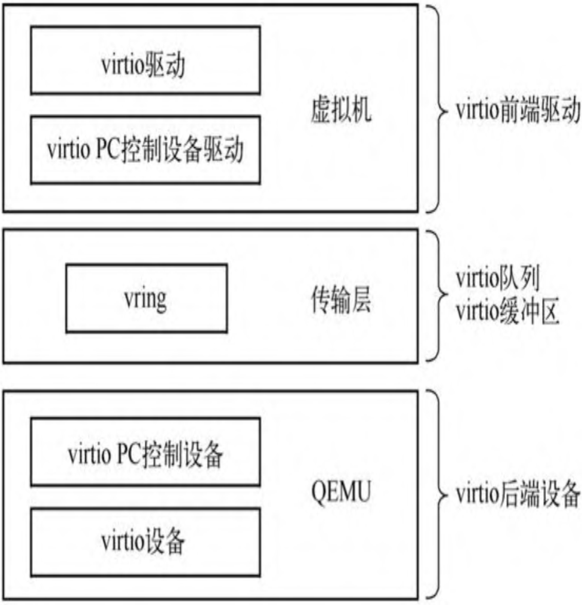
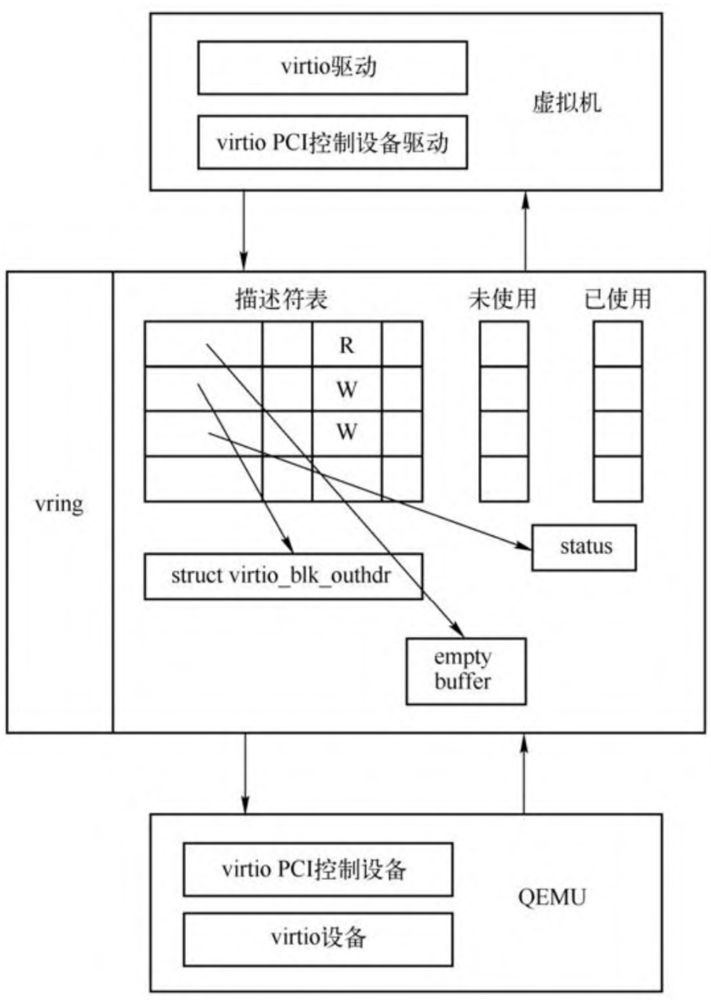
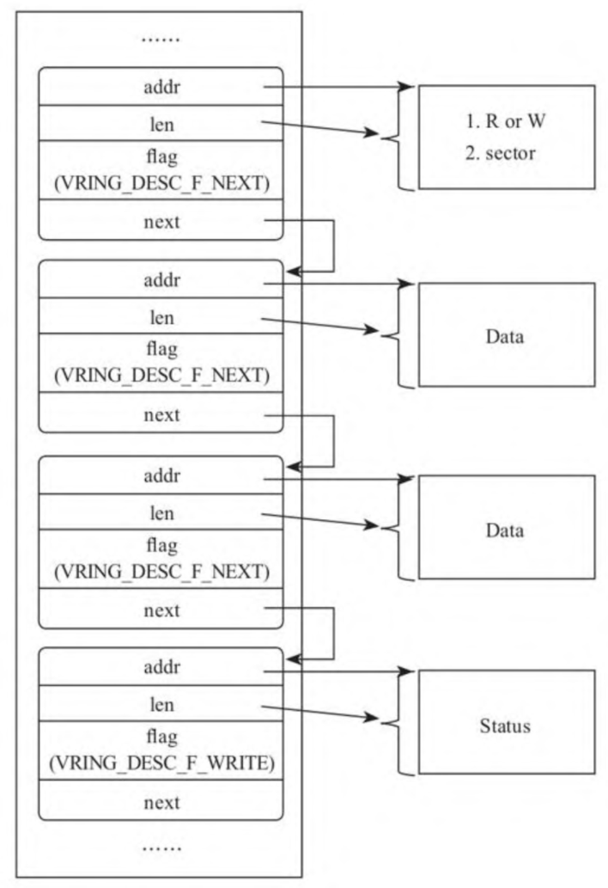
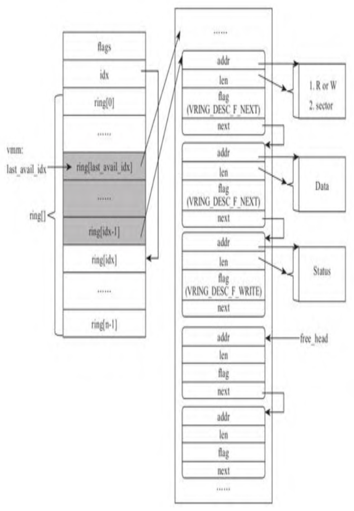
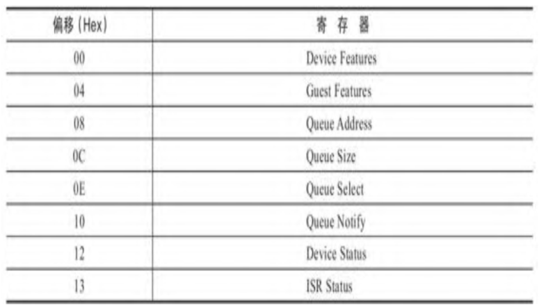

<!-- @import "[TOC]" {cmd="toc" depthFrom=1 depthTo=6 orderedList=false} -->

<!-- code_chunk_output -->

- [1. virtio 框架](#1-virtio-框架)
  - [1.1. 前端驱动](#11-前端驱动)
  - [1.2. 后端设备](#12-后端设备)
  - [1.3. virtqueue](#13-virtqueue)
- [2. virtqueue](#2-virtqueue)
  - [2.1. vq 组成](#21-vq-组成)
- [3. 描述符表](#3-描述符表)
- [4. 可用描述符区域](#4-可用描述符区域)
- [5. 已用描述符区域](#5-已用描述符区域)
- [6. Virtio 设备的 PCI 配置空间](#6-virtio-设备的-pci-配置空间)

<!-- /code_chunk_output -->

最初, 广泛使用的 Virtio 协议版本是 0.9.5. 在 Virtio 1.0 之后, Virtio 将设备的配置部分做了些微调, 但是 Virtio 的**核心部分保持一致**. 比如 PCI 接口的 Virtio, 将**原来**放在**第 1 个 I/O 区域**内的**配置拆分**成**几个部分**, **每一部分**使用**一个 capability** 表示, 包括 Common configuration、Notifications、ISR Status、Device-specific configuration 等, 使设备的配置更灵活、更易扩展.

# 1. virtio 框架

virtio 即是这样一种利用半虚拟化技术提供 I/O 性能的框架. virtio 框架如图.

virtio 是一种**前后端架构**, 包括**前端驱动**(`Front-End Driver`)和**后端设备**(`Back-End Device`)以及**自身定义的传输协议**. 通过传输协议, virtio 不仅可以用于 QEMU/KVM 方案, 也可以用于其他的虚拟化方案. 如虚拟机可以不必是 QEMU, 也可以是其他类型的虚拟机, 后端不一定要在 QEMU 中实现, 也可以在**内核中**实现(这实际上就是 **vhost** 方案, 后面会详细介绍). 接下来对这 3 个组件做简单介绍.

## 1.1. 前端驱动

前端驱动为虚拟机内部的virtio模拟设备对应的驱动, 每一种前端设备都需要有对应的驱动才能正常运行. 前端驱动的主要作用是接收用户态的请求, 然后按照传输协议将这些请求进行封装, 再写I/O端口, 发送一个通知到QEMU的后端设备.

## 1.2. 后端设备

后端设备则是在QEMU中, 用来接收前端驱动发过来的I/O请求, 然后从接收的数据中按照传输协议的格式进行解析, 对于网卡等需要实际物理设备交互的请求, 后端驱动会对物理设备进行操作, 从而完成请求, 并且会通过中断机制通知前端驱动.

## 1.3. virtqueue

virtio前端和后端驱动的数据传输通过 virtio 队列(virtio queue, virtqueue)完成, 一个设备会注册若干个 virtio 队列, 每个队列负责处理不同的数据传输, 有的是控制层面的队列, 有的是数据层面的队列. virtqueue 是通过 vring 实现的. vring 是虚拟机和 QEMU 之间共享的一段环形缓冲区.

当虚拟机需要发送请求到 QEMU 的时候就准备好数据, 将数据描述放到 vring 中, 写一个 I/O 端口, 然后 QEMU 就能够从 vring 中读取数据信息, 进而从内存中读出数据. QEMU 完成请求之后, 也将数据结构存放在 vring 中, 前端驱动也就可以从 vring 中得到数据.

vring 的基本原理如图所示.

# 2. virtqueue

Virtio 的核心数据结构是 **Virtqueue**, 其是 **Guest 内核中的驱动**和 **VMM 中的模拟设备**之间**传输数据**的**载体**.

后续如无特别指出, "**Guest 内核中的驱动**"将简称为**驱动**, "**VMM中的模拟设备**"将简称为**设备**.

**一个设备**可以只有一个 Virtqueue, 也可以有**多个 Virtqueue**. 比如对于**网络设备**而言, 可以有一个**用于控制的 Virtqueue**, 然后分别有**一个或多个**用于**发送和接收**的 Virtqueue. 所以, **很多变量**、**状态**都是 **per queue** 的.

## 2.1. vq 组成

Virtqueue 主要包含**三部分**: **描述符表**(`Descriptor Table`)、**可用描述符区域**(`Available Ring`)、**已用描述符区域**(`Used Ring`).

* **描述符表**(`Descriptor Table`), 用来表述 I/O 请求的传输数据信息, 包括地址、长度等信息;

* **可使用的 vring**(`Available Vring`), 这是**前端驱动设置**的表示后端设备可用的**描述符表中**的**索引**;

* **已经使用的 vring**(`Used Vring`)是**后端设备**在使用完**描述符表**后设置的**索引**, 这样前端驱动可以知道哪些描述符已经被用了.

Virtio 1.0 **之前**的标准要求这三部分**在一块连续的物理内存**上, Virtio 1.0 **之后**就没有这个规定了, 只要求这三部分**各自的物理内存连续**即可.

# 3. 描述符表

> 描述符表中每一项都由驱动侧添加, 也由驱动侧移除.

**描述符表**是 Virtqueue 的核心, 由一系列的**描述符组成**. **每一个描述符**指向**一块内存**

* 如果这块内存存放的是**驱动写给设备**的数据, 我们将这个描述符称为 **out** 类型的;

* 如果是**驱动从设备读取**的数据, 我们称这个描述符为 **in** 类型的.

在前面 I/O 栈部分探讨驱动时, 我们看到, 无论是读还是写, 都是**驱动侧**负责**管理存储区**, 同样的道理, **Virtqueue 的管理**也是由 **Guest** 内核中的**驱动**负责, 它会管理这些内存的分配和回收. 即使是 in 类型的内存块, 也是由驱动为设备分配的, 设备仅仅是向其中写入驱动需要的数据, 驱动读取数据后自行回收资源.

**描述符**包括如下几个字段:

1) addr. 字段 addr 指向存储数据的**内存块的起始地址**, 为了让模拟设备理解这个地址, Guest 填充这个地址时, 需要将 GVA 转换为 **GPA**.

2) len. 对于 out、in 两个方向, 描述符中的字段 len 有不同意义.

* 对于 out 方向的, len 表示**驱动**在这个内存块中准备了可供设备读取的**数据量**.

* 对于 in 方向的, len 表示**驱动**为设备提供的**空白的存储区**的尺寸及设备至多可以向里面写入的**数据量**.

3) flag. 用来标识**描述符的属性**, 例如, 如果这个描述符**只允许**有 **in** 方向的数据, 即只承载设备向驱动传递的数据, 那么 flag 需要加上标识 `VRING_DESC_F_WRITE`. 除此之外, flag 还有一个重要的作用, 后面会进行介绍.

4) next. 驱动和设备的**一次数据交互**, 可能需要用**多个描述符**来表示, 多个描述符构成一个**描述符链**(`descriptor chain`). 那么当前描述符是否是描述链的最后一个, 后面是否还有描述符, 我们要根据 **flag** 字段来判别. 如果字段 flag 中有标识 `VRING_DESC_F_NEXT`, 则表示描述符中的字段 **next** 指向**下一个描述符**, 否则, 当前描述符就是描述符链的**最后一个描述符**.

驱动除了需要向设备提供 **I/O 命令**、**写入的起始扇区和数据**外, 还需要知道**设备的执行状态**. 因此,

* 描述符链既包含 **out 类型**的描述符, 承载驱动提供给设备的 **I/O 命令和数据**;

* 也包含 **in 类型**的描述符, 将**命令的执行状态**写在其中, 让**驱动**了解**设备处理 I/O 的状态**.

以**驱动向设备写数据**为例, **描述符链**包括:

* 一个 **header**, header 指向的内存块会记录 **I/O 命令写**及**起始的扇区号**, **不需要**记录写的**扇区总数**, 因为模拟设备会根据数据**描述符**中的**长度**计算.

* 接下来是 **I/O 数据**相关的**描述符**, 一个 **request** 中可能合并了**多个 I/O request**, 即使**单个 I/O request** 也可能包含**多个不连续的内存块**, 而**每个单独的内存块**都需要**一个描述符**描述, 所以数据相关的描述符可能有**多个**.

* 最后一个是**状态描述符**, 它记录设备 I/O 执行的状态, 比如 I/O 是否成功.

**描述符链**的组织如下图所示.

**一个描述符链**代表**一个请求**, 而在 **描述符表** 中可能存在**多个描述符链**.

# 4. 可用描述符区域

**驱动**准备好描述符后, 需要有个位置记录**哪些描述符可用**. 为此, Virtqueue 中就开辟了一块区域, 我们称其为**可用描述符区域**, 这个"可用"是**相对设备而言**的(**供设备使用**).

> **可用描述符区域** 由 **驱动侧添加**, 然后再由 **设备侧移除**.

* **数组 ring**: 可用描述符区域的**主体**是**一个数组 ring**, ring 中**每个元素**记录的是**描述符链**的第一个**描述符的 ID**, 这个 ID 是描述符在**描述符表**中的**索引**.

> 描述符表中可能存在多个描述符链, 每个 ring 元素是一个描述符链的索引.

* **驱动侧 idx**: **驱动**每次将 I/O request 转换为一个**可用描述符链**后, 就会向**数组 ring** 中追加**一个元素**, 因此, 在**驱动侧**需要知道数组 ring 中**下一个可用的位置**, 即未被设备消费的段之后的一个位置, 在**可用描述符区域**中定义了字段 **idx** 来记录这个位置.

* **设备侧 last_avail_idx**: 在 CPU 从 Guest 模式切换到 Host 模式后, **模拟设备**将**检查可用描述符区域**, 如果有可用的描述符, 就依次**进行消费**. 因此, 设备需要知道上次消费到哪里了. 为此, **设备侧**定义了一个变量 `last_avail_idx`, 记录**可以消费的起始位置**.

**最初**, 数组 ring 是**空的**, `last_avail_idx` 和 `idx` 都初始化为0, 即指向数组 ring 的**开头**. 随着时间的推移, 将形成如下图所示的常态, **数组 ring** 中位于 `last_avail_idx` 和 `idx-1` 之间的部分就是**未被设备处理**的, 我们将数组 ring 中的这部分称为**有效区域**.

有效区域是 `last_avail_idx` 到 `idx-1`, 其中 `last_avail_idx` 变量增加, `idx-1` 变量减少 从而遍历这个 **有效可用描述符区域**. 所以可以称 `idx-1` 是 head, 而 `last_avail_idx` 是 尾部.

# 5. 已用描述符区域

与可用描述符类似, **设备**也需要将**已经处理的描述符**记录起来, 反馈给**驱动**. 为此, Virtio 标准定义了另一个数据结构, 我们称其为**已用描述符区域**, 显然, 这个"已用"也是**相对驱动而言**的(**供驱动使用**).

> **已用描述符区域** 由 **设备侧添加**, 然后再由 **驱动侧移除**.

**数组 ring**: 已用描述符区域的主体也是**一个数组 ring**, 与可用描述符区域中的数组稍有不同, 已用描述区域数组中的**每个元素**除了记录设备已经处理的**描述符链头**的 **ID** 外, 因为设备可能还会向驱动写回数据, 比如驱动从设备读取数据、设备告知驱动写操作的状态等, 所以还需要有个位置能够记录**设备写回**的**数据长度**.

**设备侧 idx**: **设备**每处理一个**可用描述符数组** ring 中的**描述符链**, 都需要将其追加到**已用描述符数组** ring 中, 因此, 设备需要知道**已用描述符数组** ring 的下一个可用的位置, 这就是已用描述符区域中变量 idx 的作用.

**驱动侧 last_used_idx**: 同理, 在**驱动侧定义**了变量 `last_used_idx`, 指向当前驱动侧已经回收到的位置, 位于 `last_used_idx` 和 `idx-1` 之间的部分就是**需要回收**的, 我们称其为**有效已用描述符区域**, 如下图所示.

# 6. Virtio 设备的 PCI 配置空间

Virtio 设备可以支持**不同的总线接口**. 有些嵌入式设备**不支持 PCI 总线**, 而是使用 **MMIO** 的方式, 一些如 S390 的体系结构, 既不支持PCI 也不支持MMIO, 而是使用 `channel I/O`, Virito协议定义了对这些接口的支持.

因为 PCI 是最普遍的方式, 所以这里以 PCI 为例进行讨论. 基于 PCI 总线的 Virtio 设备有**特殊**的 **Vendor ID** 和 **Devcie ID**:

* Vendor ID 是 `0x1AF4`

* Device ID 的范围从 `0x1000` 到 `0x103F`

就像 PCI 设备都有自己的配置空间一样(配置空间就是一些支持 PCI 设备配置的寄存器集合), **Virtio 设备**也有一些自己**特殊的寄存器**, 包括一些**公共的寄存器**和与**具体设备类型相关的寄存器**. 公共的寄存器在前, 设备相关的紧跟其后, Virtio 标准约定使用**第 1 个 BAR** 指向的 **I/O 区域**放置这些寄存器.

**公共的寄存器**也称为 **Virtio header**, 包含如表所示的寄存器.

其中:

1) `Device Features` 寄存器是 **Virtio 设备填写**的, 用来**告诉驱动**, 当前**设备**可以**支持哪些特性**.

2) `Guest Features` 用来**告知设备**, **当前驱动**支持**哪些特性**. 通过 Device Features 和 Guest Features 这 2 个寄存器, Guest 和 Host 之间就可以进行协商, 做到**不同版本驱动和设备之间的兼容**.

3) `Device Status` 表示**设备的状态**, 比如 Guest 是否已经正确地驱动了设备等.

4) `ISR Status` 是中断相关的.

5) `Queue Address` 表示 **Virtqueue** 所在的**地址**, 这个地址由**驱动分配**, 并**告知设备**.

6) `Queue Size` 表示 **Virtqueue** 的描述符表中**描述符的个数**, **设备端**初始化队列时会**设置**.

7) 因为一个 Virtio 设备可能有多个 Virtqueue, 当**某个操作**是针对某个 Virtqueue 时, **驱动**首先要指定针对**哪个 Virtqueue**, 这就是 `Queue Select` 寄存器的作用.

8) 在某个 **Virtqueue 准备**好后, **驱动**需要**通知设备**进行消费, Virtio 标准采用的方式就是**对某个约定地址进行 I/O**, 触发 CPU 从 **Guest** 切换到 **Host**, 这个约定的 I/O 地址就是 **Queue Notify 寄存器**.

