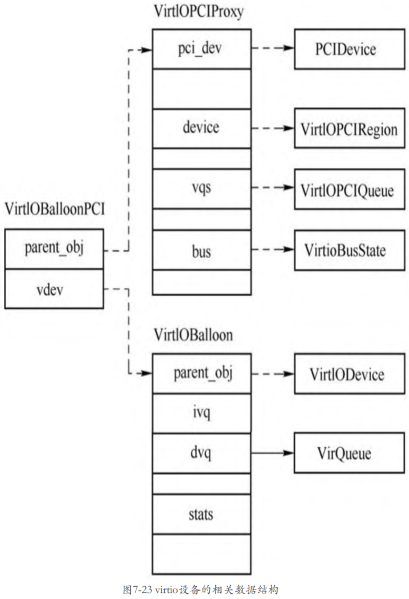

virtio 设备首先需要创建一个 **PCI 设备**, 叫作 **virtio PCI 代理设备**, 这个**代理设备**挂到 **PCI 总线**上, 接着 virtio 代理设备再**创建一条 virtio 总线**, 这样真正的 **virtio 设备**就可以挂到这条总线上了.

> 一层一层: PCI 总线 -> virtio PCI 代理设备 -> virtio 总线 -> 真正的 virtio PCI 设备
> 举例来讲: virtio_balloon 设备
> `VirtIOPCIProxy`(virtio balloon PCI 代理设备的抽象父类) -> `VirtIOBalloonPCI`(virtio balloon PCI 代理设备) -> `VirtIOBalloon`(virtio balloon PCI 设备)

# virtio PCI 代理设备父类

首先看 **virtio PCI 代理设备**类型的定义.

```cpp
// hw/virtio/virtio-pci.c
static const TypeInfo virtio_pci_info = {
    .name          = TYPE_VIRTIO_PCI,
    .parent        = TYPE_PCI_DEVICE,
    // 当前实例
    .instance_size = sizeof(VirtIOPCIProxy),
    .class_init    = virtio_pci_class_init,
    .class_size    = sizeof(VirtioPCIClass),
    .abstract      = true,
};
```

**virtio PCI 代理设备**的

* **父设备**是**一个 PCI 设备**;

* 类型为 **VirtioPCIClass**;

* 实例为 **VirtIOPCIProxy**

注意这是一个**抽象设备**, 所以并**不能创建其实例**, 只能由**其子类去创建**. QEMU 中定义了**所有 virtio 设备的 PCI 代理设备**, 如 virtio balloon PCI 设备、virtio scsi PCI 设备、virito crypto PCI 设备, 其定义分别如下所示.

# virtio PCI 代理设备

```cpp
// hw/virtio/virtio-pci.c
static const TypeInfo virtio_balloon_pci_info = {
    .name          = TYPE_VIRTIO_BALLOON_PCI,
    .parent        = TYPE_VIRTIO_PCI,
    // 当前实例
    .instance_size = sizeof(VirtIOBalloonPCI),
    .instance_init = virtio_balloon_pci_instance_init,
    .class_init    = virtio_balloon_pci_class_init,
};

static const TypeInfo virtio_scsi_pci_info = {
    .name          = TYPE_VIRTIO_SCSI_PCI,
    .parent        = TYPE_VIRTIO_PCI,
    // 当前实例
    .instance_size = sizeof(VirtIOSCSIPCI),
    .instance_init = virtio_scsi_pci_instance_init,
    .class_init    = virtio_scsi_pci_class_init,
};

static const TypeInfo virtio_blk_pci_info = {
    .name          = TYPE_VIRTIO_BLK_PCI,
    .parent        = TYPE_VIRTIO_PCI,
    // 当前实例
    .instance_size = sizeof(VirtIOBlkPCI),
    .instance_init = virtio_blk_pci_instance_init,
    .class_init    = virtio_blk_pci_class_init,
};

// hw/virtio/virtio-crypto-pci.c
static const TypeInfo virtio_crypto_pci_info = {
    .name          = TYPE_VIRTIO_CRYPTO_PCI,
    .parent        = TYPE_VIRTIO_PCI,
    // 当前实例
    .instance_size = sizeof(VirtIOCryptoPCI),
    .instance_init = virtio_crypto_initfn,
    .class_init    = virtio_crypto_pci_class_init,
};
```

virtio 设备在系统的设备树中的位置如图:


# virtio PCI 设备

**所有的 virtio 设备**都有一个**共同的父类** `TYPE_VIRTIO_DEVICE`, 如 virtio balloon 设备的定义如下.

```cpp
// hw/virtio/virtio-balloon.c
static const TypeInfo virtio_balloon_info = {
    .name = TYPE_VIRTIO_BALLOON,
    .parent = TYPE_VIRTIO_DEVICE,
    // 当前实例
    .instance_size = sizeof(VirtIOBalloon),
    .instance_init = virtio_balloon_instance_init,
    .class_init = virtio_balloon_class_init,
};
```

virtio balloon 设备的实例对象为 `VirtIOBalloon`. 具体的virtio
设备、virtio PCI代理设备、virtio公共设备的关系如图所示.



上图显示了 virtio balloon 设备对应的几个数据结构, `VirtIOBalloonPCI` 是 **virtio balloon PCI 代理设备**的**实例对象**, 其**包括两个部分**：

* 一个是 **VirtIOPCIProxy**, 这个是 **virtio PCI 代理设备**的**通用结构**, 里面存放了具体 virtio PCI 代理设备的相关成员；

* 另一个是 **VirtIOBalloon**, 这个结构里面存放的是 virtio balloon 设备的相关数据, 其第一个成员是 **VirtIODevice**, 也就是 virtio 公共设备的实例对象, VirtIOBalloon 剩下的成员是与 virtio balloon 设备相关的数据.

# virtio 设备初始化

这里以 virtio balloon 设备为例分析 virtio 设备的初始化过程.

创建 virtio balloon 时**只需要**创建其 **virtio balloon PCI 代理设备**(即 `TYPE_VIRTIO_BALLOON_PCI`)即可, 在命令行指定 `-device virtioballoon-pci`, 先来看实例化函数.

```cpp
// hw/virtio/virtio-pci.c
static void virtio_balloon_pci_instance_init(Object *obj)
{
    // virtio balloon PCI 代理设备
    VirtIOBalloonPCI *dev = VIRTIO_BALLOON_PCI(obj);

    virtio_instance_init_common(obj, &dev->vdev, sizeof(dev->vdev),
                                TYPE_VIRTIO_BALLOON);
    ......
}

// hw/virtio/virtio.c
void virtio_instance_init_common(Object *proxy_obj, void *data,
                                 size_t vdev_size, const char *vdev_name)
{
    DeviceState *vdev = data;
    // 初始化 TYPE_VIRTIO_BALLOON 实例
    object_initialize(vdev, vdev_size, vdev_name);
    // proxy_obj 是 virtio balloon PCI 代理设备
    // 
    object_property_add_child(proxy_obj, "virtio-backend", OBJECT(vdev), NULL);
    object_unref(OBJECT(vdev));
    qdev_alias_all_properties(vdev, proxy_obj);
}
```

`TYPE_VIRTIO_BALLOON_PCI` 的实例化函数是 `virtio_balloon_pci_instance_init`, 在该函数中会调用 `virtio_instance_init_common`, 并将 VirtIOBalloonPCI 结构体的 vdev 成员地址以及 `TYPE_VIRTIO_BALLOON` 作为参数传递给该函数. `virtio_instance_init_common` 函数会调用 `object_initialize` 初始化 `TYPE_VIRTIO_BALLOON` 的实例对象 VirtIOBalloon, 然后添加一些属性. 由此可见, virtio 设备在实例创建过程中并没有做很多事情, 大部分的工作是在设备的具现化过程中做的.

