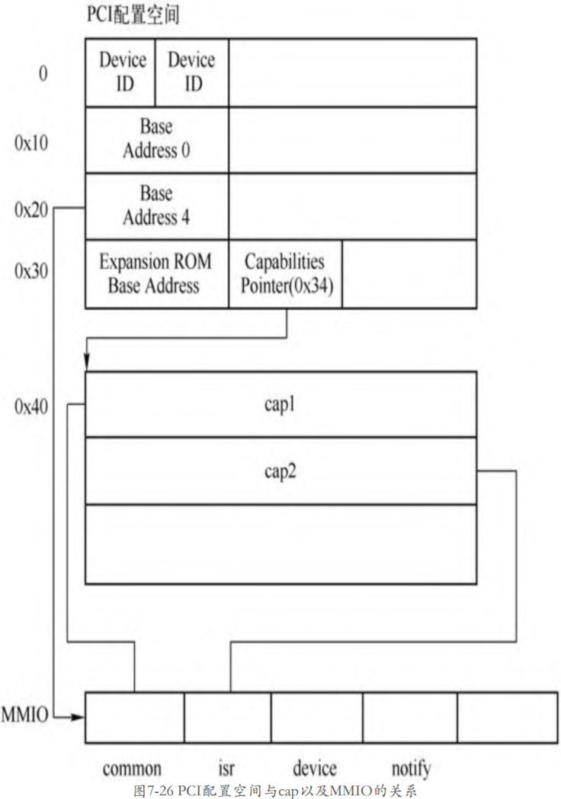
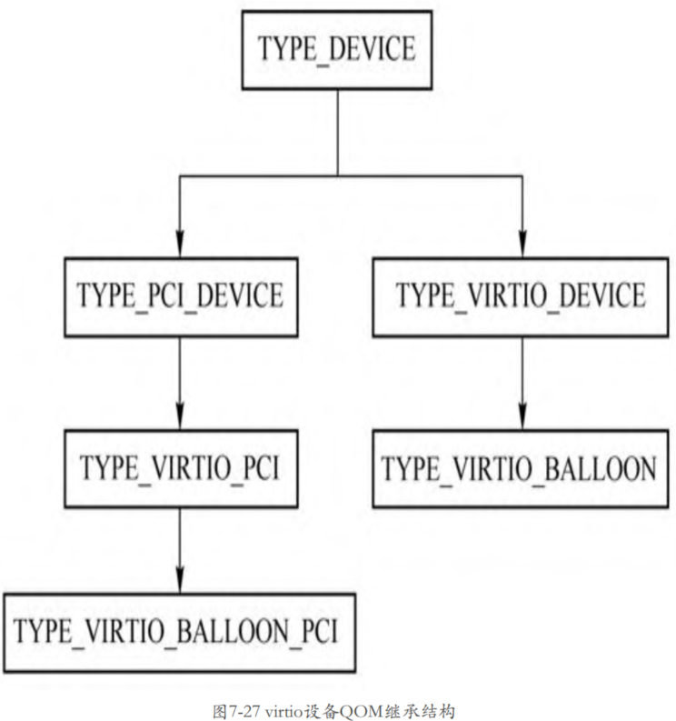
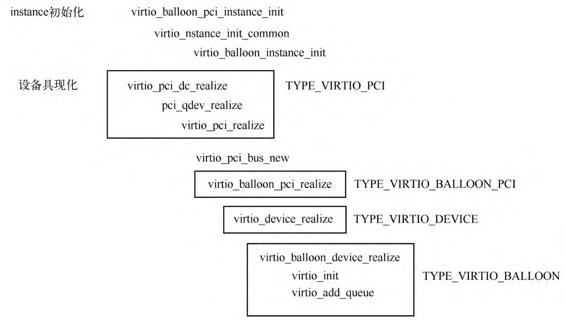

# 相关设备结构

virtio 设备首先需要创建一个 **PCI 设备**, 叫作 **virtio PCI 代理设备**, 这个**代理设备**挂到 **PCI 总线**上, 接着 virtio 代理设备再**创建一条 virtio 总线**, 这样真正的 **virtio 设备**就可以挂到这条总线上了.

> 一层一层: PCI 总线 -> virtio PCI 代理设备 -> virtio 总线 -> 真正的 virtio PCI 设备
>
> 举例来讲: virtio_balloon 设备
>
> `VirtIOPCIProxy`(virtio balloon PCI 代理设备的抽象父类) -> `VirtIOBalloonPCI`(virtio balloon PCI 代理设备) -> `VirtIOBalloon`(virtio balloon PCI 设备)

## virtio PCI 代理设备父类

> **virtio PCI 代理设备**的**通用结构**, 没有实例对象

首先看 **virtio PCI 代理设备**类型的定义.

```cpp
// hw/virtio/virtio-pci.c
static const TypeInfo virtio_pci_info = {
    .name          = TYPE_VIRTIO_PCI,
    // 父类, PCI Device
    .parent        = TYPE_PCI_DEVICE,
    // 当前实例
    .instance_size = sizeof(VirtIOPCIProxy),
    .class_init    = virtio_pci_class_init,
    // 类型
    .class_size    = sizeof(VirtioPCIClass),
    .abstract      = true,
};
```

**virtio PCI 代理设备**的:

* **父设备**是**一个 PCI 设备**;

* 类型为 **VirtioPCIClass**;

* 实例为 **VirtIOPCIProxy**

注意这是一个**抽象设备**, 所以并**不能创建其实例**, 只能由**其子类去创建**. QEMU 中定义了**所有 virtio 设备的 PCI 代理设备**, 如 virtio balloon PCI 设备、virtio scsi PCI 设备、virito crypto PCI 设备, 其定义分别如下所示.

## virtio PCI 代理设备子类

>

```cpp
// hw/virtio/virtio-pci.c
static const TypeInfo virtio_balloon_pci_info = {
    .name          = TYPE_VIRTIO_BALLOON_PCI,
    .parent        = TYPE_VIRTIO_PCI,
    // 当前实例
    .instance_size = sizeof(VirtIOBalloonPCI),
    .instance_init = virtio_balloon_pci_instance_init,
    .class_init    = virtio_balloon_pci_class_init,
};

static const TypeInfo virtio_scsi_pci_info = {
    .name          = TYPE_VIRTIO_SCSI_PCI,
    .parent        = TYPE_VIRTIO_PCI,
    // 当前实例
    .instance_size = sizeof(VirtIOSCSIPCI),
    .instance_init = virtio_scsi_pci_instance_init,
    .class_init    = virtio_scsi_pci_class_init,
};

static const TypeInfo virtio_blk_pci_info = {
    .name          = TYPE_VIRTIO_BLK_PCI,
    .parent        = TYPE_VIRTIO_PCI,
    // 当前实例
    .instance_size = sizeof(VirtIOBlkPCI),
    .instance_init = virtio_blk_pci_instance_init,
    .class_init    = virtio_blk_pci_class_init,
};

// hw/virtio/virtio-crypto-pci.c
static const TypeInfo virtio_crypto_pci_info = {
    .name          = TYPE_VIRTIO_CRYPTO_PCI,
    // 父类是 Virtio PCI
    .parent        = TYPE_VIRTIO_PCI,
    // 当前实例
    .instance_size = sizeof(VirtIOCryptoPCI),
    .instance_init = virtio_crypto_initfn,
    .class_init    = virtio_crypto_pci_class_init,
};
```

virtio 设备在系统的设备树中的位置如图:


## virtio PCI 设备父类

> **virtio PCI 公共设备**的**实例对象**

**所有的 virtio 设备**都有一个**共同的父类** `TYPE_VIRTIO_DEVICE`.

```cpp
// hw/virtio/virtio.c
static const TypeInfo virtio_device_info = {
    .name = TYPE_VIRTIO_DEVICE,
    // 父类是 device
    .parent = TYPE_DEVICE,
    .instance_size = sizeof(VirtIODevice),
    .class_init = virtio_device_class_init,
    .instance_finalize = virtio_device_instance_finalize,
    .abstract = true,
    .class_size = sizeof(VirtioDeviceClass),
};
```

## virtio PCI 设备

> 具体的 virtio pci 设备

如 virtio balloon 设备的定义如下.

```cpp
// hw/virtio/virtio-balloon.c
static const TypeInfo virtio_balloon_info = {
    .name = TYPE_VIRTIO_BALLOON,
    // 父类, Virtio Device
    .parent = TYPE_VIRTIO_DEVICE,
    // 当前实例
    .instance_size = sizeof(VirtIOBalloon),
    .instance_init = virtio_balloon_instance_init,
    .class_init = virtio_balloon_class_init,
};
```

virtio balloon 设备的实例对象为 `VirtIOBalloon`.

## 四者的关系

具体的 **virtio PCI 设备**、**virtio PCI 代理设备**、**virtio PCI 公共设备**的关系如图所示.


> 看起来是以 virtio PCI 代理设备子类为核心

以 virtio balloon 设备为例:

* `VirtIOBalloonPCI` 是 **virtio balloon PCI 代理设备**的**实例对象**, 其**包括两个部分**:

  * 一个是 **VirtIOPCIProxy**(virtio PCI 代理设备父类), 这个是 **virtio PCI 代理设备**的**通用结构**, 里面存放了具体 virtio PCI 代理设备的相关成员;

  * 另一个是 **VirtIOBalloon**(virtio balloon PCI 设备), 这个结构里面存放的是 **virtio balloon 设备**的相关数据, 其:

    * 第一个成员是 **VirtIODevice**, 也就是 **virtio PCI 公共设备的实例对象**;

    * VirtIOBalloon 剩下的成员是**与 virtio balloon 设备相关的数据**.

# virtio 设备初始化

这里以 virtio balloon 设备为例分析 virtio 设备的初始化过程.

## virtio PCI 代理设备子类实例化

创建 virtio balloon 时**只需要**创建其 **virtio balloon PCI 代理设备**(即 `TYPE_VIRTIO_BALLOON_PCI`)即可, 在命令行指定 `-device virtio-balloon-pci,id=balloon0,bus=pci.0,addr=0x4`, 先来看实例化函数.

> qemu 命令行指定的是 virtio-balloon-pci, 即 virtio balloon PCI 代理设备
>
> 所以符合前面说的 以 virtio PCI 代理设备子类为核心, 初始化也是从 virtio PCI 代理设备子类开始?

`TYPE_VIRTIO_BALLOON_PCI`(**virtio balloon PCI 代理设备子类**) 的实例化函数 `instance_init` 是 `virtio_balloon_pci_instance_init`

```cpp
// hw/virtio/virtio-pci.c
static void virtio_balloon_pci_instance_init(Object *obj)
{
    // virtio balloon PCI 代理设备
    VirtIOBalloonPCI *dev = VIRTIO_BALLOON_PCI(obj);

    virtio_instance_init_common(obj, &dev->vdev, sizeof(dev->vdev),
                                TYPE_VIRTIO_BALLOON);
    ......
}
```

```cpp
// hw/virtio/virtio.c
void virtio_instance_init_common(Object *proxy_obj, void *data,
                                 size_t vdev_size, const char *vdev_name)
{
    // VirtIOBalloonPCI->vdev, 对应具体的 Virtio Balloon PCI 设备(即子类)
    DeviceState *vdev = data;
    // 初始化 TYPE_VIRTIO_BALLOON 实例, virtio PCI 设备
    object_initialize(vdev, vdev_size, vdev_name);
    // proxy_obj 是 virtio balloon PCI 代理设备
    // OBJECT(vdev) 是 virtio PCI 设备
    // 添加属性
    object_property_add_child(proxy_obj, "virtio-backend", OBJECT(vdev), NULL);
    object_unref(OBJECT(vdev));
    qdev_alias_all_properties(vdev, proxy_obj);
}
```

调用 `object_initialize` 初始化 `TYPE_VIRTIO_BALLOON`(virtio balloon PCI 设备, "`virtio-balloon-device`") 的实例对象 **VirtIOBalloon**, 然后添加一些属性.

```cpp
// data: 对应具体的 Virtio Balloon PCI 设备(即子类 VirtIOBalloon)
// typename: "virtio-balloon-device"
void object_initialize(void *data, size_t size, const char *typename)
{
    // 获取到的对应 TypeInfo virtio_balloon_info
    TypeImpl *type = type_get_by_name(typename);
    ...
    object_initialize_with_type(data, size, type);
}

static void object_initialize_with_type(Object *obj, size_t size, TypeImpl *type)
{
    //
    type_initialize(type);
    ......
    // 先调用父类的 instance_init, 再调用自己的
    object_init_with_type(obj, type);
    // 先调用自己的 instance_post_init, 再调用父类的
    object_post_init_with_type(obj, type);
}
```

由此可见, virtio PCI 代理设备子类在**实例创建过程**中并没有做很多事情, 大部分的工作是在**设备的具现化过程中**做的.

## realize 函数设置

在介绍 virtio balloon 设备的**具现化之前**, 先来回顾一下设备具现化调用的函数.

**virtio 设备类**的**继承链关系**为 `DeviceClass -> PCIDeviceClass -> VirtioPCIClass`.

QEMU 在 **main** 函数中会对**所有** `-device` 的**参数**进行**具现化**.

**设备的具现化函数**都会调用 `device_set_realized` 函数, 在该函数中会调用 DeviceClass(**设备类**)的 **realize** 函数.

> `hw/core/qdev.c` 中定义了 device 类, 是**所有设备的父类**. 该 class 初始化(`device_class_init`)时候定义了 "realized" 的属性:
>
> * `device_get_realized`, 获取 realized 函数
>
> * `device_set_realized`, 用来设置 realized 属性

### DeviceClass 类设置

上面 `object_initialize()` 会调用 **类型初始化函数** `type_initialize()`, 函数会先递归调用**父设备类型**的 `class_init()`, 最后调用**自身类型**的 `class_init()`.

```cpp
TypeImpl *ti; //
ti->class_init(ti->class, ti->class_data);
```

其中:

* class 属性是在 `type_initialize()` 中设置的

* `class_data` 对应 TypeInfo 的 class_data

> DeviceClass 类初始化(`device_class_init`)时候并没有设置 `DeviceClass->realize` 函数.

**最开始**调用的应该是 **DeviceClass** 的 **realize** 函数, 这个默认没有函数.

### PCIDeviceClass 类重写

> **virtio 设备类**的**继承链关系**为 `DeviceClass -> PCIDeviceClass -> VirtioPCIClass`.

当然, 如果**继承**自 **DeviceClass** 的类可以**重写**这个函数, 如 **PCIDeviceClass** 类就在其类初始化函数 `pci_device_class_init` 中设置.

> 后面**继承** PCIDeviceClass 的类可以在**自己的类初始化函数**中设置 **realize** 函数.

```cpp
// hw/pci/pci.c
static const TypeInfo pci_device_type_info = {
    .name = TYPE_PCI_DEVICE,
    .parent = TYPE_DEVICE,
    .instance_size = sizeof(PCIDevice),
    .abstract = true,
    .class_size = sizeof(PCIDeviceClass),
    .class_init = pci_device_class_init,
    .class_base_init = pci_device_class_base_init,
};

static void pci_device_class_init(ObjectClass *klass, void *data)
{
    // DeviceClass
    DeviceClass *k = DEVICE_CLASS(klass);
    // 重写 DeviceClass 的 realize 设置
    k->realize = pci_qdev_realize;
    k->unrealize = pci_qdev_unrealize;
    k->bus_type = TYPE_PCI_BUS;
    device_class_set_props(k, pci_props);
}
```

* 将 `DeviceClass->realize` 重写为 `pci_qdev_realize`

* 现有代码其实并没有设置 **PCIDeviceClass** 的 realize 方法.

在 **VirtioPCIClass** 类还**没有初始化**时的 realize 函数, 如下图所示.


> 图中 `PCIDeviceClass->realize` 其实并没有

### VirtioPCIClass 类重写

> virtio PCI 代理设备父类

VirtioPCIClass 的初始化函数, 该类相关的定义是在**所有 virtio PCI 代理设备**的**父设备** `TYPE_VIRTIO_PCI`(**virtio PCI 代理设备父类**) 中进行的, 其中的**类初始化函数**是 `virtio_pci_class_init`.

`virtio_pci_class_init` 的函数定义如下.

```cpp
// hw/virtio/virtio-pci.c
static void virtio_pci_class_init(ObjectClass *klass, void *data)
{
    // DeviceClass, 设备类
    DeviceClass *dc = DEVICE_CLASS(klass);
    // PCIDeviceClass, PCI 设备类
    PCIDeviceClass *k = PCI_DEVICE_CLASS(klass);
    // VirtioPCIClass, virtio PCI 代理设备父类
    VirtioPCIClass *vpciklass = VIRTIO_PCI_CLASS(klass);

    dc->props = virtio_pci_properties;
    // 第一, PCIDeviceClass
    k->realize = virtio_pci_realize;
    k->exit = virtio_pci_exit;
    k->vendor_id = PCI_VENDOR_ID_REDHAT_QUMRANET;
    k->revision = VIRTIO_PCI_ABI_VERSION;
    k->class_id = PCI_CLASS_OTHERS;
    // pci_qdev_realize
    // 第二, VirtioPCIClass
    vpciklass->parent_dc_realize = dc->realize;
    // 第三, DeviceClass
    dc->realize = virtio_pci_dc_realize;
    dc->ret = virtio_pci_reset;
}
```

第一. PCIDeviceClass(**PCI 设备类**). 把 `PCIDeviceClass->realize` 函数替换成了自己的 `virtio_pci_realize` 函数;

第二. VirtioPCIClass(**virtio PCI 代理设备父类**). 将 `vpciklass->parent_dc_realize` 设置成了 `dc->realize`, 这个值是 `pci_qdev_realize`;

第三. DeviceClass(**设备类**). 将 `dc->realize` 设置成了 `virtio_pci_dc_realize`.

通常来说**父类**的 **realize** 函数会调用**子类**的 **realize** 函数, 如 `DeviceClass->realize`(`pci_qdev_realize`)会调用 `PCIDeviceClass->realize` 回调, `PCIDeviceClass->realize` 回调可以调用**子类型**的 **realize** 函数. 但是这两条语句改变了这个顺序. 这里 `dc->realize` 成了 `virtio_pci_dc_realize`, 所以这个函数会**最先执行**, 然后将**原来**的 `dc->realize`(`pci_qdev_realize`) 保存到 `VirtioPCIClass->parent_dc_realize` 函数中. 通常在设备具现化过程中**子类型**的 realize 函数需要先做某些事情的时候会使用这种方法.

### virtio PCI 代理设备子类重写

> virtio PCI 代理设备子类, VirtIOBalloonPCI

回到 virtio balloon PCI 代理设备子类类型的初始化函数 `virtio_balloon_pci_class_init`.

```cpp
//
static void virtio_balloon_pci_class_init(ObjectClass *klass, void *data)
{
    // DeviceClass
    DeviceClass *dc = DEVICE_CLASS(klass);
    // VirtioPCIClass
    VirtioPCIClass *k = VIRTIO_PCI_CLASS(klass);
    // PCIDeviceClass
    PCIDeviceClass *pcidev_k = PCI_DEVICE_CLASS(klass);
    // VirtioPCIClass 的
    k->realize = virtio_balloon_pci_realize;
    ......
}
```

其设置了 `VirtioPCIClass->realize` 函数为 `virtio_balloon_pci_realize`

综上所述, **virtio balloon** 相关类涉及的 realize 函数如图所示.


## 设备具现化

### 调用栈

**设置 virtio PCI 代理设备**的 `realized` 属性时, 会调用 **DeviceClass** 的 `device_set_realized` 函数:

* 首先调用 **DeviceClass**(**Device 类**) 的 `realize`, 也就是这里的 `virtio_pci_dc_realize`;

* `virtio_pci_dc_realize` 函数中会调用 `VirtioPCIClass->parent_dc_realize` 函数, 也就是这里的 `pci_qdev_realize`;

* 在 `pci_qdev_realize` 会调用 **PCIDeviceClass**(**PCI Device 类**) 的 realize 函数, 也就是这里的 `virtio_pci_realize`.

* 在这个函数的最后会调用 **VirtioPCIClass**(**Virtio PCI 类**) 的 realize 函数, 也就是这里的 `virtio_balloon_pci_realize`.

### DeviceClass->realize

所以当**具现化** `TYPE_VIRTIO_BALLOON` 的时候, 首先会调用 `virtio_pci_dc_realize`, 该函数代码如下.

```cpp
// hw/virtio/virtio-pci.c
static void virtio_pci_dc_realize(DeviceState *qdev, Error **errp)
{
    VirtioPCIClass *vpciklass = VIRTIO_PCI_GET_CLASS(qdev);
    VirtIOPCIProxy *proxy = VIRTIO_PCI(qdev);
    PCIDevice *pci_dev = &proxy->pci_dev;
    // 第一, PCIe 接口
    if (!(proxy->flags & VIRTIO_PCI_FLAG_DISABLE_PCIE) &&
        virtio_pci_modern(proxy)) {
        pci_dev->cap_present |= QEMU_PCI_CAP_EXPRESS;
    }
    // 第二
    vpciklass->parent_dc_realize(qdev, errp);
}
```

第一. 判断了 **virtio PCI 代理设备**是否具有 `VIRTIO_PCI_FLAG_DISABLE_PCIE` 特性, 它使得 **virtioPCI 代理**展现出 **PCIe 的接口**.

第二. 特性之后将调用 `parent_dc_realize` 函数, 即 `pci_qdev_realize`.

`pci_qdev_realize` 已经在之前 PCI 设备模拟中分析了, 该函数会将 **virtioPCI 代理设备**注册到 **PCI 总线**上, 并调用 `PCIDeviceClass->realize`, 也就是 `virtio_pci_realize` 函数.

`virtio_pci_realize` 函数初始化 **virtio PCI 代理设备**, 也就是**结构体 VirtIOPCIProxy**.

```cpp
// 
static void virtio_pci_realize(PCIDevice *pci_dev, Error **errp)
{
    VirtIOPCIProxy *proxy = VIRTIO_PCI(pci_dev);
    VirtioPCIClass *k = VIRTIO_PCI_GET_CLASS(pci_dev);
    bool pcie_port = pci_bus_is_express(pci_get_bus(pci_dev)) &&
                     !pci_bus_is_root(pci_get_bus(pci_dev));

    ......
    /*
     * virtio pci bar layout used by default.
     * subclasses can re-arrange things if needed.
     *
     *   region 0   --  virtio legacy io bar
     *   region 1   --  msi-x bar
     *   region 2   --  virtio modern io bar (off by default)
     *   region 4+5 --  virtio modern memory (64bit) bar
     *
     */
    // 第一, 多个 BAR
    proxy->legacy_io_bar_idx  = 0;
    proxy->msix_bar_idx       = 1;
    proxy->modern_io_bar_idx  = 2;
    proxy->modern_mem_bar_idx = 4;
    // 第二, 多个 capability
    // CommonCfg
    proxy->common.offset = 0x0;
    proxy->common.size = 0x1000;
    proxy->common.type = VIRTIO_PCI_CAP_COMMON_CFG;
    // ISR
    proxy->isr.offset = 0x1000;
    proxy->isr.size = 0x1000;
    proxy->isr.type = VIRTIO_PCI_CAP_ISR_CFG;
    // DeviceCfg
    proxy->device.offset = 0x2000;
    proxy->device.size = 0x1000;
    proxy->device.type = VIRTIO_PCI_CAP_DEVICE_CFG;
    // Notify
    proxy->notify.offset = 0x3000;
    proxy->notify.size = virtio_pci_queue_mem_mult(proxy) * VIRTIO_QUEUE_MAX;
    proxy->notify.type = VIRTIO_PCI_CAP_NOTIFY_CFG;

    proxy->notify_pio.offset = 0x0;
    proxy->notify_pio.size = 0x4;
    proxy->notify_pio.type = VIRTIO_PCI_CAP_NOTIFY_CFG;

    /* subclasses can enforce modern, so do this unconditionally */
    // 第三
    memory_region_init(&proxy->modern_bar, OBJECT(proxy), "virtio-pci",
                        /* PCI BAR regions must be powers of 2 */
                        pow2ceil(proxy->notify.offset + proxy->notify.size));

    memory_region_init_alias(&proxy->modern_cfg,
                            OBJECT(proxy),
                            "virtio-pci-cfg",
                            &proxy->modern_bar,
                            0,
                            memory_region_size(&proxy->modern_bar));

    address_space_init(&proxy->modern_as, &proxy->modern_cfg, "virtio-pci-cfg-as");

    if (proxy->disable_legacy == ON_OFF_AUTO_AUTO) {
        proxy->disable_legacy = pcie_port ? ON_OFF_AUTO_ON : ON_OFF_AUTO_OFF;
    }

    ......

    if (pcie_port && pci_is_express(pci_dev)) {
        ......
    } else {
        /*
         * make future invocations of pci_is_express() return false
         * and pci_config_size() return PCI_CONFIG_SPACE_SIZE.
         */
        pci_dev->cap_present &= ~QEMU_PCI_CAP_EXPRESS;
    }
    // 第四
    virtio_pci_bus_new(&proxy->bus, sizeof(proxy->bus), proxy);
    // 第五
    if (k->realize) {
        k->realize(proxy, errp);
    }
}
```

第一. 初始化 VirtIOPCIProxy 设备的**多个 BAR 数据**, 设置了这些 BAR 的**索引号**, 其中 `legacy I/O` 地址为 0, `msi-x` 地址为 1, `modern IO` 地址为 2, `modern MMIO` 地址为 4.

这里的 legacy 和 modern 指的是**不同**的 virtio **版本**, 下面以 modern 为例说明.

第二. 初始化了**多个 VirtIOPCIRegion**(多个 capability), 如 VirtIOPCIProxy 的 common、isr、device、notify 等成员.

**VirtIOPCIRegion** 保存了 **VirtIOPCIProxy 设备 modern MMIO 的相关信息**, 如 VirtIOPCIProxy 的 modern MMIO 中, 最开始区域是 **common** 区域, 其大小为 0x1000, 接着是 isr 区域, 大小也是 0x1000, 依次类推到 notify 区域.

**VirtIOPCIRegion** 用来表示 virtio 设备的**配置空间信息**, 后面会单独介绍.

第三. VirtIOPCIProxy 的 modern MMIO 对应的 MemoryRegion 存放在 VirtIOPCIProxy 的 `modern_bar` 成员中, 它还有一个 MemoryRegion 存放在 `modern_cfg` 成员中.

第四. 调用 `virtio_pci_bus_new` 创建 **virtio-bus**, 挂载到**当前的 virtio PCI 代理设备下面**.

第五. 最后调用了 `k->realize` 函数, 按照刚才的分析, 这个回调函数对应的是 `virtio_balloon_pci_realize`.

```cpp
// hw/virtio/virtio-pci.c
static void virtio_balloon_pci_realize(VirtIOPCIProxy *vpci_dev, Error **errp)
{
    // 第一, VirtIOBalloonPCI 代理设备
    VirtIOBalloonPCI *dev = VIRTIO_BALLOON_PCI(vpci_dev);
    // 第二, 实际的 virtio balloon 设备
    DeviceState *vdev = DEVICE(&dev->vdev);

    if (vpci_dev->class_code != PCI_CLASS_OTHERS &&
        vpci_dev->class_code != PCI_CLASS_MEMORY_RAM) { /* qemu < 1.1 */
        vpci_dev->class_code = PCI_CLASS_OTHERS;
    }
    // 第三
    qdev_set_parent_bus(vdev, BUS(&vpci_dev->bus));
    // 第四
    object_property_set_bool(OBJECT(vdev), true, "realized", errp);
}
```

第一. 首先通过 `VIRTIO_BALLOON_PCI` 宏将 VirtIOPCIProxy 类型的设备转换为 VirtIOBalloonPCI 设备, 相当于从一个**父类**转换到一个**子类**.

第二. 接着得到设备 VirtIOBalloonPCI 的 VirtIOBalloon 部分, 这个就是实际的 virtio balloon 设备了.

第三. 设置 **virtio balloon 设备**的**总线**为 VirtIOPCIProxy 设备中的 **bus 成员**, 也就是把**这个 virtio balloon 设备**挂到了 virtio 总线上.

第四. 接下来调用 `object_property_set_bool` 将 virtio balloon 设备具现化, 这会导致 `virtio_device_realize` 的执行.

```cpp
// hw/virtio/virtio.c
static void virtio_device_realize(DeviceState *dev, Error **errp)
{
    VirtIODevice *vdev = VIRTIO_DEVICE(dev);
    // 第一
    VirtioDeviceClass *vdc = VIRTIO_DEVICE_GET_CLASS(dev);
    ...
    // 第一
    if (vdc->realize != NULL) {
        vdc->realize(dev, &err);
        ...
    }
    // 第二
    virtio_bus_device_plugged(vdev, &err);
    ...
}
```

这其实是一个通用函数, 是类型为 `TYPE_VIRTIO_DEVICE` 抽象设备的具现化函数, 所有的virtio设备在初始化的时候都会调用这个函数.

第一. 这个函数首先得到virtio设备所属的类, 然后调用具体类的realize函数, 对于virtio balloon设备来说是 `virtio_balloon_device_realize`, 这个函数稍后会做分析.

第二. 调用 `virtio_bus_device_plugged` 函数, 将 virtio 设备插到 virtio 总线上.

接下来分析 virtio balloon 设备的具现化函数 `virtio_balloon_device_realize`, 它用于实现 `TYPE_VIRTIO_BALLOON_DEVICE` 的具现化.

```cpp
// hw/virtio/virtio-balloon.c
static void virtio_balloon_device_realize(DeviceState *dev, Error **errp)
{
    VirtIODevice *vdev = VIRTIO_DEVICE(dev);
    VirtIOBalloon *s = VIRTIO_BALLOON(dev);
    int ret;
    // 第一
    virtio_init(vdev, "virtio-balloon", VIRTIO_ID_BALLOON,
                sizeof(struct virtio_balloon_config));

    ret = qemu_add_balloon_handler(virtio_balloon_to_target,
                                   virtio_balloon_stat, s);

    ......
    // 第二
    s->ivq = virtio_add_queue(vdev, 128, virtio_balloon_handle_output);
    s->dvq = virtio_add_queue(vdev, 128, virtio_balloon_handle_output);
    s->svq = virtio_add_queue(vdev, 128, virtio_balloon_receive_stats);

    reset_stats(s);
}
```

第一. 首先调用 `virtio_init` 初始化 virtio 设备的公共部分. virtio_init 的工作是初始化所有 virtio 设备的基类 `TYPE_VIRTIO_DEVICE` 的实例 VirtIODevice 结构体.

第二. 初始化 VirtIODevice 之后, 调用 `virtio_add_queue` 函数创建了 3 个 virtqueue, virtqueue 是 virtio 设备的重要组成部分, 用来与虚拟机中的操作系统进行数据传输.

`virtio_init` 的代码如下

```cpp
// hw/virtio/virtio.c
void virtio_init(VirtIODevice *vdev, const char *name,
                 uint16_t device_id, size_t config_size)
{
    BusState *qbus = qdev_get_parent_bus(DEVICE(vdev));
    VirtioBusClass *k = VIRTIO_BUS_GET_CLASS(qbus);
    int i;
    int nvectors = k->query_nvectors ? k->query_nvectors(qbus->parent) : 0;

    if (nvectors) {
        vdev->vector_queues =
            g_malloc0(sizeof(*vdev->vector_queues) * nvectors);
    }

    vdev->device_id = device_id;
    vdev->status = 0;
    atomic_set(&vdev->isr, 0);
    vdev->queue_sel = 0;
    vdev->config_vector = VIRTIO_NO_VECTOR;
    vdev->vq = g_malloc0(sizeof(VirtQueue) * VIRTIO_QUEUE_MAX);
    vdev->vm_running = runstate_is_running();
    vdev->broken = false;
    for (i = 0; i < VIRTIO_QUEUE_MAX; i++) {
        vdev->vq[i].vector = VIRTIO_NO_VECTOR;
        vdev->vq[i].vdev = vdev;
        vdev->vq[i].queue_index = i;
    }

    vdev->name = name;
    vdev->config_len = config_size;
    if (vdev->config_len) {
        vdev->config = g_malloc0(config_size);
    } else {
        vdev->config = NULL;
    }
    vdev->vmstate = qemu_add_vm_change_state_handler(virtio_vmstate_change,
                                                     vdev);
    vdev->device_endian = virtio_default_endian();
    vdev->use_guest_notifier_mask = true;
}
```

`virtio_init` 函数对 VirtIODevice 的成员进行初始化. VirtIODevice 的 `vector_queues` 成员和 `config_vector` 成员与MSI中断相关, device_id、status、name 成员表示设备的 id、状态和名字, isr 用来表示中断请求, `queue_sel` 用来在进行配置队列的时候选择队列, vq 成员表示的是该设备的virtio queue, 这里分配了 `VIRTIO_QUEUE_MAX` 个 queue 并且进行了初始化, `config_len` 和 config 表示该 virtio 设备配置空间的长度和数据存放区域, `use_guest_notifier_mask` 成员与 irqfd 有关.

`virtio_add_queue` 是 virtio 框架中用来添加 virtqueue 的接口, 其 3 个参数分别表示要添加的 virtio 设备、virtqueue 的大小以及处理函数.

```cpp
// hw/virtio/virtio.c
VirtQueue *virtio_add_queue(VirtIODevice *vdev, int queue_size,
                            VirtIOHandleOutput handle_output)
{
    int i;

    for (i = 0; i < VIRTIO_QUEUE_MAX; i++) {
        if (vdev->vq[i].vring.num == 0)
            break;
    }

    if (i == VIRTIO_QUEUE_MAX || queue_size > VIRTQUEUE_MAX_SIZE)
        abort();

    vdev->vq[i].vring.num = queue_size;
    vdev->vq[i].vring.num_default = queue_size;
    vdev->vq[i].vring.align = VIRTIO_PCI_VRING_ALIGN;
    vdev->vq[i].handle_output = handle_output;
    vdev->vq[i].handle_aio_output = NULL;

    return &vdev->vq[i];
}
```

virtio_add_queue 函数从 VirtIODevice 的 vq 数组成员中找到还未被使用的一个 queue, 一个 virtqueue 使用 VirtQueue 结构体表示, 这里对 VirtQueue 的成员进行初始化, 包括这个 queue 的大小以及 align 信息等, 最重要的是设置 VirtQueue 的 `handle_output` 成员, 这是一个函数指针, 在收到虚拟机发过来的IO请求时会调用存放在 `handle_output` 中的回调函数.

通过上面对各个函数的分析, 可以看到从 virtio PCI 代理设备的具现化到 virtio 设备的具现化过程, 但是上面的分析还遗漏了一部分, 就是 virtio 设备挂载到 virtio 总线上的行为. 这个过程是在 `virtio_device_realize` 函数中通过调用 `virtio_bus_device_plugged` 函数完成的, 这个函数的作用就是将 virtio 设备插入 virtio 总线上去. `virtio_bus_device_plugged` 主要是调用了 VirtioBusClass 类型的 `device_plugged` 回调函数, 而该回调函数在 `virtio_pci_bus_class_init` 被初始化成了 `virtio_pci_device_plugged`, 其代码如下.

```cpp
// hw/virtio/virtio-pci.c
static void virtio_pci_device_plugged(DeviceState *d, Error **errp)
{
    VirtIOPCIProxy *proxy = VIRTIO_PCI(d);
    VirtioBusState *bus = &proxy->bus;
    bool legacy = virtio_pci_legacy(proxy);
    bool modern;
    bool modern_pio = proxy->flags & VIRTIO_PCI_FLAG_MODERN_PIO_NOTIFY;
    uint8_t *config;
    uint32_t size;
    VirtIODevice *vdev = virtio_bus_get_device(&proxy->bus);
    ......
    modern = virtio_pci_modern(proxy);

    config = proxy->pci_dev.config;
    if (proxy->class_code) {
        pci_config_set_class(config, proxy->class_code);
    }

    if (legacy) {
        ......
    } else {
        /* pure virtio-1.0 */
        pci_set_word(config + PCI_VENDOR_ID,
                     PCI_VENDOR_ID_REDHAT_QUMRANET);
        pci_set_word(config + PCI_DEVICE_ID,
                     0x1040 + virtio_bus_get_vdev_id(bus));
        pci_config_set_revision(config, 1);
    }
    config[PCI_INTERRUPT_PIN] = 1;


    if (modern) {
        struct virtio_pci_cap cap = {
            .cap_len = sizeof cap,
        };
        struct virtio_pci_notify_cap notify = {
            .cap.cap_len = sizeof notify,
            .notify_off_multiplier =
                cpu_to_le32(virtio_pci_queue_mem_mult(proxy)),
        };
        struct virtio_pci_cfg_cap cfg = {
            .cap.cap_len = sizeof cfg,
            .cap.cfg_type = VIRTIO_PCI_CAP_PCI_CFG,
        };
        struct virtio_pci_notify_cap notify_pio = {
            .cap.cap_len = sizeof notify,
            .notify_off_multiplier = cpu_to_le32(0x0),
        };

        struct virtio_pci_cfg_cap *cfg_mask;

        virtio_pci_modern_regions_init(proxy);

        virtio_pci_modern_mem_region_map(proxy, &proxy->common, &cap);
        virtio_pci_modern_mem_region_map(proxy, &proxy->isr, &cap);
        virtio_pci_modern_mem_region_map(proxy, &proxy->device, &cap);
        virtio_pci_modern_mem_region_map(proxy, &proxy->notify, &notify.cap);

        if (modern_pio) {
            memory_region_init(&proxy->io_bar, OBJECT(proxy),
                               "virtio-pci-io", 0x4);

            pci_register_bar(&proxy->pci_dev, proxy->modern_io_bar_idx,
                             PCI_BASE_ADDRESS_SPACE_IO, &proxy->io_bar);

            virtio_pci_modern_io_region_map(proxy, &proxy->notify_pio,
                                            &notify_pio.cap);
        }

        pci_register_bar(&proxy->pci_dev, proxy->modern_mem_bar_idx,
                         PCI_BASE_ADDRESS_SPACE_MEMORY |
                         PCI_BASE_ADDRESS_MEM_PREFETCH |
                         PCI_BASE_ADDRESS_MEM_TYPE_64,
                         &proxy->modern_bar);

        proxy->config_cap = virtio_pci_add_mem_cap(proxy, &cfg.cap);
        cfg_mask = (void *)(proxy->pci_dev.wmask + proxy->config_cap);
        pci_set_byte(&cfg_mask->cap.bar, ~0x0);
        pci_set_long((uint8_t *)&cfg_mask->cap.offset, ~0x0);
        pci_set_long((uint8_t *)&cfg_mask->cap.length, ~0x0);
        pci_set_long(cfg_mask->pci_cfg_data, ~0x0);
    }

    if (proxy->nvectors) {
        int err = msix_init_exclusive_bar(&proxy->pci_dev, proxy->nvectors,
                                          proxy->msix_bar_idx, NULL);
        ......
    }

    proxy->pci_dev.config_write = virtio_write_config;
    proxy->pci_dev.config_read = virtio_read_config;

    if (legacy) {
        ......
    }
}
```

这里只讨论 virtio 是 modern 模式的情况, `virtio_pci_device_plugged` 函数设置 virtio PCI 代理设备的配置空间的 vendor id 和 device id. 将device id 设置成 0x1040 加上 virtio 设备类型的 id, 对于 virtio balloon 来说是 VIRTIO_ID_BALLOON(5). 接下来是将 virtio 设备的寄存器配置信息作为 PCIcapability 写入到配置空间中. 这里简单介绍一下pci capability.

pci capability 用来表明设备的功能, virtio 会把多个 MemoryRegion 作为 VirtIOPCIProxy 设备 MMIO 对应 MemoryRegion 的子 MemoryRegion, 这几个 MemoryRegion 的信息会作为 capbility 写入到 virtioPCI 代理这个 PCI 设备的配置空间. 这些 capability 的头结构用 `virtio_pci_cap` 表示.

```cpp
// include/standard-headers/linux/virtio_pci.h
struct virtio_pci_cap {
    uint8_t cap_vndr;		/* Generic PCI field: PCI_CAP_ID_VNDR */
    uint8_t cap_next;		/* Generic PCI field: next ptr. */
    uint8_t cap_len;		/* Generic PCI field: capability length */
    uint8_t cfg_type;		/* Identifies the structure. */
    uint8_t bar;		/* Where to find it. */
    uint8_t padding[3];	/* Pad to full dword. */
    uint32_t offset;		/* Offset within bar. */
    uint32_t length;		/* Length of the structure, in bytes. */
};
```

其中, cap_vndr 用来表示 capability 的 id, 除了一些标准的 capability 外, 如果是设备自定义的(如这里的 virtio 设备), 会设置为 `PCI_CAP_ID_VNDR`; cap_next 指向下一个 capability 在 PCI 配置空间的偏移; bar 表示这个 capability 使用哪个bar; offset 表示这个 capability 代表的 MemoryRegion 在 virtioPCI 代理设备的 bar 中从哪里开始; length 则表示长度.

整体上, virtio_pci_cap 用来描述在 virtioPCI 代理设备 modern MMIO 中的一段地址空间. virtio 驱动可以通过这些 capability 信息将对应的地址映射到内核虚拟地址空间中, 然后方便地访问. PCI配置空间与 cap 以及MMIO的关系可以用下图表示.



`virtio_pci_modern_regions_init` 函数初始化 5 个 MemoryRegion, 分别是 `virtio-pci-common`、`virtio-pci-isr`、`virtio-pci-device`、`virtio-pci-notify` 和 `virtio-pci-notify-pio`, 这些MemoryRegion的相关信息存放在 VirtIOPCIProxy 结构中的几个 VirtIOPCIRegion 类型的成员中.

`virtio_pci_device_plugged` 接下来调用 `virtio_pci_modern_mem_region_map` 函数, 后者调用 `virtio_pci_modern_region_map`, 这个函数完成两个功能：第一个是将 VirtIOPCIRegion 的 mr 成员 `virtio-pci-***` 作为子 MemoryRegion 加入到 VirtIOPCIProxy 的 `modern_bar` 成员中去, 所以当在虚拟机内部写 virtio PCI proxy 的 MMIO 时会落入这几个 virtio 设备的 MemoryRegion 的回调函数; 第二个是调用 `irtio_pci_add_mem_cap` 将这些寄存器信息加入到virtio PCI代理设备的pci capability上去.

`virtio_pci_device_plugged` 函数接着调用 `pci_register_bar` 将 VirtIOPCIProxy 的 `modern_bar` 这个 MemoryRegion 注册到系统中. `msix_init_exclusive_bar` 注册与 msi 中断有关的数据.

`virtio_pci_device_plugged` 还会将 Virt IOPCIProxy 设备 PCI 配置空间的读写函数分别设置成 `virtio_write_config` 和 `virtio_read_config`.

经过这一列的函数调用, 就在QEMU侧准备好了 virtio balloon 设备, 其他virtio设备与此类似.

图7-27展示了 virtio PCI 代理设备和 virtio 设备的相关类型的继承关系.



图7-28展示了virtio设备初始化过程中涉及的相关函数及其所对应的类型.

