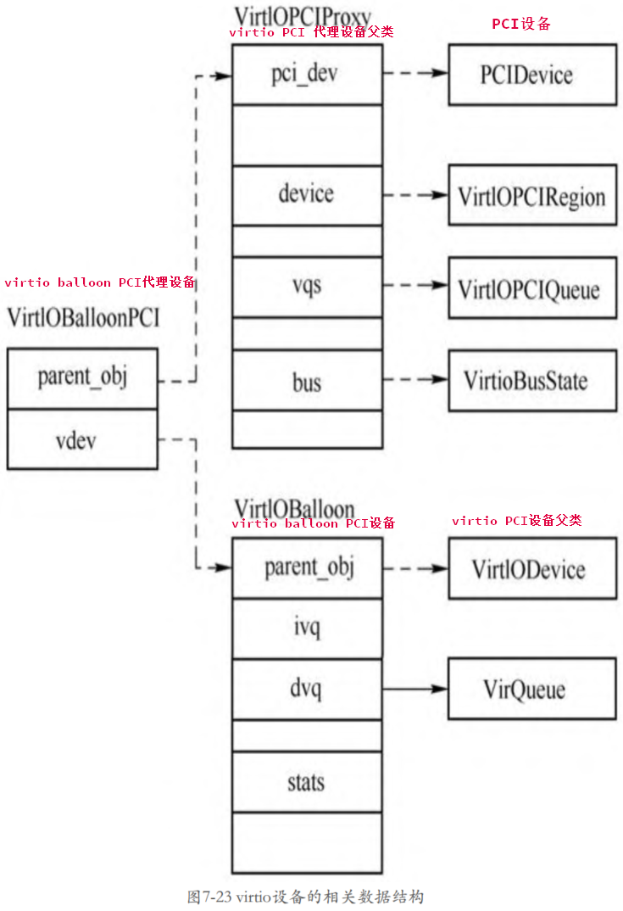

virtio 设备首先需要创建一个 **PCI 设备**, 叫作 **virtio PCI 代理设备**, 这个**代理设备**挂到 **PCI 总线**上, 接着 virtio 代理设备再**创建一条 virtio 总线**, 这样真正的 **virtio 设备**就可以挂到这条总线上了.

> 一层一层: PCI 总线 -> virtio PCI 代理设备 -> virtio 总线 -> 真正的 virtio PCI 设备
> 举例来讲: virtio_balloon 设备
> `VirtIOPCIProxy`(virtio balloon PCI 代理设备的抽象父类) -> `VirtIOBalloonPCI`(virtio balloon PCI 代理设备) -> `VirtIOBalloon`(virtio balloon PCI 设备)

# virtio PCI 代理设备父类

> **virtio PCI 代理设备**的**通用结构**, 没有实例对象

首先看 **virtio PCI 代理设备**类型的定义.

```cpp
// hw/virtio/virtio-pci.c
static const TypeInfo virtio_pci_info = {
    .name          = TYPE_VIRTIO_PCI,
    // 父类, PCI Device
    .parent        = TYPE_PCI_DEVICE,
    // 当前实例
    .instance_size = sizeof(VirtIOPCIProxy),
    .class_init    = virtio_pci_class_init,
    .class_size    = sizeof(VirtioPCIClass),
    .abstract      = true,
};
```

**virtio PCI 代理设备**的:

* **父设备**是**一个 PCI 设备**;

* 类型为 **VirtioPCIClass**;

* 实例为 **VirtIOPCIProxy**

注意这是一个**抽象设备**, 所以并**不能创建其实例**, 只能由**其子类去创建**. QEMU 中定义了**所有 virtio 设备的 PCI 代理设备**, 如 virtio balloon PCI 设备、virtio scsi PCI 设备、virito crypto PCI 设备, 其定义分别如下所示.

# virtio PCI 代理设备子类

>

```cpp
// hw/virtio/virtio-pci.c
static const TypeInfo virtio_balloon_pci_info = {
    .name          = TYPE_VIRTIO_BALLOON_PCI,
    .parent        = TYPE_VIRTIO_PCI,
    // 当前实例
    .instance_size = sizeof(VirtIOBalloonPCI),
    .instance_init = virtio_balloon_pci_instance_init,
    .class_init    = virtio_balloon_pci_class_init,
};

static const TypeInfo virtio_scsi_pci_info = {
    .name          = TYPE_VIRTIO_SCSI_PCI,
    .parent        = TYPE_VIRTIO_PCI,
    // 当前实例
    .instance_size = sizeof(VirtIOSCSIPCI),
    .instance_init = virtio_scsi_pci_instance_init,
    .class_init    = virtio_scsi_pci_class_init,
};

static const TypeInfo virtio_blk_pci_info = {
    .name          = TYPE_VIRTIO_BLK_PCI,
    .parent        = TYPE_VIRTIO_PCI,
    // 当前实例
    .instance_size = sizeof(VirtIOBlkPCI),
    .instance_init = virtio_blk_pci_instance_init,
    .class_init    = virtio_blk_pci_class_init,
};

// hw/virtio/virtio-crypto-pci.c
static const TypeInfo virtio_crypto_pci_info = {
    .name          = TYPE_VIRTIO_CRYPTO_PCI,
    // 父类是 Virtio PCI
    .parent        = TYPE_VIRTIO_PCI,
    // 当前实例
    .instance_size = sizeof(VirtIOCryptoPCI),
    .instance_init = virtio_crypto_initfn,
    .class_init    = virtio_crypto_pci_class_init,
};
```

virtio 设备在系统的设备树中的位置如图:


# virtio PCI 设备父类

> **virtio PCI 公共设备**的**实例对象**

**所有的 virtio 设备**都有一个**共同的父类** `TYPE_VIRTIO_DEVICE`.

```cpp
// hw/virtio/virtio.c
static const TypeInfo virtio_device_info = {
    .name = TYPE_VIRTIO_DEVICE,
    // 父类是 device
    .parent = TYPE_DEVICE,
    .instance_size = sizeof(VirtIODevice),
    .class_init = virtio_device_class_init,
    .instance_finalize = virtio_device_instance_finalize,
    .abstract = true,
    .class_size = sizeof(VirtioDeviceClass),
};
```

# virtio PCI 设备

> 具体的 virtio pci 设备

如 virtio balloon 设备的定义如下.

```cpp
// hw/virtio/virtio-balloon.c
static const TypeInfo virtio_balloon_info = {
    .name = TYPE_VIRTIO_BALLOON,
    // 父类, Virtio Device
    .parent = TYPE_VIRTIO_DEVICE,
    // 当前实例
    .instance_size = sizeof(VirtIOBalloon),
    .instance_init = virtio_balloon_instance_init,
    .class_init = virtio_balloon_class_init,
};
```

virtio balloon 设备的实例对象为 `VirtIOBalloon`.

# 四者的关系

具体的 **virtio PCI 设备**、**virtio PCI 代理设备**、**virtio PCI 公共设备**的关系如图所示.



> 看起来是以 virtio PCI 代理设备子类为核心

以 virtio balloon 设备为例:

* `VirtIOBalloonPCI` 是 **virtio balloon PCI 代理设备**的**实例对象**, 其**包括两个部分**:

  * 一个是 **VirtIOPCIProxy**(virtio PCI 代理设备父类), 这个是 **virtio PCI 代理设备**的**通用结构**, 里面存放了具体 virtio PCI 代理设备的相关成员;

  * 另一个是 **VirtIOBalloon**(virtio balloon PCI 设备), 这个结构里面存放的是 **virtio balloon 设备**的相关数据, 其:

    * 第一个成员是 **VirtIODevice**, 也就是 **virtio PCI 公共设备的实例对象**;

    * VirtIOBalloon 剩下的成员是**与 virtio balloon 设备相关的数据**.

# virtio 设备初始化

这里以 virtio balloon 设备为例分析 virtio 设备的初始化过程.

创建 virtio balloon 时**只需要**创建其 **virtio balloon PCI 代理设备**(即 `TYPE_VIRTIO_BALLOON_PCI`)即可, 在命令行指定 `-device virtio-balloon-pci, id=balloon0, bus=pci.0, addr=0x4`, 先来看实例化函数.

> 所以符合前面说的 以 virtio PCI 代理设备子类为核心, 初始化也是从 virtio PCI 代理设备子类开始?
>
> `virtio_balloon_pci_instance_init` 是 **virtio balloon PCI 代理设备子类** 的实例对象初始化函数

```cpp
// hw/virtio/virtio-pci.c
static void virtio_balloon_pci_instance_init(Object *obj)
{
    // virtio balloon PCI 代理设备
    VirtIOBalloonPCI *dev = VIRTIO_BALLOON_PCI(obj);

    virtio_instance_init_common(obj, &dev->vdev, sizeof(dev->vdev),
                                TYPE_VIRTIO_BALLOON);
    ......
}

// hw/virtio/virtio.c
void virtio_instance_init_common(Object *proxy_obj, void *data,
                                 size_t vdev_size, const char *vdev_name)
{
    // VirtIOBalloonPCI->vdev, 对应具体的 Virtio Balloon PCI 设备(即子类)
    DeviceState *vdev = data;
    // 初始化 TYPE_VIRTIO_BALLOON 实例, virtio PCI 设备
    object_initialize(vdev, vdev_size, vdev_name);
    // proxy_obj 是 virtio balloon PCI 代理设备
    // OBJECT(vdev) 是 virtio PCI 设备
    // 添加属性
    object_property_add_child(proxy_obj, "virtio-backend", OBJECT(vdev), NULL);
    object_unref(OBJECT(vdev));
    qdev_alias_all_properties(vdev, proxy_obj);
}
```

`TYPE_VIRTIO_BALLOON_PCI` 的实例化函数是 `virtio_balloon_pci_instance_init`, 在该函数中会调用 `virtio_instance_init_common`, 并将 VirtIOBalloonPCI 结构体的 vdev 成员地址以及 `TYPE_VIRTIO_BALLOON` 作为参数传递给该函数. `virtio_instance_init_common` 函数会调用 `object_initialize` 初始化 `TYPE_VIRTIO_BALLOON` 的实例对象 **VirtIOBalloon**, 然后添加一些属性. 由此可见, virtio 设备在实例创建过程中并没有做很多事情, 大部分的工作是在**设备的具现化过程中**做的.


在介绍 virtio balloon 设备的**具现化**之前, 先来回顾一下设备具现化调用的函数, QEMU 在 **main** 函数中会对**所有** `-device` 的**参数**进行具现化, **设备的具现化函数**都会调用 `device_set_realized` 函数, 在该函数中会调用**设备类**的 **realize** 函数. 最开始调用的是 DeviceClass 的 realize 函数, 这个回调的默认函数是 `device_realize`, 当然, 如果继承自 DeviceClass 的类可以重写这个函数, 如 PCIDeviceClass 类就在其类初始化函数 `pci_device_class_init` 中将 `DeviceClass->realize` 重写为 `pci_qdev_realize`, 对于 PCIDeviceClass 本身来说, 其 `PCIDeviceClass->realize` 可设置为 `pci_default_realize`, 后面继承 PCIDeviceClass 的类可以在自己的类初始化函数中设置 realize 函数.

**virtio 设备类**的**继承链关系**为 `DeviceClass -> PCIDeviceClass -> VirtioPCIClass`. 下面分析一下在 VirtioPCIClass 类还没有初始化时的 realize 函数, 如下图所示.


下面分析 VirtioPCIClass 的初始化函数, 该类相关的定义是在**所有 virtio PCI 代理设备**的**父设备** `TYPE_VIRTIO_PCI` 中进行的, 其中的**类初始化函数**是 `virtio_pci_class_init`.

`virtio_pci_class_init` 的函数定义如下.

```cpp
// hw/virtio/virtio-pci.c
static void virtio_pci_class_init(ObjectClass *klass, void *data)
{
    // DeviceClass
    DeviceClass *dc = DEVICE_CLASS(klass);
    // PCIDeviceClass
    PCIDeviceClass *k = PCI_DEVICE_CLASS(klass);
    // VirtioPCIClass
    VirtioPCIClass *vpciklass = VIRTIO_PCI_CLASS(klass);

    dc->props = virtio_pci_properties;
    // 第一
    k->realize = virtio_pci_realize;
    k->exit = virtio_pci_exit;
    k->vendor_id = PCI_VENDOR_ID_REDHAT_QUMRANET;
    k->revision = VIRTIO_PCI_ABI_VERSION;
    k->class_id = PCI_CLASS_OTHERS;
    // pci_qdev_realize
    // 第二
    vpciklass->parent_dc_realize = dc->realize;
    dc->realize = virtio_pci_dc_realize;
    dc->ret = virtio_pci_reset;
}
```

第一. 首先把 `PCIDeviceClass->realize` 函数替换成了自己的 `virtio_pci_realize` 函数

第二. 将 `dc->realize` 设置成了 `virtio_pci_dc_realize`, 而将 `vpciklass->parent_dc_realize` 设置成了 `dc->realize`, 这个值是 `pci_qdev_realize`.

通常来说**父类**的 **realize** 函数会调用**子类**的 **realize** 函数, 如 `DeviceClass->realize`(`pci_qdev_realize`)会调用 `PCIDeviceClass->realize` 回调, `PCIDeviceClass->realize` 回调可以调用**子类型**的 **realize** 函数. 但是这两条语句改变了这个顺序. 这里 `dc->realize` 成了 `virtio_pci_dc_realize`, 所以这个函数会**最先执行**, 然后将**原来**的 `dc->realize`(`pci_qdev_realize`) 保存到 `VirtioPCIClass->parent_dc_realize` 函数中. 通常在设备具现化过程中**子类型**的 realize 函数需要先做某些事情的时候会使用这种方法.

回到 virtio balloon PCI 代理设备类型的初始化函数 `virtio_balloon_pci_class_init`, 可以看到其设置了 `VirtioPCIClass->realize` 函数为 `virtio_balloon_pci_realize`

```cpp
//
static void virtio_balloon_pci_class_init(ObjectClass *klass, void *data)
{
    // DeviceClass
    DeviceClass *dc = DEVICE_CLASS(klass);
    // VirtioPCIClass
    VirtioPCIClass *k = VIRTIO_PCI_CLASS(klass);
    // PCIDeviceClass
    PCIDeviceClass *pcidev_k = PCI_DEVICE_CLASS(klass);
    k->realize = virtio_balloon_pci_realize;
    ......
}
```

综上所述, **virtio balloon** 相关类涉及的 realize 函数如图所示.


所以设置 **virtio PCI 代理设备**的 realized 属性时, `device_set_realized` 函数中会首先调用 `DeviceClass->realize`, 也就是这里的 `virtio_pci_dc_realize`. `virtio_pci_dc_realize` 函数中会调用 `VirtioPCIClass->parent_dc_realize` 函数, 也就是这里的 `pci_qdev_realize`. 在 `pci_qdev_realize` 会调用 PCIDeviceClass 的 realize 函数, 也就是这里的 `virtio_pci_realize`. 在这个函数的最后会调用 VirtioPCIClass 的 realize 函数, 也就是这里的 `virtio_balloon_pci_realize`.

综上所述, 当**具现化** `TYPE_VIRTIO_BALLOON` 的时候, 首先会调用 `virtio_pci_dc_realize`, 该函数代码如下.

```cpp
// hw/virtio/virtio-pci.c
static void virtio_pci_dc_realize(DeviceState *qdev, Error **errp)
{
    VirtioPCIClass *vpciklass = VIRTIO_PCI_GET_CLASS(qdev);
    VirtIOPCIProxy *proxy = VIRTIO_PCI(qdev);
    PCIDevice *pci_dev = &proxy->pci_dev;
    // 第一
    if (!(proxy->flags & VIRTIO_PCI_FLAG_DISABLE_PCIE) &&
        virtio_pci_modern(proxy)) {
        pci_dev->cap_present |= QEMU_PCI_CAP_EXPRESS;
    }
    // 第二
    vpciklass->parent_dc_realize(qdev, errp);
}
```

第一. 判断了 **virtio PCI 代理设备**是否具有 `VIRTIO_PCI_FLAG_DISABLE_PCIE` 特性, `VIRTIO_PCI_FLAG_DISABLE_PCIE` 使得 **virtioPCI 代理**展现出 **PCIe 的接口**.

第二. 特性之后将调用 `parent_dc_realize` 函数, 由上面的分析可知, 该回调函数是 `pci_qdev_realize`.

`pci_qdev_realize` 已经在之前 PCI 设备模拟中分析了, 该函数会将 **virtioPCI 代理设备**注册到 **PCI 总线**上, 并调用 `PCIDeviceClass->realize`, 也就是 `virtio_pci_realize` 函数. `virtio_pci_realize` 函数初始化 **virtio PCI 代理设备**, 也就是结构体 VirtIOPCIProxy.

```cpp
static void virtio_pci_realize(PCIDevice *pci_dev, Error **errp)
{
    VirtIOPCIProxy *proxy = VIRTIO_PCI(pci_dev);
    VirtioPCIClass *k = VIRTIO_PCI_GET_CLASS(pci_dev);
    bool pcie_port = pci_bus_is_express(pci_get_bus(pci_dev)) &&
                     !pci_bus_is_root(pci_get_bus(pci_dev));

    ......

    /*
     * virtio pci bar layout used by default.
     * subclasses can re-arrange things if needed.
     *
     *   region 0   --  virtio legacy io bar
     *   region 1   --  msi-x bar
     *   region 2   --  virtio modern io bar (off by default)
     *   region 4+5 --  virtio modern memory (64bit) bar
     *
     */
    proxy->legacy_io_bar_idx  = 0;
    proxy->msix_bar_idx       = 1;
    proxy->modern_io_bar_idx  = 2;
    proxy->modern_mem_bar_idx = 4;

    proxy->common.offset = 0x0;
    proxy->common.size = 0x1000;
    proxy->common.type = VIRTIO_PCI_CAP_COMMON_CFG;

    proxy->isr.offset = 0x1000;
    proxy->isr.size = 0x1000;
    proxy->isr.type = VIRTIO_PCI_CAP_ISR_CFG;

    proxy->device.offset = 0x2000;
    proxy->device.size = 0x1000;
    proxy->device.type = VIRTIO_PCI_CAP_DEVICE_CFG;

    proxy->notify.offset = 0x3000;
    proxy->notify.size = virtio_pci_queue_mem_mult(proxy) * VIRTIO_QUEUE_MAX;
    proxy->notify.type = VIRTIO_PCI_CAP_NOTIFY_CFG;

    proxy->notify_pio.offset = 0x0;
    proxy->notify_pio.size = 0x4;
    proxy->notify_pio.type = VIRTIO_PCI_CAP_NOTIFY_CFG;

    /* subclasses can enforce modern, so do this unconditionally */
    memory_region_init(&proxy->modern_bar, OBJECT(proxy), "virtio-pci",
                        /* PCI BAR regions must be powers of 2 */
                        pow2ceil(proxy->notify.offset + proxy->notify.size));
        proxy->lm.offset = proxy->notify.offset + proxy->notify.size;
        proxy->lm.size = 0x20 + VIRTIO_QUEUE_MAX * 4;
    memory_region_init_alias(&proxy->modern_cfg,
                            OBJECT(proxy),
                            "virtio-pci-cfg",
                            &proxy->modern_bar,
                            0,
                            memory_region_size(&proxy->modern_bar));

    address_space_init(&proxy->modern_as, &proxy->modern_cfg, "virtio-pci-cfg-as");

    if (proxy->disable_legacy == ON_OFF_AUTO_AUTO) {
        proxy->disable_legacy = pcie_port ? ON_OFF_AUTO_ON : ON_OFF_AUTO_OFF;
    }

    ......

    if (pcie_port && pci_is_express(pci_dev)) {
        ......
    } else {
        /*
         * make future invocations of pci_is_express() return false
         * and pci_config_size() return PCI_CONFIG_SPACE_SIZE.
         */
        pci_dev->cap_present &= ~QEMU_PCI_CAP_EXPRESS;
    }

    virtio_pci_bus_new(&proxy->bus, sizeof(proxy->bus), proxy);
    if (k->realize) {
        k->realize(proxy, errp);
    }
}
```

`virtio_pci_realize` 函数初始化 VirtIOPCIProxy 设备的**多个 BAR 数据**, 设置了这些 BAR 的**索引号**, 其中 `legacy I/O` 地址为 0, `msi-x` 地址为 1, `modern IO` 地址为 2, `modern MMIO` 地址为 4 和 5. 这里的 legacy 和 modern 指的是**不同**的 virtio **版本**, 下面以 modern 为例说明.

`virtio_pci_realize` 还初始化了**多个 VirtIOPCIRegion**, 如 VirtIOPCIProxy 的 common、isr、device、notify 等成员. **VirtIOPCIRegion** 保存了 **VirtIOPCIProxy 设备 modern MMIO 的相关信息**, 如 VirtIOPCIProxy 的 modern MMIO 中, 最开始区域是 common 区域, 其大小为 0x1000, 接着是 isr 区域, 大小也是0x1000, 依次类推到 notify 区域. **VirtIOPCIRegion** 用来表示 virtio 设备的**配置空间信息**, 后面会单独介绍. VirtIOPCIProxy 的 modern MMIO 对应的 MemoryRegion 存放在 VirtIOPCIProxy 的 modern_bar 成员中, 它还有一个 MemoryRegion 存放在 `modern_cfg` 成员中. virtio_pci_realize 会调用 `virtio_pci_bus_new` 创建 **virtio-bus**, 挂载到当前的 virtio PCI 代理设备下面.

virtio_pci_realize 函数在最后调用了 k->realize 函数, 按照刚才的分析, 这个回调函数对应的是 `virtio_balloon_pci_realize`.