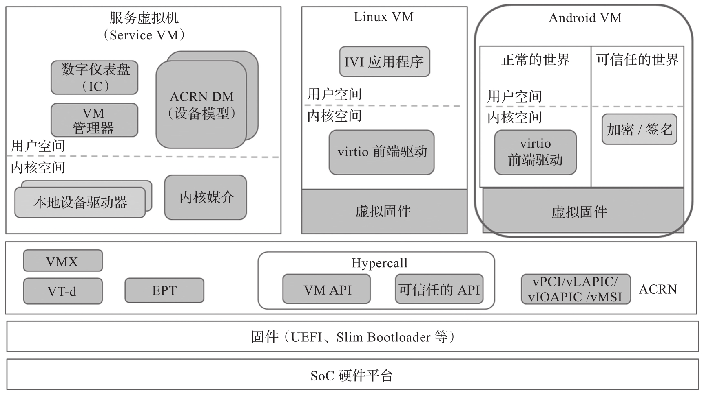

图中的 ACRN 1.0 架构是为智能驾驶舱场景专门设计的, 其中包括服务虚拟机, 可以运行车载娱乐系统的 Linux VM 或者 Android VM.

* **服务虚拟机**主要提供两类功能. 其一是**设备管理**, 它负责管理硬件平台上的大部分物理设备, 而物理设备的硬件驱动安装和运行在服务虚拟机上, 如果一个物理设备是被多个用户虚拟机共享的, 则用户虚拟机对硬件设备的访问和操作都必须经过服务虚拟机, 先经过设备模型, 再通过物理设备驱动来访问硬件. 其二是**用户虚拟机的生命周期管理**, VM 管理器负责用户虚拟机的启动 / 停止 / 暂停, 虚拟 CPU 的暂停 / 恢复等.

* 用户虚拟机. 可以是 Android VM 或者普通 Linux VM, 里面主要运行**车载信息娱乐程序**. 根据厂商需求和硬件平台的能力, 可以支持**多个娱乐系统 VM**.

* **仪表盘**控制应用程序, 可以直接运行在**服务虚拟机**或者**单独的 Linux VM** 上. 具体功能的配置划分可以根据需求来确定.
