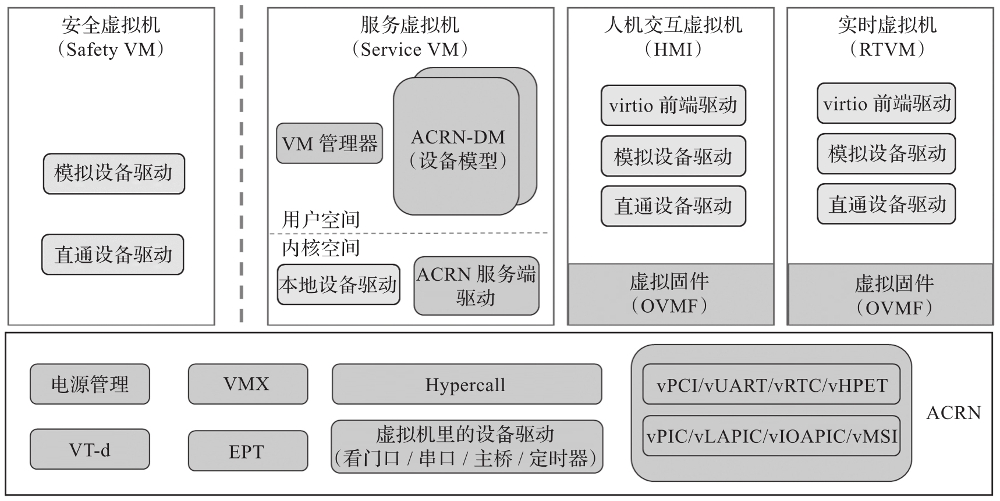

从 ACRN 2.0 开始, ACRN 扩展支持了预启动 VM(主要用于安全虚拟机)和实时虚拟机. 图 4-4 是 ACRN 2.0/3.0 的架构图, 与 ACRN 1.0 主要有如下区别.

* ACRN 2.0 支持预启动的虚拟机. 这里的预启动 (Pre-launched) 意味着该虚拟机是由 ACRN Hypervisor 直接启动的, 而且早于服务虚拟机启动. 预启动的虚拟机独立于其他虚拟机运行, 并拥有专用的硬件资源, 如 CPU 核, 内存和 I/O 硬件设备. 其他虚拟机甚至可能不知道预启动的虚拟机的存在. 因此, 它通常被作为安全操作系统虚拟机使用. 平台硬件故障检测代码可以在这个预启动的虚拟机中运行, 并在发生系统关键故障时采取紧急措施.

* 用户虚拟机. 服务虚拟机和用户虚拟机之间共享剩余的硬件资源. 用户虚拟机都是通过服务虚拟机来启动的, 因此也叫后启动虚拟机. 用户虚拟机系统可以是 Ubuntu, Android, Windows 或 VxWorks. 另外, 还有一种特殊的用户虚拟机, 称为实时虚拟机(RTVM), 它运行的是实时操作系统, 如 Zephyr, VxWorks, Xenomai 或者 PREEMPT_RT Linux. RTVM 通常用于各种工业控制, 可编程逻辑控制器或机器人应用等对实时性有需求的场景. 为了支持 RTVM 的实时性, ACRN 也从多个方面做了优化, 这将在后面的章节中详细介绍.

* 服务虚拟机. 如果没有预启动的虚拟机, 则服务虚拟机是 ACRN 启动的第一个虚拟机. 系统的硬件资源会首先分配给服务虚拟机, 服务虚拟机可以通过设备驱动程序直接访问这些硬件资源. 通过设备模型(ACRN-DM), 服务虚拟机可以向用户虚拟机提供设备共享服务. 服务虚拟机也可以把一些硬件设备直接分配给某一个用户虚拟机, 让该虚拟机可以独占这些硬件设备进行直通访问, 则此时就不用再经过服务虚拟机. 目前 ACRN 项目中服务虚拟机的实现是基于 Linux 的, 但只要将 ACRN 设备模型和其对应的内核模块移植到非 Linux 操作系统中, 其他系统也可以扮演服务虚拟机的角色.

* ACRN Hypervisor 优化. ACRN 2.0 在 Hypervisor 中添加了一些必要的设备仿真支持, 例如 vPCI 和 vUART, 以避免不同虚拟机之间的干扰. 另外, ACRN 2.0 支持在服务虚拟机上创建并运行 RTOS, 具有 LAPIC 的直通和轮询模式的驱动程序 (Polling Mode Driver,PMD) 等功能.