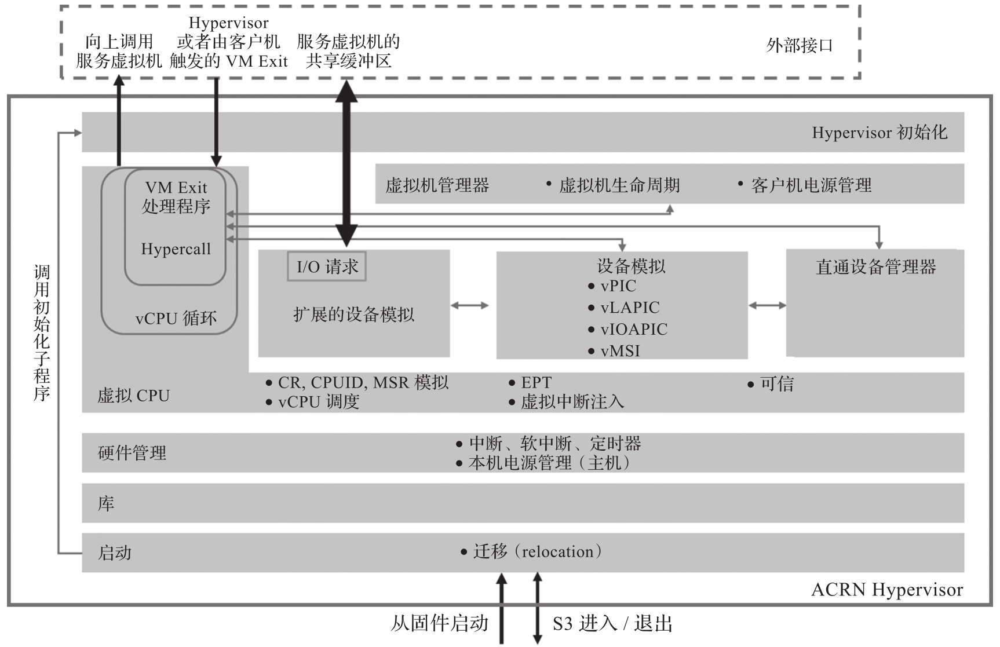

ACRN 利用基于硬件的英特尔虚拟化技术 (Intel VT). ACRN Hypervisor 运行在虚拟机扩展(VMX) 的根模式 (root mode) 下, 而服务虚拟机和用户虚拟机则运行在 VMX 非根模式 (non-root mode) 下.

下图所示为 ACRN Hypervisor 的分层架构, 各模块的功能介绍如下.

ACRN Hypervisor 分层架构中各个模块的功能如下.

* Boot 执行最基本的硬件初始化, 以启用 C 代码的执行.

* Library 由不需要显式初始化的子程序组成, 包括**标准内存和字符串操作函数**, 如 strncpy, 原子操作函数和位图操作函数. 该组件独立于其他组件并广泛用于其他组件.

* Hardware Management and Utilities 对硬件资源进行抽象, 并向上层提供定时器和物理中断处理程序注册等服务.

* Virtual CPU 实现 CPU, 内存和中断虚拟化. 其中 **vCPU 循环**通过调用其他组件中的处理程序来处理 VM 退出事件. Hypercall 为一种特殊类型的 VM 退出事件处理过程. 该组件还能够向 Service VM 注入上行调用中断.

* Device Emulation 实现在管理程序中仿真的设备, 例如虚拟可编程中断控制器, 包括 vPIC, vLAPIC 和 vIOAPIC 等.

* Passthrough Management 管理分配给某特定 VM 的物理 PCIe 设备.

* Extended Device Emulation 组件实现一种 I/O 请求机制, 使管理程序能够将 I/O 访问从用户虚拟机转发到**服务虚拟机**以进行仿真.

* VM Management 组件管理虚拟机的创建, 删除和其他生命周期操作.

* Hypervisor Initialization 组件调用其他组件中的初始化子例程, 以启动 Hypervisor 并以共享模式启动 Service VM 或以分区模式启动所有 VM.

以上模块的具体的实现将在后面的章节中详细说明.

虚拟化技术主要包括 4 个技术领域, 即 CPU 虚拟化, 内存虚拟化, 中断虚拟化和 I/O 虚拟化. 后面的章节将介绍这 4 个技术领域及其实现.
