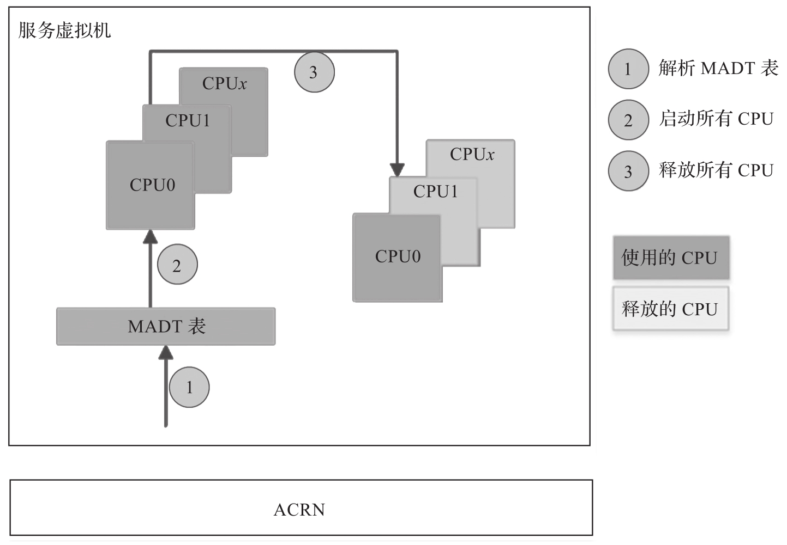

# 1. 静态的处理器分区

处理器分区是一种将虚拟处理器 (vCPU) 映射到物理处理器 (pCPU) 的策略. 为了实现这一点, ACRN Hypervisor 可以配置一个 **NOOP** 调度器作为 pCPU 的调度策略. 当为客户机操作系统创建 vCPU 时, ACRN 在 vCPU 和其专用的 pCPU 之间创建固定的 1:1 映射. 这样可以使 vCPU 的管理代码更加简单.

此时, ACRN Hypervisor 的虚拟机配置 (VM Configuration) 中的 cpu_affinity 有助于决定虚拟机 (VM) 中的 vCPU 关联到哪个 pCPU, 然后完成固定映射. 启动客户虚拟机时, 需要从虚拟机的 cpu_affinity 中选择未被任何其他虚拟机使用的 pCPU.

# 2. 灵活的处理器共享

为了启用 pCPU 共享, ACRN Hypervisor 可以配置 **IORR**(I/O 敏感轮询)或 **BVT**(借用虚拟时间)调度程序策略.

此时, ACRN Hypervisor 的虚拟机配置 (VM Configuration) 中的 cpu_affinity 表示允许此 VM 运行的所有 pCPU. 只要未在该客户虚拟机中启用 LAPIC 透传, 就可以在服务虚拟机和任何用户虚拟机之间共享 pCPU.

# 3. Hypervisor 的处理器管理

正如前文所述, ACRN Hypervisor 的虚拟机配置 (VM Configuration) 中的 cpu_affinity 决定了 vCPU 与 pCPU 的关联关系.

目前, ACRN Hypervisor 不支持 vCPU 动态迁移到不同的 pCPU. 这意味着在不首先调用 offline_vcpu 的情况下, vCPU 不会更改其运行所在的 pCPU.

# 4. 服务虚拟机的处理器管理

在 ACRN Hypervisor 中, 所有 ACPI 表都传递到服务虚拟机, 包括多中断控制器表(Multiple APIC Description Table,MADT). 当特权虚拟机内核启动时, 特权虚拟机通过解析 MADT 来查看所有物理处理器(pCPU). 通过创建相同数量的虚拟处理器(vCPU), 所有 pCPU 最初都分配给服务虚拟机.

当使用静态的处理器分区时, 服务虚拟机启动完成后, 它会释放供用户虚拟机使用的 pCPU. 图 4-7 所示为多核平台上 CPU 分配的示例流程.

多核平台上 CPU 分配的示例流程:

当使用灵活的处理器共享时, 服务虚拟机可以与不同的用户虚拟机共享 pCPU, 因此, 服务虚拟机启动完成后, 它不需要释放供用户虚拟机使用的 pCPU.

# 5. 用户虚拟机的处理器管理

ACRN Hypervisor 的虚拟机配置 (VM Configuration) 中的 cpu_affinity 定义了一组允许 VM 运行的物理 CPU.ACRN 设备模型可以选择仅在 cpu_affinity 的一个子集或 cpu_affinity 中列出的所有 pCPU 上启动, 但它不能分配任何未包含在 cpu_affinity 中的 pCPU 给用户虚拟机.

