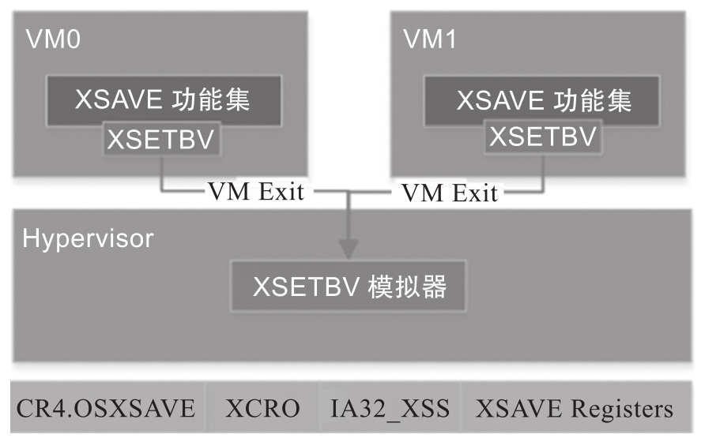

XSAVE 功能集主要由以下 8 个指令组成.

* XGETBV 和 XSETBV 允许软件读写扩展控制寄存器 XCR0, 它**控制着 XSAVE 功能集的操作**.

* XSAVE, XSAVEOPT, XSAVEC 和 XSAVES 是**将处理器状态保存到内存**的四个指令.

* XRSTOR 和 XRSTORS 是从**内存**加载**处理器状态**的对应指令.

其中 XGETBV,XSAVE,XSAVEOPT,XSAVEC 和 XRSTOR 可以在任何权限级别执行; XSETBV,XSAVES 和 XRSTORS 只有在 CPL=0 时才能执行.

启用 XSAVE 功能集由 XCR0(通过 XSETBV) 和 IA32_XSS MSR 控制. 下图描述了 ACRN Hypervisor 对 XSAVE 功能集的模拟.

默认情况下, ACRN Hypervisor 在 VMCS VM-Execution 控制域中启用 XSAVES/XRSTORS, 因此它允许 Guest 使用 XSAVE 功能. 由于 Guest 执行 XSETBV 总是会触发 VM Exit, 因此 ACRN Hypervisor 实际上需要处理 XCR0 的写入.

ACRN Hypervisor 通过以下规则模拟 XSAVE 功能. 枚举 CPUID.01H 以查询物理上是否支持 XSAVE 功能; 如果是, 则通过 CR4.OSXSAVE 在 Hypervisor 中启用 XSAVE. 模拟 XSAVE 相关的 `CPUID.01H&CPUID.0DH` 给 Guest, 通过 `xsetbv_vmexit_handler` 模拟 XCR0 的访问, ACRN Hypervisor 将 IA32_XSS MSR 的访问透传给 Guest, ACRN Hypervisor 不使用 XSAVE 的任何功能, vCPU 将完全控制非根操作模式下的 XSAVE 功能.
