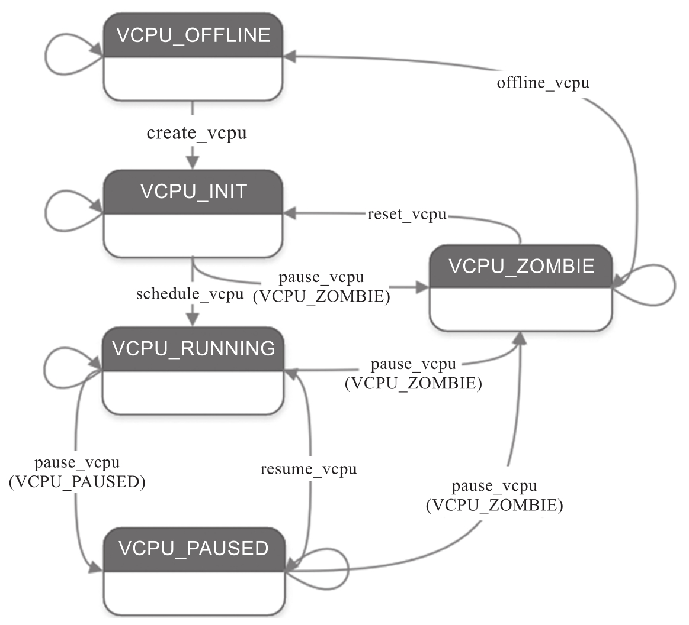

ACRN Hypervisor vCPU 生命周期如下图所示.

其中主要状态为:

* `VCPU_INIT`, vCPU 处于初始化状态, 其 vCPU 线程尚未准备好在其关联的 pCPU 上运行.

* `VCPU_RUNNING`, vCPU 正在运行, 并且其 vCPU 线程已准备好 (在队列中) 或已经在其关联的 pCPU 上运行.

* `VCPU_PAUSED`, vCPU 已暂停, 并且其 vCPU 线程未在其关联的 pCPU 上运行.

* `VCPU_ZOMBIE`, vCPU 正在被离线, 并且其 vCPU 线程未在其关联的 pCPU 上运行.

* `VCPU_OFFLINE`, vCPU 已经离线.
