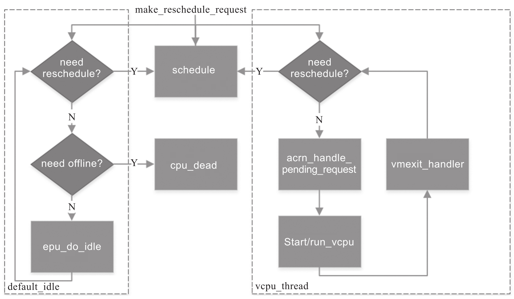
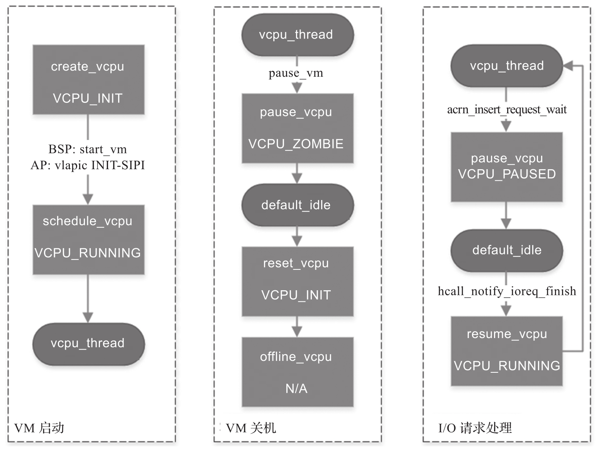
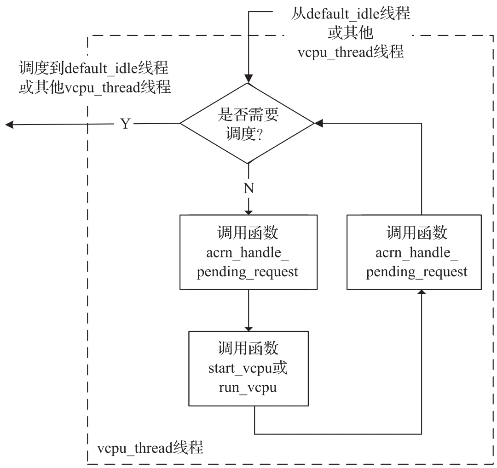

本节以静态处理器分区模式为例讲述 vCPU 的调度.

在静态处理器分区下, ACRN Hypervisor 实现了基于两个线程的简单调度机制: **vCPU 线程** (`vcpu_thread`) 和**默认空闲线程**(`default_idle`).

* `VCPU_RUNNING` 状态的 vCPU 始终运行在 `vcpu_thread` 循环中;

* 而 `VCPU_PAUSED` 或 `VCPU_ZOMBIE` 状态的 vCPU 运行在 `default_idle` 循环中.

vcpu_thread 和 default_idle 线程中的详细行为如下图所示.

* `vcpu_thread` 循环将循环处理 **VM Exit** 以及一些**待处理请求**. 它还将检查是否存在**调度**请求, 然后在必要时调度到 `default_idle`.

* `default_idle` 循环主要循环执行 `cpu_do_idle`, 同时还检查是否存在**离线**和**调度请求**.

  * 如果一个 pCPU 被标记为需要**离线**, 它将转到 `cpu_dead`.
  * 如果一个 pCPU 发出**重新调度**请求, 它会在必要时调度到 `vcpu_thread`.

* 函数 `make_reschedule_request` 用于 `vcpu_thread` 和 `default_idle` 之间的线程切换.

下图展示了 ACRN Hypervisor 的 vCPU 调度场景和步骤.

1) 启动虚拟机时, 创建 vCPU 后, 主启动处理器 (Bootstrap Processor, **BSP**) 通过 `start_vm` 调用 `launch_vcpu`, 应用处理器 (Application Processor, **AP**) 通过 vlapic 模拟 `INIT-SIPI` 从而调用 `launch_vcpu`, 最后该 vCPU 会**运行**在 `vcpu_thread` 循环中.

2) 在关闭虚拟机时, `pause_vm` 的调用会使得在 `vcpu_thread` 中运行的 vCPU 调度到 `default_idle`. 之后的 `reset_vcpu` 和 `offline_vcpu` 重置并下线该 vCPU.

3) 在处理 I/O 请求时, 将 I/O 请求 (IOReq) 发送到设备模型进行模拟后, 运行在 `vcpu_thread` 中的 vCPU 通过 `acrn_insert_request` 调度到 `default_idle`. 设备模型完成对这个 I/O 请求的模拟后, 调用 `hcall_notify_ioreq_finish` 并使 vCPU 调度回到 `vcpu_thread` 以继续其客户机操作系统的执行.

# vCPU 线程

vCPU 线程是一个循环, 它的工作流程如下图所示.

其工作流程如下:

1) 检查当前 vcpu_thread 是否需要通过重新调度请求切换到 default_idle 或其他 vcpu_thread. 如果需要, 则调度到 `default_idle` 或其他 vcpu_thread.

2) 通过调用 `acrn_handle_pending_request` 处理**未处理的请求**, 例如对 VMCS 的初始化, NMI 的处理等.

3) 通过调用 start/run_vcpu 完成 VM Entry, 然后进入 VXM 非根操作模式运行客户机操作系统.

4) 当客户机操作系统在 VXM 非根操作模式下触发 VM Exit 时, VM 从 start/run_vcpu 退出.

5) 根据引发 VM Exit 的原因处理 VM Exit.

6) 循环回到步骤 1)​.

# vCPU 运行时上下文

在 VMX 根操作模式和 VMX 非根操作模式进行切换时, vCPU 的运行时上下文通过数据结构 `struct run_context` 来进行保存和恢复.

ACRN Hypervisor 按**三种不同的类别**处理运行时 vCPU 上下文的保存与恢复.

* 在 VM Exit/Entry 时**始终**需要**保存与恢复**. 这些寄存器必须在每次 VM Exit 时保存, 并在每次 VM Entry 时恢复. 寄存器包括: **通用寄存器**, **CR2** 和 **IA32_SPEC_CTRL**. 定义在 `vcpu -> run_context` 中. 通过 vcpu_get/set_xxx 获取 / 设置它们.

* VM Exit/Entry 时**按需**缓存 / 更新. 这些寄存器经常使用. 它们应该在 VM Exit 后的第一次访问时从 VMCS 中读取并缓存. 如果其后被更改, 那么应当在 VM Entry 时根据缓存下的值更新 VMCS. 寄存器包括: **RSP**, **RIP**, **EFER**, **RFLAGS**, **CR0** 和 **CR4**. 定义在 vcpu -> run_context 中. 通过 vcpu_get/set_xxx 获取 / 设置它们.

* 始终从 **VMCS** 中**读取**或者**始终写入 VMCS**. 这些寄存器**很少使用**. 对它们的访问**总是通过 VMCS**. 寄存器包含在 VMCS 中, 但未在上述两种情况中列出. 没有定义在 vcpu -> run_context 中. 通过 VMCS 的读取接口获取 / 设置它们.

# VM Exit 处理程序

ACRN Hypervisor 在 vcpu_thread 中使用函数 `vmexit_handler` 来处理 VM Exit. 在 ACRN Hypervisor 中, **静态数组** `vm_exit_dispatch dispatch_table[​]` 被用来存储不同的 VM Exit 原因及其处理程序, 当 VM Exit 发生时, ACRN Hypervisor 会依据 VM Exit 的原因在数组内查询到其对应的处理程序并进行相关处理.

# 待处理的请求处理程序

ACRN Hypervisor 在 vcpu_thread 中使用函数 `acrn_handle_pending_request` 来处理 **VM Entry 之前的请求**. vCPU 结构中有一个**位图**(bitmap) "`vcpu -> arch -> pending_req`" 被用来**存储**不同的请求.

目前, ACRN Hypervisor 支持以下请求.

* `ACRN_REQUEST_EXCP`: **异常** (Exception) **注入**请求.

* `ACRN_REQUEST_EVENT`: 来自虚拟 LAPIC(**vLAPIC**)的中**断注入**请求.

* `ACRN_REQUEST_EXTINT`: 来自虚拟 PIC(**vPIC**)的**中断注入**请求.

* `ACRN_REQUEST_NMI`: **NMI 注入**请求.

* `ACRN_REQUEST_EOI_EXIT_BITMAP_UPDATE`: 更新 **VMCS** 中 `EOI-exit bitmap` 的请求.

* `ACRN_REQUEST_EPT_FLUSH`: **刷掉缓存的 EPT 映射**的请求.

* `ACRN_REQUEST_TRP_FAULT`: **三重故障**发生后申请将虚拟机关闭的请求.

* `ACRN_REQUEST_VPID_FLUSH`: **刷掉缓存的 VPID 映射**的请求.

* `ACRN_REQUEST_INIT_VMCS`: **初始化 VMCS** 的请求.

ACRN Hypervisor 提供了函数 `vcpu_make_request` 来发出不同的请求, 在 bitmap 中设置对应请求的比特位, 必要时通过 **IPI** 通知**目标 vCPU**(比如在目标 vCPU 当前没有运行时)​.

