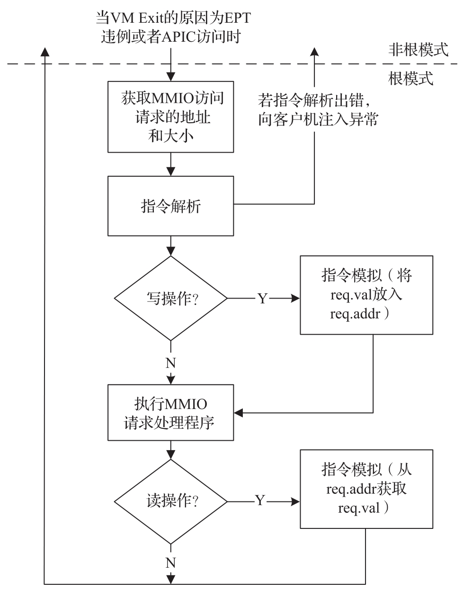

ACRN Hypervisor 为 MMIO(EPT) 和 APIC 访问模拟实现了一个简单的指令模拟基础设施. 当由此导致的 VM Exit 被触发时, Hypervisor 需要解码来自 RIP 的指令, 然后根据其指令和读 / 写尝试相应的模拟. 指令模拟工作流程如图 4-12 所示.

ACRN Hypervisor 目前支持模拟 mov,movx,movs,stos,test 和 / 或 cmp,sub,bittest 指令, 不支持指令的 lock 前缀与实模式模拟.

当 VM Exit 的原因为 EPT 违例 (处理程序为 ept_violation_vmexit_handler) 或者 APIC 访问 (处理程序为 apic_access_vmexit_handler) 时, ACRN Hypervisor 将:

1) 获取 MMIO 访问请求的地址和大小.

2) 解析当前 RIP 中的指令并做以下检查:

* 指令是否支持? 如果不支持, 将 #UD 注入客户虚拟机.

* 指令的目标操作数以及源操作数的 GVA(Guest Virtual Address) 是否有效? 如果无效, 将 #PF 注入客户虚拟机.

* 堆栈是否有效? 如果无效, 将 #SS 注入客户虚拟机.

3) 如果步骤 2) 成功, 检查访问方向. 如果是写入, 则执行 emulate_instruction 从指令操作数中获取 MMIO 请求的值. 如果是读取, 则执行 emulate_instruction 将 MMIO 请求的值放入指令操作数中.

4) 执行 MMIO 请求处理程序. 对于 EPT 违例来说, 处理程序是 emulate_io, 对于 APIC 访问来说, 处理程序是 vlapic_write/read. 它们将最终通过以下方式完成此 MMIO 请求模拟:

* 将 req.val 放入 req.addr 以进行写入操作.

* 从 req.addr 获取 req.val 以进行读取操作.

5) 返回 Guest.