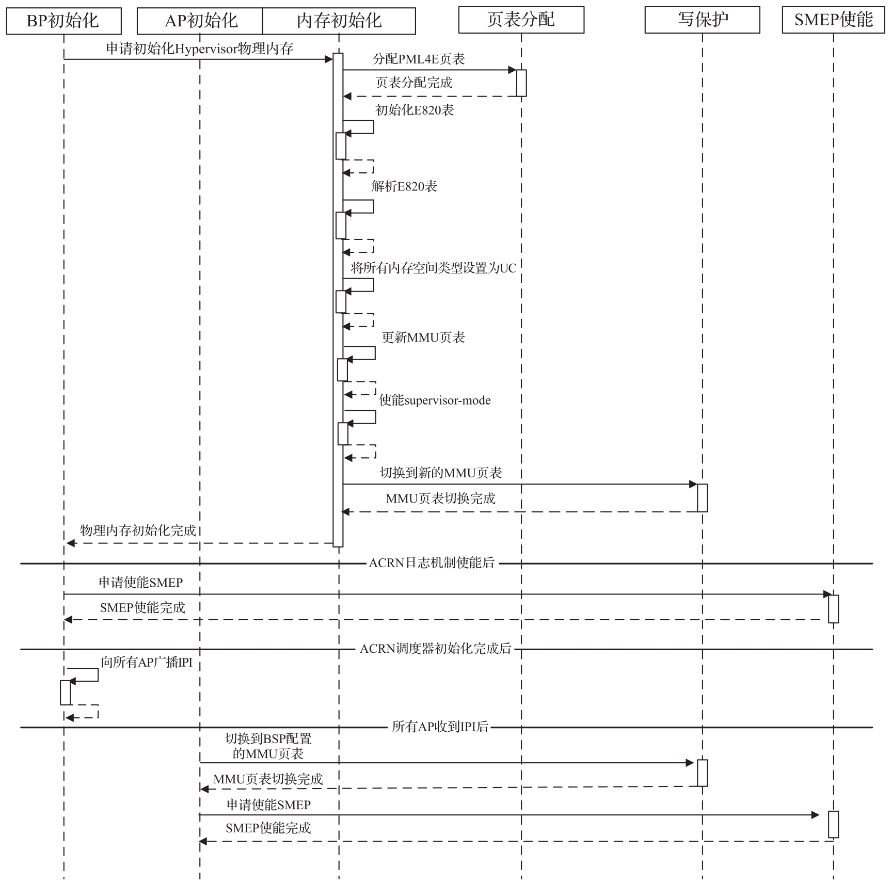
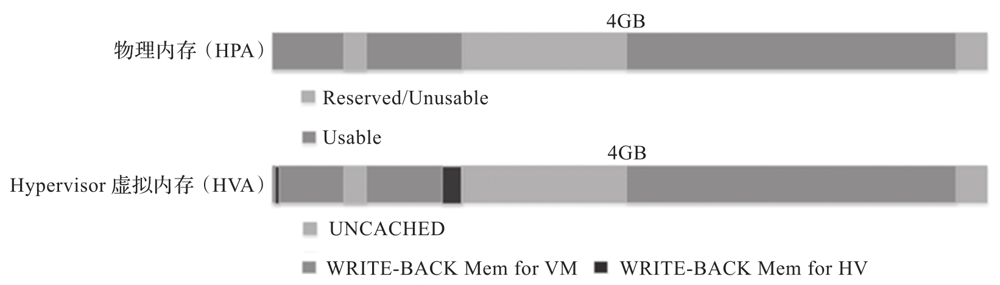
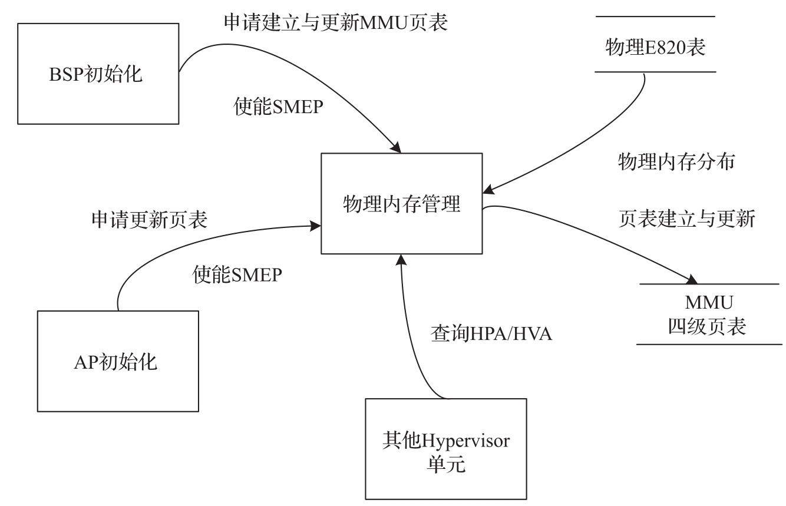

ACRN Hypervisor 会初始化 MMU 页表以管理所有物理内存.

在平台初始化阶段初始化 MMU 页表后, 除调用 `set_paging_supervisor` 外, 不会对 MMU 页表进行任何更新. 但是, 由 `set_paging_supervisor` 更新的内存区域在此之前不应被 ACRN Hypervisor 访问, 因为访问那些内存会在 TLB 中进行映射, 而 ACRN Hypervisor 并没有 TLB 刷新机制.

# 1. 物理内存布局(E820 表)

ACRN Hypervisor 是管理系统内存的主要所有者. 通常, 启动固件 (例如 EFI) 将平台的物理内存布局 (E820 表) 传递给 Hypervisor. ACRN Hypervisor 使用 4 级分页基于此表进行内存管理.

**BIOS**/启动加载程序固件 (例如 **EFI**) 通过 **multiboot** 协议传递 **E820** 表. 此表包含**平台的原始内存布局**. 图 4-14 展示了一个简单的 E820 表的物理内存布局示例.

# 2. Hypervisor 内存初始化

ACRN Hypervisor 以分页模式运行. 主启动处理器 (BSP) 得到平台 E820 表后, BP 根据它创建 MMU 页表. 这是由函数 `init_paging()` 完成的. 应用处理器 (AP) 收到 IPI 启动中断后, 使用 BP 创建的 MMU 页表.

为了使内存访问权限生效, ACRN Hypervisor 还提供了其他的 API:

* `enable_paging` 将启用 IA32_EFER.NXE 和 CR0.WP.

* `enable_smep` 将启用 CR4.SMEP.

* `enable_smap` 将启用 CR4.SMAP.

下图描述了 ACRN Hypervisor 中 BSP 和 AP 的内存初始化.

ACRN Hypervisor 使用以下内存映射策略.

1) **一对一**的映射(**HPA** 与 **HVA** 相同)​.

2) 开始将所有地址空间映射为 **UNCACHED** 类型, 拥有读 / 写权限, 没有执行权限, 处于 **User** 模式.

3) 将 `[0, low32_max_ram)` 区域重新映射为 **WRITE-BACK** 类型.

4) 将 `[4G, high64_max_ram)` 区域重新映射为 **WRITE-BACK** 类型.

5) 对于 Hypervisor 需要访问的内存空间, 将其分页结构表项中的 U/S 标志设置为 supervisor 模式.

6) 对于 Hypervisor 代码所在的内存空间, 将其分页结构表项中的 **NX** 位清零.

下图展示了 ACRN Hypervisor 虚拟内存布局.

* Hypervisor 可以查看并访问所有系统内存.

* Hypervisor 预留了 UNCACHED 类型的 **MMIO/PCI 空洞**(hole).

* Hypervisor 的**代码**和**数据**所在的内存空间具有 **WRITE-BACK** 类型(在低于 1MB 的内存中存有用于应用处理器的启动代码)​.

ACRN Hypervisor 使用**最少的内存页**来从**虚拟地址空间**映射到**物理地址空间**. 所以 ACRN Hypervisor 只支持将**线性地址**映射到 **2MB** 的页表或者 **1GB** 的页表; 它**不支持**将线性地址映射到 4KB 的页表.

* 如果 2MB 的大页可以用于虚拟地址空间映射, 则需要为这个 2MB 的大页设置相应的 PDPT 表项.

* 如果 2MB 的大页不能用于虚拟地址空间映射, 而 2MB 的大页可以使用, 则需要为这个 2MB 的大页设置相应的 PDT 表项.

# 3. 数据流设计

ACRN Hypervisor 物理内存管理单元为其他单元提供 4 级页表创建和服务更新, SMEP 使能服务以及 HPA/HVA 检索服务. 图 4-17 展示了 ACRN Hypervisor 物理内存管理的数据流图.

