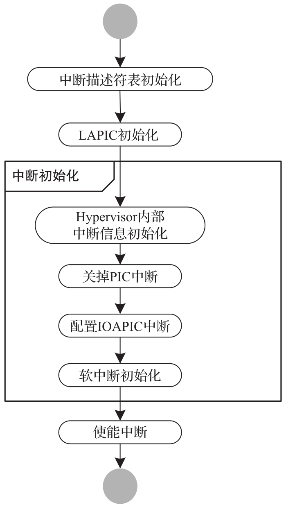
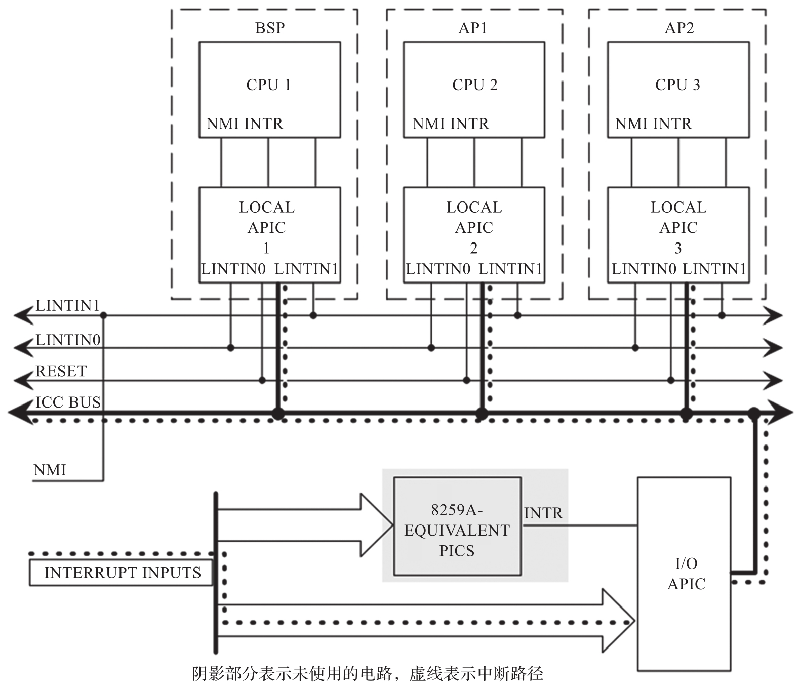
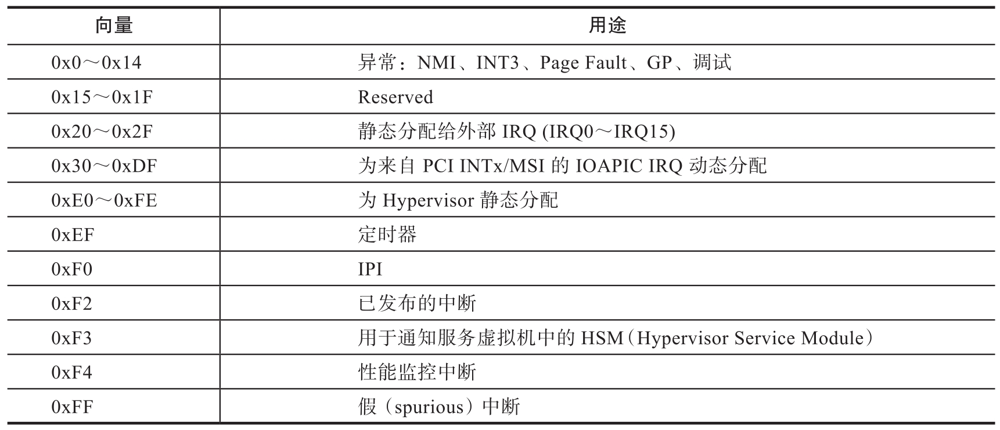
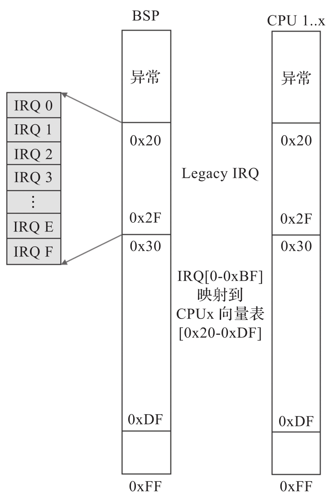
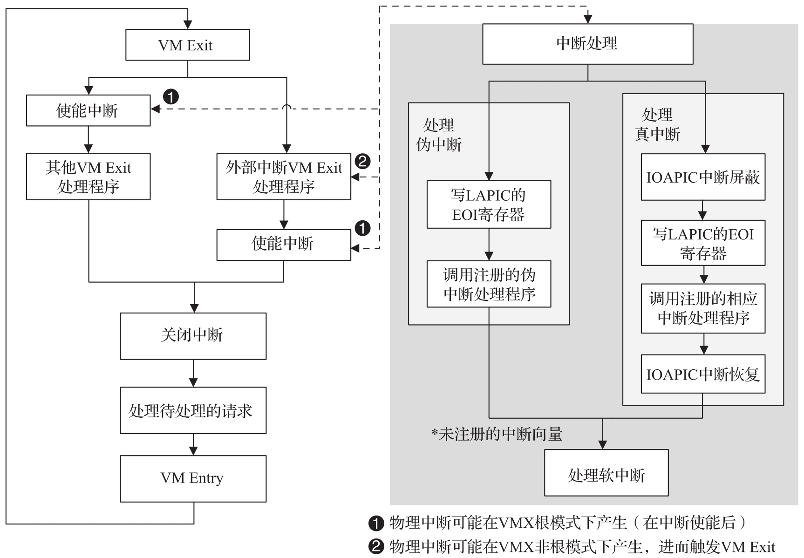
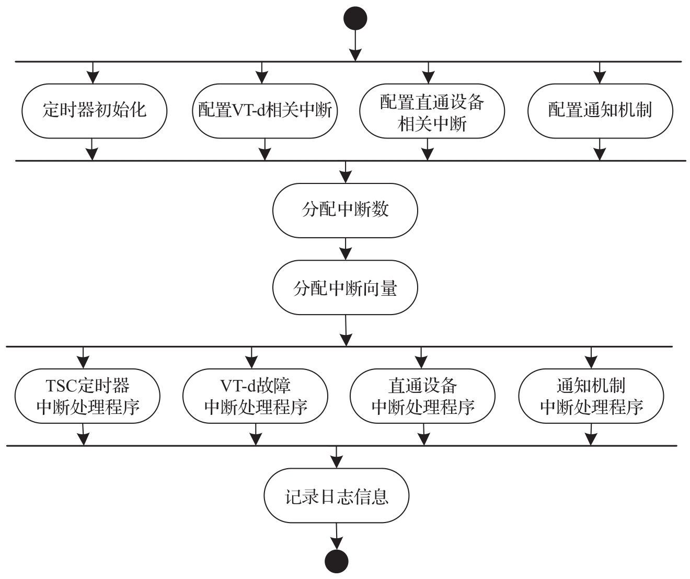

ACRN Hypervisor 从 Bootloader 获得控制权后, 它会为所有处理器初始化所有与物理中断相关的模块. ACRN Hypervisor 创建了一个框架来管理 Hypervisor 本地设备, 直通设备和处理器之间的 IPI 的物理中断, 如下图所示.

物理中断初始化:

# IDT 初始化

ACRN Hypervisor 在中断初始化期间构建其中断描述符表 (IDT) 并设置以下处理程序:

* 出现异常时, Hypervisor 打印其上下文 (用于调试) 并停止当前的物理处理器, 因为 Hypervisor 中不应发生异常.

* 对于外部中断, Hypervisor 可能会屏蔽中断(取决于触发模式)​, 然后确认中断并将其分派到已注册的处理程序(如果存在的话)​.

大多数中断和异常在没有堆栈切换的情况下, 处理除在 TSS 中设置了自己的堆栈的 #MC,#DF 和 #SS 异常.

# PIC/IOAPIC 初始化

ACRN Hypervisor 屏蔽来自 PIC 的所有中断. 来自 PIC(中断向量小于 16)的所有传统中断都将连接到 IOAPIC, 如图 4-24 中的连接所示.

ACRN Hypervisor PIC/IOAPIC/LAPIC 配置:

>这是 Symmetric I/O Mode, 对称 I/O 模式

ACRN Hypervisor 将为 IOAPIC RTE 中的这些传统中断预先分配向量并设置它们. 对于其他(中断向量大于等于 16)​,ACRN Hypervisor 将在 RTE 中将它们设置为向量 0, 并且将根据需要动态分配有效向量.

根据 ACPI 的定义, 所有外部 IOAPIC 引脚都被归类为 GSI 中断. Hypervisor 支持多个 IOAPIC 组件. IRQ PIN 到 GSI 的映射在内部维护以确定 GSI 源 IOAPIC.

# LAPIC 初始化

物理 LAPIC 在 ACRN Hypervisor 中处于 x2APIC 模式. Hypervisor 通过屏蔽本地向量表 (Local Vector Table,LVT) 中的所有中断, 清除所有中断在服寄存器 (In-Service Register) 并启用 LAPIC 来为每个物理处理器初始化 LAPIC.

ACRN Hypervisor 会为其他软件组件提供 API 供其访问 LAPIC, 旨在进一步使用 Local Timer(TSC Deadline)程序, IPI 通知程序等.

# 中断向量

ACRN Hypervisor 中断向量的分配如表所示.

* 向量 0x15～0x1F 是 Hypervisor 未处理的异常. 如果确实发生了这样的异常, 系统就会停止.

* 向量 0x20～0x2F 为 legacy IRQ0-15 静态分配的向量.

* 向量 0x30～0xDF 是为 PCI 设备 INTx 或 MSI/MIS-X 使用动态分配的向量.

* 向量 0xE0-0xFE 是 Hypervisor 为专用目的保留的高优先级向量.

来自 IOAPIC 或 MSI 的中断可以被传送到目标 CPU. 默认情况下, 它们被配置为最低优先级 (FLAT 模式)​, 即它们被传送到当前空闲或执行最低优先级的中断在服寄存器(In-Service Register) 的 CPU.ACRN Hypervisor 不会保证设备的中断会传送到特定的 vCPU. 定时器中断是一个例外, 它们总是被传送到对 LAPIC 定时器进行编程的 CPU.

x86 的 64 位架构支持每个 CPU 都有自己的 IDT, 但 ACRN Hypervisor 使用全局共享的 IDT, 所有 CPU 上的中断 / IRQ 到向量的映射都相同. CPU 的向量分配如图所示.

# IRQ 描述符表

ACRN Hypervisor 维护一个在物理 CPU 之间共享的全局 IRQ 描述符表, 因此相同的向量将链接到所有 CPU 的相同 IRQ 编号.

irq_desc[​]数组的索引代表 IRQ 编号. 从 dispatch_interrupt 调用 do_irq 来处理 edge/level 触发的 IRQ 并调用注册的 action_fn.

ACRN Hypervisor 除维护从 IRQ 到向量的映射的 IRQ 描述符表之外, 还使用另一种从向量到 IRQ 的反向映射.

ACRN Hypervisor 在初始化时, Legacy IRQ 的描述符用适当的向量初始化, 并建立相应的反向映射. 其他 IRQ 的描述符在初始化时会被填充为无效向量(256), 最终生效的向量将会在 IRQ 分配时进行更新.

例如, 如果 Local Timer 使用 IRQ 编号 254 和向量 0xEF 注册中断, 则设置将如下所示:

* `irq_desc[254].irq = 254`.

* `irq_desc[254].vector = 0xEF`.

* `vector_to_irq[0xEF] = 254`.

# 外部中断处理

在 ACRN Hypervisor 中, 当 CPU 在非根操作模式下收到物理中断时, VM Exit 就会被触发. VM Exit 发生后, Hypervisor 会将中断相关信息存储下来后做进一步处理. 导致 vCPU VM Exit 到 Hypervisor 的外部中断并一定不意味着该中断属于该 VM. 当 CPU 执行 VM Exit 进入根操作模式时, 中断处理将被启用, 中断将在 Hypervisor 内部会尽快处理. Hypervisor 也可以模拟虚拟中断并在必要时注入 Guest.

中断和 IRQ 处理流程如图所示.

当物理中断被触发并传送到物理 CPU 时, CPU 可能在 VMX 根操作模式或非根操作模式下运行.

* 如果 CPU 在 VMX 根操作模式下运行, 则按照标准的原生 IRQ 流程处理中断, dispatch_interrupt,IRQ 处理程序, 最后注册的回调函数被调用.

* 如果 CPU 运行在 VMX 非根操作模式下, 外部中断会以 external-interrupt 为由触发 VM Exit, 然后 VM Exit 处理流程会调用 dispatch_interrupt()来调度和处理该中断.

从上图所示的任一路径发生中断后, ACRN Hypervisor 将跳转到 dispatch_interrupt. 该函数从上下文中获取产生的中断的向量, 从 vector_to_irq[​]中获取 IRQ 号, 然后获取对应的 irq_desc.

Hypervisor 内部的 IRQ 编号是一个用于识别 GSI 和向量的软件概念. 每个 GSI 将映射到一个 IRQ,GSI 编号通常与 IRQ 编号相同, 大于最大 GSI(nr_gsi)编号的 IRQ 编号是动态分配的. 例如, Hypervisor 为 PCI 设备分配一个中断向量, 然后为该向量分配一个 IRQ 编号. 当向量稍后到达 CPU 时, 将定位并执行相应的 IRQ 操作函数.

不同条件下的 IRQ 控制流程如图 4-27 所示.

# IPI 管理

在 ACRN Hypervisor 中使用 IPI 的目的是将 vCPU 踢出非根操作模式然后进入根操作模式. Hypervisor 会给 I/O 请求和虚拟中断注入分配不同的 IPI 向量. I/O 请求使用 IPI 向量 0xF3 进行 upcall. 虚拟中断注入使用 IPI 向量 0xF0.

* 0xF3 upcall.EPT 违例或 I/O 指令会导致 VM Exit, 它可能需要设备模型来模拟 MMIO/PIO 指令. 但是, 服务虚拟机 vCPU0 可能仍处于非根操作模式, 因此, 应将 IPI(0xF3 upcall 向量)发送到物理 CPU0(在服务虚拟机中使用非根操作模式作为 vCPU0)以强制 vCPU0 由于外部中断而退出 VM. 然后将虚拟 upcall 向量注入服务虚拟机, 服务虚拟机内的 vCPU0 将接收 I/O 请求并为其他 Guest 进行模拟.

* 0xF0 IPI. 如果服务虚拟机内的设备模型需要向其他 Guest(例如 vCPU1)注入中断, 它将首先发出 IPI 将 CPU1(假设 vCPU1 在 CPU1 上运行)踢到根操作模式. CPU1 将在 VM Entry 之前注入中断.
