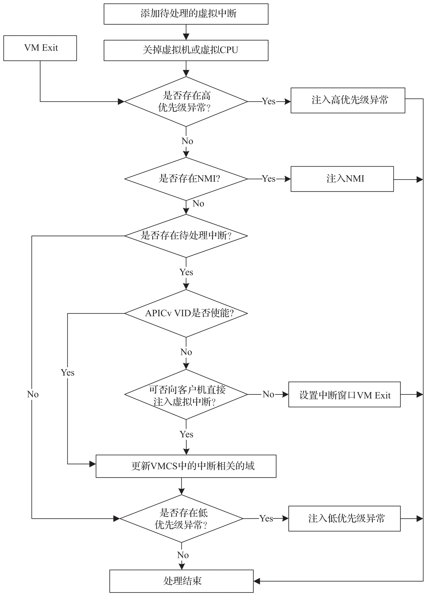

本节介绍 ACRN Hypervisor 虚拟中断的管理, 包括:

* **vCPU** 的**虚拟中断请求**;

* `vPIC`/`vIOAPIC`/`vLAPIC` 用于**虚拟中断注入**接口;

* **直通设备**的**中断映射**(物理中断到虚拟中断)​;

* VMX **中断/异常注入**的过程.

**客户机操作系统**收到的所有中断都来自 **vLAPIC**, **vIOAPIC** 或 **vPIC 注入的虚拟中断**. 此类虚拟中断由**直通设备**或**服务虚拟机**中的 **I/O 中介设备**通过 **Hypercall** 触发. 中断重映射部分讨论了 Hypervisor 如何管理**直通设备**的**物理和虚拟中断**之间的**映射**.

**设备模拟**位于**服务虚拟机**中的**用户空间设备模型**中, 即 acrn-dm. 但是, 出于性能考虑, **vLAPIC**, **vIOAPIC** 和 **vPIC** 直接在 **HV 内部进行模拟**.

# 1. vCPU 的中断注入请求

vCPU 请求机制被用来**向某个 vCPU 注入中断**. 正如 IPI 管理中提到的, **物理向量 0xF0** 用于将 vCPU 踢出其 VMX 非根操作模式, 用于发出虚拟中断注入请求或其他请求, 例如**刷新 EPT**.

`vcpu_make_request` 是**虚拟中断注入**所必需的. 如果**目标 vCPU** 在 **VMX 非根操作模式**下运行, ACRN Hypervisor 将发送一个 **IPI** 将其踢出非根操作模式, 从而导致**外部中断**的 **VM Exit**.

在某些情况下, **发出请求**时**不需要发送 IPI**, 因为**发出请求**的 **pCPU** 本身就是**目标 vCPU 运行**所在的 **pCPU**. 例如, **透传** (pass-through) 设备的**外部中断**总是发生在**该设备所属**的 VM 的 **vCPU** 上, 因此在**触发外部中断 VM Exit** 后, **当前 pCPU** 就是**目标 vCPU 运行所在的 pCPU**.

# 2. 虚拟 LAPIC

ACRN Hypervisor 针对所有 Guest 类型都进行了 **LAPIC 虚拟化**, 包含**服务虚拟机**和**用户虚拟机**.

如果**物理处理器**支持, 则 ACRN Hypervisor 会启用 **APICv 虚拟中断传递** (Virtual Interrupt Delivery, VID) 及 **Posted-Interrupt** 功能, 否则, ACRN Hypervisor 将回退到**传统的虚拟中断注入模式**.

vLAPIC 提供与原生(native) LAPIC 相同的功能:

* 中断向量的 mask/unmask.

* 将虚拟中断 (Level 或 Edge 触发模式) 注入 vCPU.

* EOI 的处理.

* TSC 定时器服务.

* 更新 TPR.

* INIT/STARTUP 的处理.

如果物理处理器支持 APICv 虚拟中断传递, ACRN Hypervisor 就会启用 EOI 虚拟化. 只有 Level 触发的中断才会因 EOI 引起 VM Exit.

如果物理处理器不支持 APICv 虚拟中断传递, 则当一个向量被客户机确认和处理时, vLAPIC 都需要收到客户机操作系统发出的 EOI. vLAPIC 的行为与硬件上 LAPIC 的行为相同. 收到 EOI 后, 它会清除中断在服寄存器 (In-Service Register) 中最高优先级的向量, 并更新 PPR 状态. 如果 TMR 位设置为指示是 Edge 触发中断, 则 vLAPIC 会向 vIOAPIC 发送 EOI 消息.

ACRN Hypervisor 基于 vLAPIC 支持 LAPIC 透传. 客户机操作系统启动时通过 vLAPIC 处于 xAPIC 模式, 之后它会切换到 x2APIC 模式以启用 LAPIC 透传.

如果使用基于 vLAPIC 的 LAPIC 透传, 系统将具有以下特点.

* LAPIC 收到的中断可以由虚拟机直接处理, 而不会产生 VM Exit.

* 出于安全的考虑, 虚拟机始终看到的是虚拟的 LAPIC ID.

* 大多数 MSR 虚拟机都可以直接访问, 除 XAPIC ID,LDR 和 ICR 之外. 为了避免恶意的 IPI, 对 ICR 的写操作会被捕获到 Hypervisor. 为了保证虚拟机看到的是虚拟的 LAPIC ID 而不是物理的 LAPIC ID, 对 XAPIC ID 和 LDR 的读取操作也会被捕获到 Hypervisor.

# 3. 虚拟 IOAPIC

当 Guest 访问 MMIO GPA 范围 0xFEC00000～0xFEC01000 时, ACRN Hypervisor 会模拟 vIOAPIC.

对于服务虚拟机, vIOAPIC 支持的引脚数量与硬件上的 IOAPIC 的引脚数量保持一致. 对于用户虚拟机, vIOAPIC 支持的引脚数量是 48.

由于 vIOAPIC 始终与 vLAPIC 相关联, 因此来自 vIOAPIC 的虚拟中断注入最终会通过调用 vLAPIC 提供的接口来触发对 vLAPIC 事件的请求.

# 4. 虚拟 PIC

在 ACRN Hypervisor 中, vPIC 对于 TSC 校准来说是必需的. 通常客户机操作系统启动时将使用 vIOAPIC 和 vPIC 作为外部中断源. 每次 VM Exit 发生时, Hypervisor 都会检查是否有任何未处理的外部 PIC 中断.

ACRN Hypervisor 根据 I/O 端口范围 0x20～0x21,0xa0～0xa1 和 0x4d0～0x4d1 为每个虚拟机模拟 vPIC.

# 5. 虚拟异常

ACRN Hypervisor 进行模拟时, 可能会需要向 Guest 注入异常, 例如:

* 如果 Guest 访问了一个无效的 MSR,Hypervisor 会向 Guest 注入 General Protection Exception(#GP).

* 在进行指令模拟时, 如果指令 rip_gva 对应的映射页表不存在, Hypervisor 会向 Guest 注入 Page Fault Exception(#PF).

Hypervisor 提供了以下接口用于向 Guest 注入异常:

* vcpu_queue_exception.

* vcpu_inject_gp.

* vcpu_inject_pf.

* vcpu_inject_ud.

* vcpu_inject_ss.

* vcpu_inject_nmi.

# 6. 虚拟中断的注入

在 ACRN Hypervisor 中, 虚拟中断可能来自设备模型, 也可能来自透传设备. 虚拟中断的处理如下图所示.

* 对于分配给**服务虚拟机**的设备, 因为大多数设备**直接透传**给服务虚拟机, 每当透传的设备出现**物理中断**时, 相应的虚拟中断将通过 vLAPIC/vIOAPIC **注入服务虚拟机**.

* 对于分配给**用户虚拟机**的**设备**(直通设备), 只有 PCI 设备可以分配给用户虚拟机. 对于**标准 VM** 和**支持软实时**的实时虚拟机, 虚拟中断注入方式与服务虚拟机相同. 当设备的物理中断发生时, 会触发**虚拟中断注入**操作. 对于**硬实时**的实时虚拟机, **物理中断直接传递给 VM**, 不会导致 VM Exit.

* 对于**用户虚拟机**中的**虚拟设备**, **设备模型**负责虚拟设备的中断生命周期管理. 设备模型知道虚拟设备何时需要更新虚拟 IOPAIC/PIC 引脚或需要向 Guest 发送虚拟 MSI 向量, 这些逻辑完全由设备模型处理. 对于**硬实时**的实时虚拟机, **不应有虚拟设备**.
