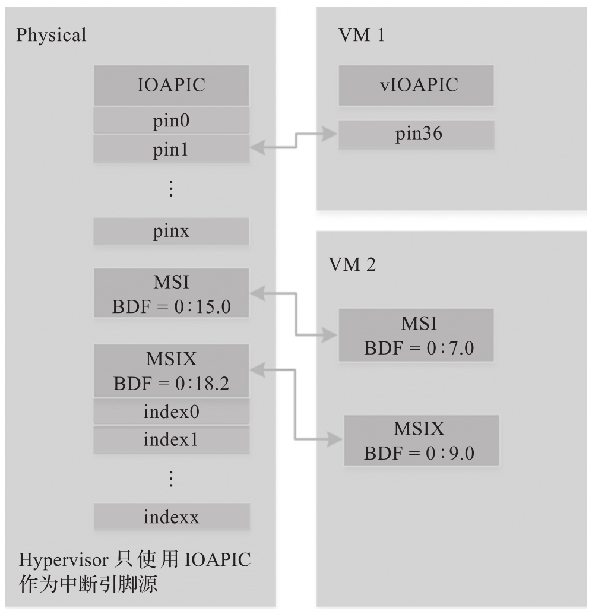
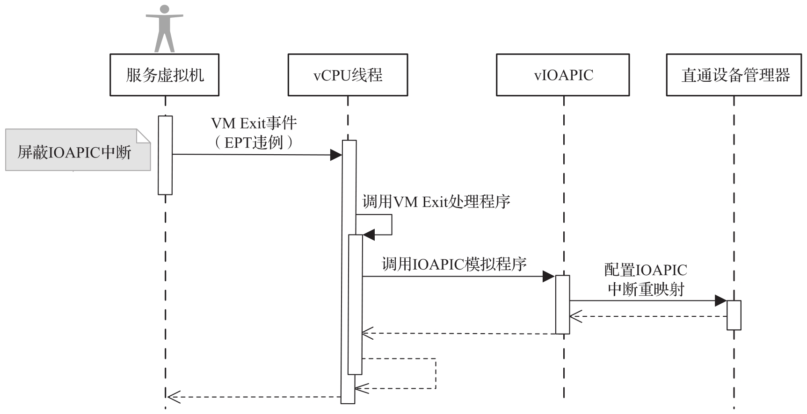
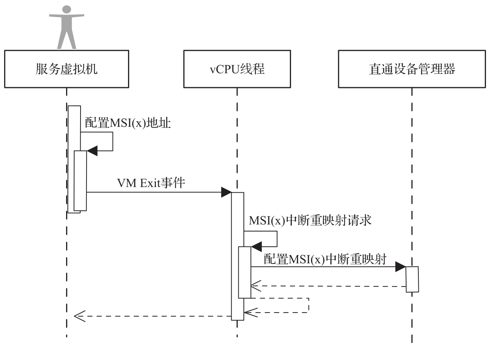

在 ACRN Hypervisor 中, 当透传设备的物理中断发生时, Hypervisor 必须根据中断重映射关系将其分配给相应的 VM.

`ptirq_remapping_info` 结构体用于定义**物理中断**与 VM 以及虚拟目的地等的从属关系.

有两种不同类型的中断源: **IOAPIC** 和 **MSI**. Hypervisor 将记录用于中断分配的不同信息: IOAPIC 源的物理和虚拟 IOAPIC 引脚; MSI 源的物理和虚拟 BDF 以及其他信息. 物理中断的重映射如下图所示.

下图说明了如何为服务虚拟机重映射 IOAPIC 中断.

每当服务虚拟机尝试通过写入重定向表条目 (Redirection Table Entry, RTE) 来取消屏蔽虚拟 IOAPIC 中的中断时, VM Exit 就会发生. 然后, Hypervisor 调用虚拟 IOAPIC 处理程序为要取消屏蔽的中断设置重映射.

下图说明了如何为服务虚拟机设置 MSI 或 MSI-X 的映射.

服务虚拟机负责在配置 PCI 配置空间 (PCI Configuration Space) 以启用 MSI 之前发出 Hypercall 以通知 Hypervisor,Hypervisor 借此机会为给定的 MSI 或 MSI-X 设置重映射, 然后再由服务虚拟机实际启用.

当用户虚拟机需要通过直通 (passthrough) 访问物理设备时, 将使用以下步骤.

1) 用户虚拟机收到一个虚拟中断.

2) VM Exit 发生, 被捕获的 vCPU 为中断注入的目标.

3) Hypervisor 将根据 ptirq_remapping_info 处理中断并转换向量.

4) Hypervisor 将中断注入用户虚拟机.

当服务虚拟机需要使用物理设备时, 直通也处于活动状态, 因为服务虚拟机是第一个 VM. 详细步骤如下.

1) 服务虚拟机获取所有物理中断. 它在初始化期间为不同的 VM 分配不同的中断, 之后在创建或删除其他 VM 时重新分配中断.

2) 物理中断会被捕获到 Hypervisor.

3) Hypervisor 将根据 ptirq_remapping_info 处理中断并转换向量.

4) Hypervisor 将虚拟中断注入服务虚拟机.
