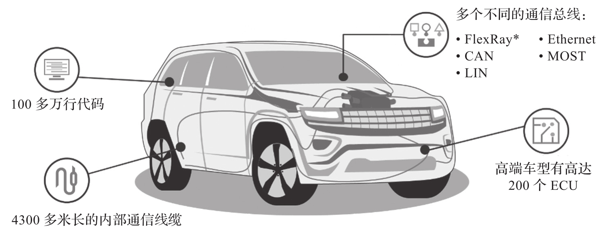

当前, 驾驶舱由几十个独立的电子控制单元组成, 每个 ECU 都有着各自的分工, 譬如用来感知车速, 控制空调温度, 道路预警, 控制显示等.

随着驾驶舱的功能越来越丰富, ECU 的数量也在增加, 而且需要多种不同的通信总线, 车内通信线缆长度已经高达数千米, 导致驾驶舱的研发和维护成本都在增加, 这和汽车的轻量化和成本控制方向背道而驰. 当前车辆组件构成图如图 13-1 所示.

下面两个例子说明了独立 ECU 面临的挑战.

* 在使用多个显示器的新车设计中, 如果每个显示器系统都是孤立的, 而不是互联的, 驾驶员就无法及时便利地获取需要的信息. 譬如在中央控制屏幕上有详细的地图导航, 但是也需要在数字仪表盘上显示主要的地图方向信息, 让驾驶员更加轻松, 而不是总是转向中控屏, 影响驾驶安全. 这就需要一个高度集成的系统, 能够把导航应用信息实时映射到包括数字仪表盘在内的其他显示屏幕.

* 汽车紧急预警系统, 如防撞系统, 提醒驾驶员即将遇到障碍物, 为了确保驾驶员能及时方便地看到警告信息, 应该把其显示在正确的位置——仪表盘或抬头显示上.

对于上述挑战, 目前车企会在现有车辆体系结构中采用间接通信方法, 即仪表盘 ECU 从中央控制系统 ECU 或预警系统 ECU 输入视频流或警告信息, 并在仪表盘显示屏的专用固定位置来呈现简要地图信息或警告信息. 这种方法需要额外的处理能力来进行编码, 解码, 也需要额外的网络带宽进行数据传输, 从而导致信息延时和复杂的集成挑战.
