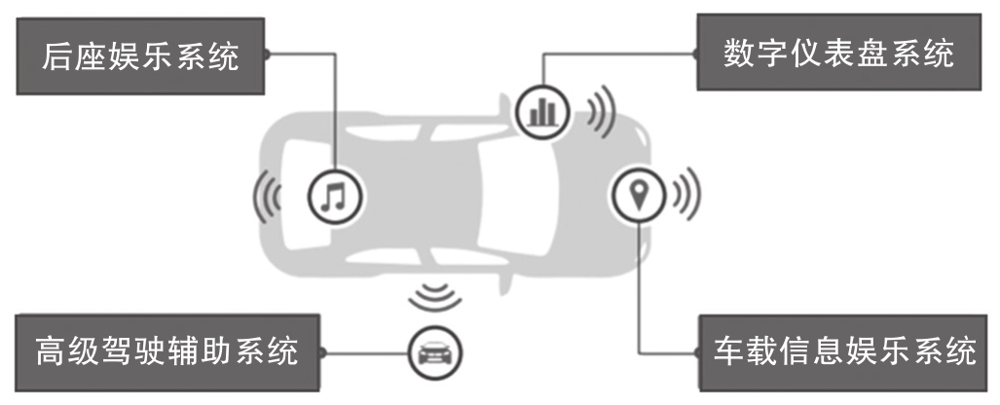

用一颗功能强大的片上系统芯片 (SoC) 来整合独立的多个 ECU, 并采用软件定义驾驶舱方案把驾驶舱设计得更贴近用户的需求, 让用户享受丰富的信息娱乐, 增强的安全特性等新功能. 而车企在研发中非常重视的成本, 空间, 重量, 功能和能耗都能在 SoC 和软件定义驾驶舱的联合应用中给予很好的解决, 并且逐渐成为未来驾驶舱的趋势.

# 更强大的 SoC 芯片

当前芯片厂商可以提供性能强大和功能丰富的 SoC, 集成了前所未有的计算能力来构建驾驶舱中央控制器. 这些 SoC 可以运行信息娱乐系统, 驾驶舱仪表系统, 预警碰撞系统等不同领域的许多应用, 并包含了强大的协处理器, 如图形处理单元, 人工智能处理单元等, 可以驱动多个显示屏幕, 并可对道路行人进行识别.

现在, 一个 SoC 上集成了之前多个 ECU 才能实现的功能, 这有助于降低总的计算能力, 减少通信损耗, 并且可以通过负载均衡来更合理地最大限度利用 SoC 的计算能力. 例如, 泊车助手可以与导航系统共享图形处理能力, 将三维地图渲染为两种功能同时使用. 如果之前使用单独的专用 ECU 硬件, 那么这种共享是不可实现的. ECU 集成带来了更高效的通信, 之前如果中央控制娱乐 ECU 需要向仪表盘 ECU 发送地图视频流, 则需要在两端进行复杂的编码和解码, 以便通过以太网或特定总线进行数据传输. 而使用集成 SoC 构建的软件定义驾驶舱, 可以更高效地通过共享内存来实时分享视频流或者预警信息等数据. 与多个单独 ECU 系统相比, 该系统具有更低的 BOM 成本, 更少的占用空间, 更小的重量, 更低的能耗, 以及更丰富的附加功能.

# 更灵活的软件

软件定义的驾驶舱集成了更丰富的车载功能, 重新定义了人机交互方式, 把互联 (Connectivity), 云(Cloud), 融合(Combination) 与驾驶舱 (Cockpit) 进行结合, 实现了 4C.

当前汽车的功能越来越多, 而人们期待把尽量多的功能都集成到中控屏, 取消按键控制; 人们也希望将更多先进的技术融入中控屏, 譬如地图导航, 手机互联, 蓝牙电话, 网络浏览, 甚至视频播放等娱乐功能, 这些都需要软件定义的驾驶舱.

软件定义驾驶舱将使人机交互更加便利, 只需语音, 就可以开关空调, 接打电话, 行路导航, 甚至微信语音; 软件定义驾驶舱也将提升驾驶体验, 抬头显示, 语音控制空调, 语音导航都将使驾驶更加便利.

如图所示, 软件定义驾驶舱主要包括以下 4 个子系统.

* 数字仪表盘 (IC) 系统: 为驾驶员提供驾驶信息, 如速度, 燃油油位, 行驶里程等. 它还可以在风窗玻璃上投射图像, 并发出低燃油或轮胎压力警报.

* 车载信息娱乐 (IVI) 系统: 提供导航系统, 收音机和娱乐系统等功能. 它可以扩展到允许通过语音识别连接到移动设备, 以便进行通话, 播放音乐和执行应用程序. 在最新的汽车上, 还包括倒车 / 环视摄像头的显示, 泊车辅助功能和手势识别 / 触摸.

* 后座娱乐 (RSE) 系统: 为后座人士提供豪华的娱乐系统. 它还可以允许进一步的功能, 如虚拟办公室访问或连接到 IVI 前端系统和移动设备(云连接)​.

* 高级驾驶辅助系统(ADAS): 提供驾驶辅助功能, 从盲点监控, 自适应巡航控制, 车道偏离警告到更先进的辅助功能, 如制动辅助, 防撞, 自动驻车系统和驾驶员监控.

软件定义驾驶舱更加助力驾驶舱的发展, 赋予了汽车仪表, 中控屏和后排娱乐屏更多的功能, 让车内人员通过触摸屏甚至语音来进行人机交互, 减少了车内按键, 简化了驾驶舱的布局.

软件定义驾驶舱丰富了驾驶舱的功能, 无论驾驶感受还是娱乐体验, 都是前所未有的, 但是同时也带来了挑战. 驾驶舱赋予了越来越多的功能, 也需要越来越多的硬件系统来实现这些功能, 譬如: 仪表盘需要一个硬件系统, 中控娱乐需要一个硬件系统, 后排娱乐系统需要一个硬件系统. 软件定义驾驶舱急需一个硬件简化, 软件统一的一体化方案.
