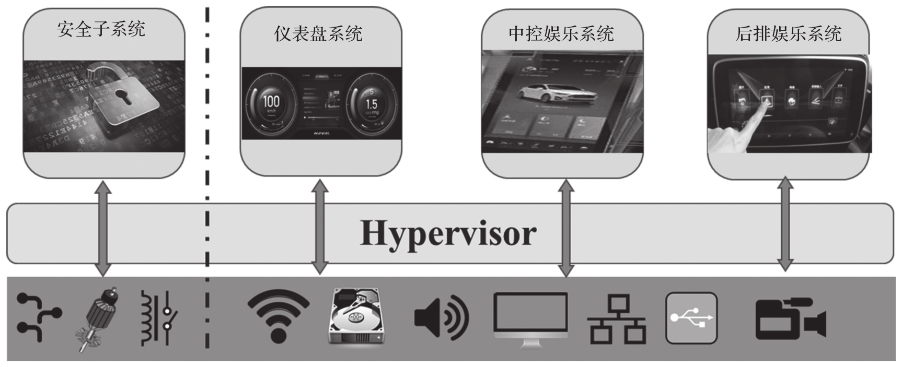

基于虚拟化技术的软件定义驾驶舱方案可以把不同的功能整合到一个功能丰富的 SoC 上, 并降低系统复杂性, 降低成本, 还可以分离各个子系统以提高各系统的安全性.

基于虚拟化技术的软件定义驾驶舱解决方案框图如图 13-3 所示.

仪表盘系统运行关键的安全操作系统, 中控娱乐系统和后排娱乐系统可以运行非安全的操作系统, 譬如 Android 或 Linux. 每个子系统都彼此独立, 但是又同时使用同一颗功能强大的 SoC.

虚拟化技术方案的关键之处是软硬件之间的 Hypervisor.Hypervisor 可以让多个操作系统同时使用一套硬件, 以此来简化硬件系统, 降低成本. 当前, 有基于 QNX,Xen 和 ACRN 等多款 Hypervisor 的虚拟化方案被应用于量产汽车的软件定义驾驶舱.

基于虚拟化方案的软件定义驾驶舱通常采用一型 Hypervisor. 这主要是基于安全角度的考虑, 因为该类型 Hypervisor 会对 VM 进行很好的隔离, 保证仪表盘 VM 的高安全性.

基于虚拟化技术的软件定义驾驶舱解决方案框图:

在软件定义的驾驶舱体系结构中, 需要用到如下几个 VM.

* 第一个 VM 运行仪表盘系统: 我们认为 Linux 是适合运行大多数仪表盘功能的操作系统. SoC 供应商非常支持 Linux, 有一个很大的开发人员和工具生态系统. Linux 可以满足仪表盘的可靠性和引导要求.

* 第二个及第三个 VM 运行中控娱乐系统或后排娱乐系统: 可使用 Android 或 Linux.

* 第四个 VM 运行功能安全子系统.