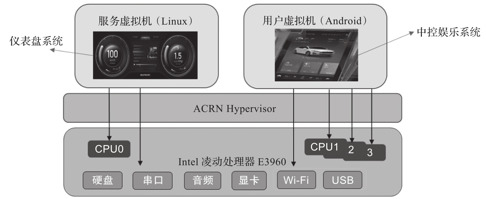

下面介绍一个基于 ACRN Hypervisor 虚拟化技术的软件定义驾驶舱解决方案, 该方案已经成功在实际车型落地并量产. 该方案的架构如图 13-4 所示.

基于 ACRN Hypervisor 虚拟化技术的软件定义驾驶舱解决方案架构:

该系统中从下至上由 4 个部分组成: 基于 Intel x86 架构的 SoC CPU,ACRN Hypervisor, 用来作为仪表盘系统的服务虚拟机, 以及采用 Android 来实现中控娱乐系统的用户虚拟机.

这套软件定义的驾驶舱方案采用了两个 VM, 服务虚拟机采用 Linux 操作系统来作为仪表盘, 而从人机交互的角度考虑, 用户虚拟机 (中控娱乐系统) 采用了 Android 操作系统. 通过 ACRN Hypervisor 的隔离, 仪表盘系统的安全性得到保障, 而 ACRN Hypervisor 所提供的共享机制, 使仪表盘的 Linux 系统和中控娱乐的 Android 系统可以共享同一套硬件资源, 譬如硬盘, USB 口, 音频输出等, 从而降低了成本; 两者还可以独享各自的显示屏. 可以根据各个系统负载的不同, 灵活地分配 CPU 数量到不同的 VM 中.
