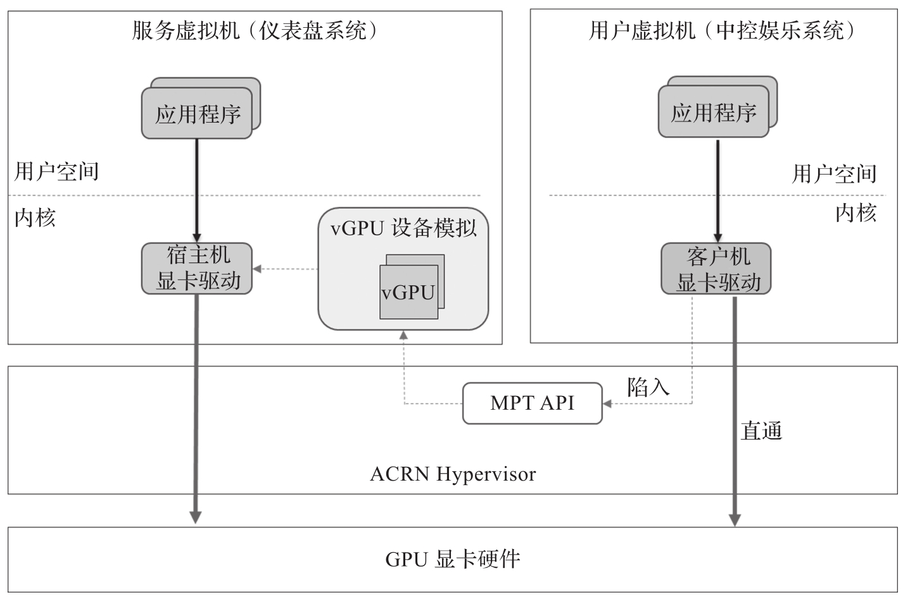
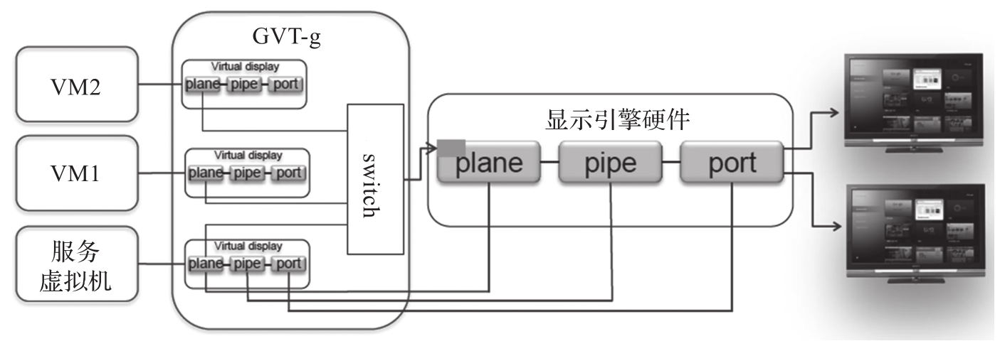

软件定义驾驶舱还需要用到另一个不可或缺的功能, 即显卡共享. 因为 SoC 硬件只有一个物理显卡硬件, 需要该 GPU 同时支持仪表盘系统 VM 和中控娱乐系统 VM 的显示和渲染.

Intel GVT-g 是一种 GPU 虚拟机技术, 它采用受控直通 (Mediated Pass-Through,MPT) 技术实现两个及两个以上 VM 的 GPU 共享, 每个 VM 可以获得接近于物理显卡的图形性能.

# Intel GVT-g 技术架构

Intel GVT-g 的架构图如图 13-5 所示. GPU 受控直通技术有如下三个特点.

* 直通, 对于影响 GPU 性能的关键 I/O 资源, 用分区的方法分给每个 VM.VM 中的显卡驱动可以直接访问 GPU 硬件资源(例如显存)​, 在大多数情况下无须 ACRN Hypervisor 进行干预.

* 受控, 来自 VM 的特权操作指令则被 ACRN Hypervisor 捕获, 然后在服务虚拟机里进行模拟, 保证 VM 之间的安全隔离. GVT-g 技术会在服务虚拟机中模拟出一个 vGPU 来模拟用户 VM 的虚拟 GPU, 并通过宿主机中的显卡驱动操作 GPU 硬件.

* 显卡驱动, 不需要对 VM 中的显卡驱动进行修改, 可以继续使用本机驱动.

# 输出显示虚拟化

GVT-g 使用服务虚拟机中的显卡驱动来初始化显示引擎, 然后通过显示引擎把不同 VM 各自对应的帧缓存器中的内容显示到不同的物理显示端口上. 图 13-6 是显示引擎的平面 (plane), 管道(pipe), 端口(port) 和各个子系统及显示器之间的连线图.

