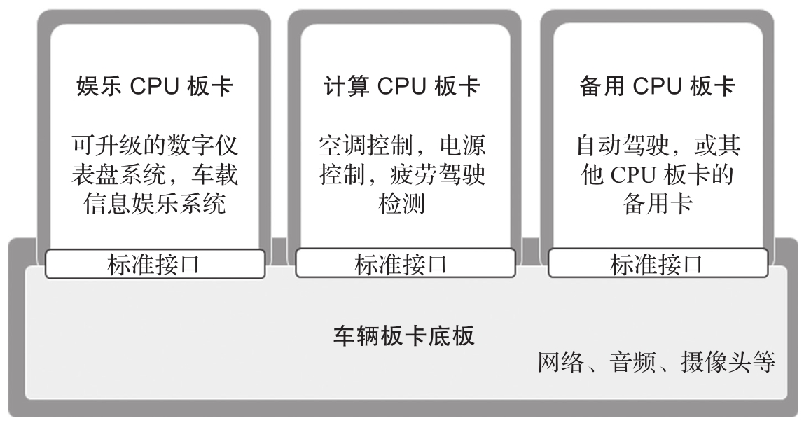

未来的软件定义驾驶舱将会把汽车变成一台 "行驶中的计算平台"​, 图 13-7 是其实现思路. 它由一个通用的板卡底板和若干个可插拔的板卡构成. 底板上主要是规范定义的各种接口以及通用外设, 而可插拔的板卡则是实现各种功能的 CPU 板卡, 比如: 娱乐 CPU 板卡负责实现数字仪表盘系统, 车载信息娱乐系统等功能; 计算 CPU 板卡负责实现汽车的控制功能; 备用 CPU 板卡用于紧急情况下的热切换, 当某个 CPU 板卡出现问题时, 系统可以将其对应的工作负载转移到备用 CPU 板卡. 该方案的另一个好处是, 由于 CPU 板卡是采用通用插卡设计的, 因此方便使用下一代的 CPU 板卡进行升级替换.

未来的软件定义驾驶舱框图:

