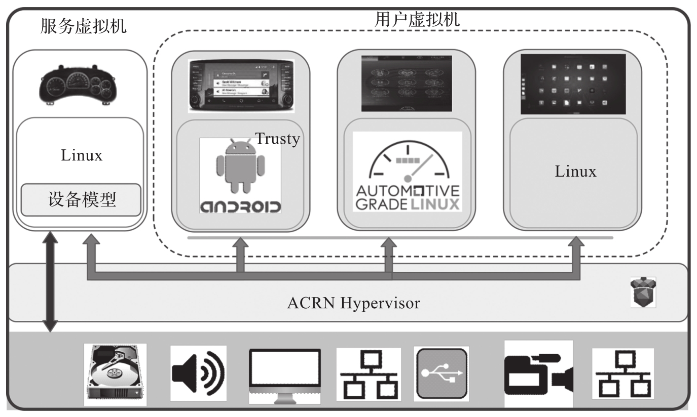
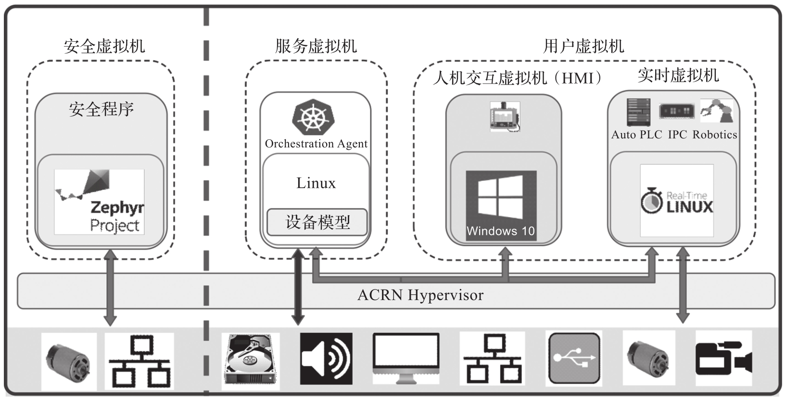

ACRN 作为一个开源的虚拟机项目, 目前主要运行在英特尔的 x86 硬件平台上. 在 ACRN 推出的主要版本中, 主要适配了异构的负载整合用例, 例如软件定义的驾驶舱 (Soft-ware-Defined Cockpit,SDC), 人机界面(Human-Machine Interface,HMI) 和工业实时操作系统.

在 ACRN 的开发过程中, 其中 1.0 的版本主要支持 SDC 场景. SDC 由多个子系统组成: 数字仪表盘 (In-Vehicle Cluster,IC), 车载信息娱乐(In-Vehicle Infotainment,IVI) 系统和一个或多个后座娱乐 (Rear Seat Entertainment,RSE) 系统. 每个系统都作为 VM 运行, 以实现更好的隔离.

其中数字仪表盘控制系统管理以下信息的显示:

* 行驶速度, 发动机转速, 温度, 油位, 里程表, 行驶里程等.

* 低燃油或轮胎压力警报.

* 用于驾驶辅助的后视摄像头 (Rear View Camera,RVC) 和环绕摄像头视图.

典型的车载信息娱乐系统支持:

* 导航系统.

* 收音机, 音频和视频播放.

* 通过语音识别和 / 或手势识别 / 触摸移动设备连接通话, 音乐和应用程序.

后座娱乐系统提供如下功能, 例如:

* 娱乐系统.

* 虚拟办公室.

* 连接 IVI 前端系统和移动设备(云连接)​.

ACRN 1.0 上支持 Linux 和 Android 的用户虚拟机, 如图 4-1 所示. OEM 厂商可以参考 Linux 或 Android 客户操作系统来实现自己的虚拟机, 以实现定制的 IC/IVI/RSE.

ACRN 1.0 车载虚拟化场景:

ACRN 2.0/3.0 主要支持工业实时场景, 如下图所示.

ACRN 2.0/3.0 的工业场景:

一个典型的工业场景包含一个 Windows 系统 (作为 HMI VM) 和一个实时的 VM[如果客户机上运行的是一个实时系统, 我们又称此 VM 为 Real-Time VM(RTVM)]​.

* Windows 作为客户机操作系统提供人机交互界面.

* RTVM 包含一个实时操作系统和里面运行的实时任务负载, 如 PLC 的控制.

也有的场景可能会包含一个安全虚拟机(Safety VM), 专门用作整机系统的安全控制. 普通的工业场景也可能不需要安全虚拟机, 只需要 HMI+RTVM 即可. 有的工业场景则需要多个 RTVM 来运行不同的实时任务.

除以上典型应用场景之外，ACRN还可以用于其他场景，厂商或用户在熟悉ACRN的配置后可以自行适配。
