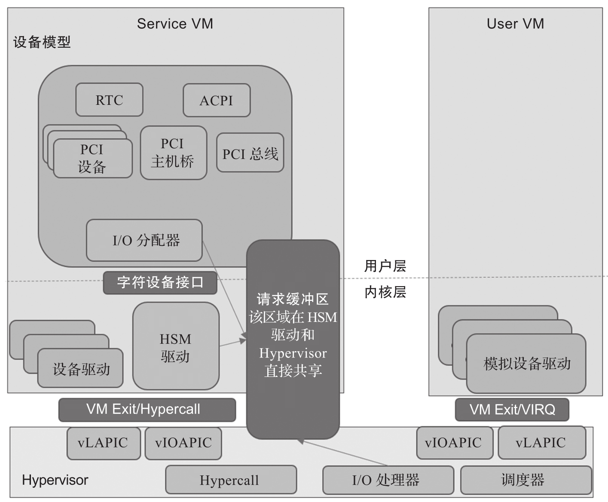
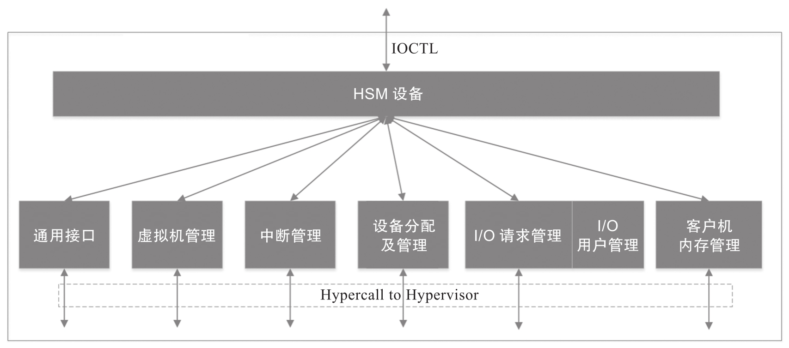
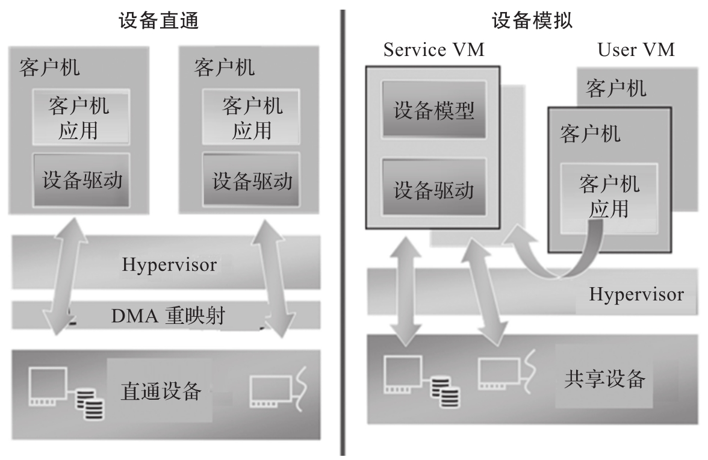
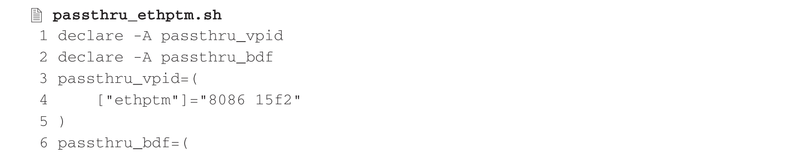
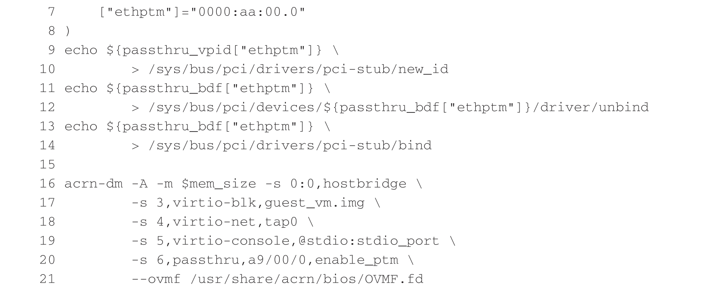
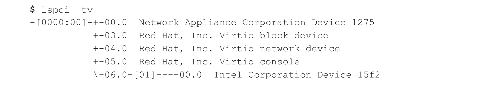

ACRN 支持两种设备模型: 第一种是设备直通, 即将一个设备完全给一个特定的虚拟机使用; 第二种是基于共享的设备模型. 设备直通具有最好的性能, 但是受硬件资源的限制, 在很多情况下无法实现 (特别是对成本敏感的嵌入式设备)​. 设备模型可以通过软件模拟的方法模拟出多个虚拟的设备, 让客户机操作系统可以通过共享的设备模型来访问虚拟的 I/O 设备, 共享宝贵的物理资源. 在客户机对 I/O 性能要求不高的情况下 (比如不需要实时性和不需要很高带宽)​, 设备模型可以节约硬件资源, 带来更高的性价比.

> ACRN 官网上的设备模型介绍: https://projectacrn.github.io/latest/developer-guides/hld/hld-devicemodel.html

ACRN 中的设备模型由 ACRN-DM(Device Model) 实现, 其架构原理如图所示.

图中显示了 ACRN 设备模型的一些重要组件.

设备模型 (Device Model,DM) 为前端客户机设备驱动程序提供后端设备仿真例程. 这些例程将它们的 I/O 处理程序注册到 DM 内的 I/O 分配器程序. 当客户机内部的驱动程序访问对应的 I/O 或 MMIO 时, 就会产生 VM Exit, 并进入 Hypervisor 中进行处理, 从而通知 Service VM HSM 模块把 I/O 请求分配给 DM,I/O 分配器会将此请求分配给相应的设备仿真例程以进行仿真.

Service VM 中的 I/O 路径:

* Hypervisor 初始化 I/O 请求并通过上行调用通知 Service VM 中的 HSM 驱动程序.

* HSM 驱动程序将 I/O 请求分配给 I/O 客户端并通知客户端 (此时客户端为 DM, 通过字符设备通知)​.

* DM I/O 分配器调用相应的 I/O 处理程序.

* I/O 分配器通过字符设备通知 HSM 驱动 I/O 请求完成.

* HSM 驱动程序通过超级调用 (Hypercall) 在完成时通知 Hypervisor.

* DM 通过超级调用将虚拟中断注入客户机来通知前端设备.

HSM(Hypervisor Service Module) 支持 DM 的中间层. 设备模型通过访问从 HSM 模块导出的接口来管理用户 VM.HSM 模块是一个 Service VM 内核驱动程序, 其初始化时会创建 / dev/acrn_hsm 节点. 设备模型遵循标准 Linux 字符设备 API(IOCTL) 来访问 HSM 功能. 服务虚拟机 HSM 内核模块架构图如图所示.

设备虚拟化一般有两种方式, 即设备直通和设备模拟, 其中设备模拟又可分全虚拟化实现以及半虚拟化实现. 设备直通是将主机物理设备直接分配给虚拟机使用, 这和物理机上使用设备相同. 全虚拟化设备是通过对具体设备的寄存器进行完整模拟以呈现给客户机一个与物理设备完全相同的设备. 而半虚拟化设备则是利用半虚拟化规范定义虚拟设备, 通过前后端驱动来实现虚拟设备模拟. 接下来, 我们简单介绍设备直通的使用, 5.2 节将介绍 ACRN 支持的各种全虚拟化设备, 5.3 节将介绍 ACRN virtio 半虚拟化设备.

设备直通与设备模拟的区别如图所示.

设备直通提供以下功能以允许 VM 直接访问 PCI 设备.

* PCI 设备的 VT-d DMA 重映射: 管理程序将在 VM 初始化阶段设置 DMA 重映射.

* PCI 设备的 VT-d 中断重映射: 出于安全考虑, 虚拟机管理程序将为 PCI 设备启用 VT-d 中断重映射.

* 虚拟和物理 BAR 之间的 MMIO 重映射.

* 设备配置空间仿真.

* 重映射 PCI 设备的中断.

* ACPI 配置虚拟化.

* GSI 共享违规检查.

下面以 PTM(Precision Time Measurement) 网卡为例介绍如何配置设备直通, 代码如下.

PCI Express(PCIe) 规范定义了 PTM 精确时间测量机制, 该机制支持同一系统内具有独立本地时钟的多个 PCI 组件之间的时间协调和事件同步. 英特尔在其多个系统和设备上支持 PTM, 例如 Whiskey Lake 和 Tiger Lake PCIe 根端口上的 PTM 根功能支持, 以及英特尔 I225-V/I225-LM 系列以太网控制器上的 PTM 设备支持.

通过 lspci 命令在 User VM 中查看直通的网卡.

