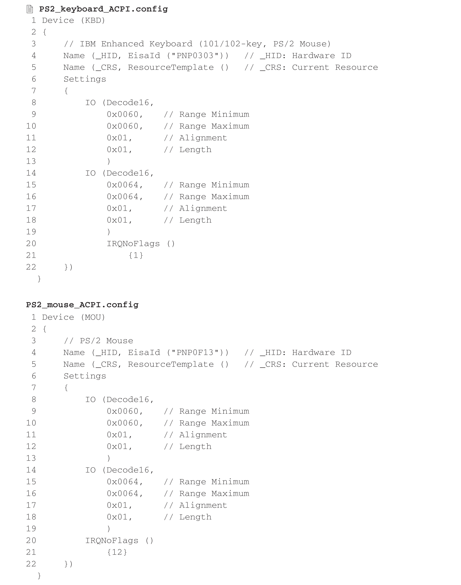
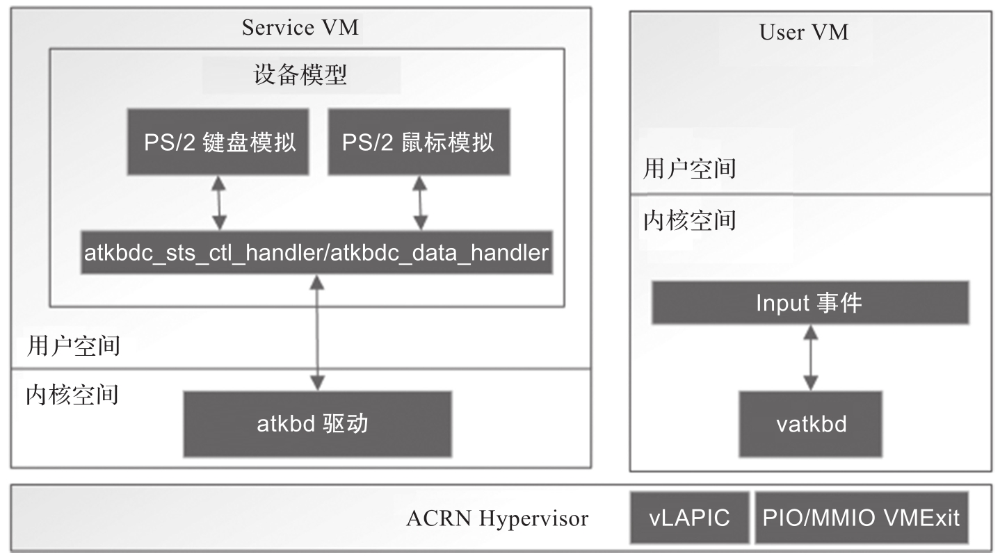

PS/2 接口是一种 PC 兼容型计算机系统上的接口, 可以用来连接键盘及鼠标. PS/2 的命名来自 1987 年 IBM 所推出的个人计算机: PS/2 系列. PS/2 鼠标连接通常用来取代旧式的序列鼠标接口 (DB-9RS-232); 而 PS/2 键盘连接则用来取代为 IBM PC/AT 设计的大型 5-pin DIN 接口. 目前 PS/2 接口已经慢慢被 USB 所取代, 只有少部分的台式机仍然提供完整的 PS/2 键盘及鼠标接口.

ACRN 对 PS/2 接口的支持基于 ACPI 模拟. 通过添加如下虚拟 DSDT 表给客户机, 并截获对端口 0x60(数据寄存器端口)​,0x64(地址寄存器端口) 的访问, ACRN 实现了对 PS/2 设备的模拟, 其 ACPI 配置代码如下所示.

其具体实现如图所示.

客户机对端口 0x60,0x64 的访问会被 ACRN 截获并传递给 ACRN 设备模型进行模拟.

PS/2 控制器相关源码: https://github.com/projectacrn/acrn-hypervisor/blob/v3.0/devicemodel/hw/platform/atkbdc.c

