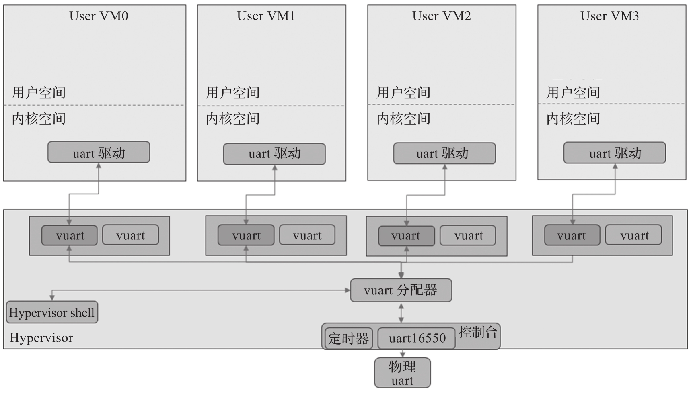

串口被广泛用于各种调试, ACRN 在其虚拟机监控器 (Hypervisor) 以及设备模型 (Device Model) 中都实现了对该设备的模拟. Hypervisor 中实现了虚拟的 16550 vUART, 它可以用作控制台或通信端口. vUART 映射到传统的 COM 端口地址. 内核中的 UART 驱动程序可以自动检测端口基数和中断号.

如下图所示, vUART 可用作控制台端口, 并且可以通过 ACRN Hypervisor 控制台中的 vm_console 命令激活任意一个 VM 使用物理串口.



图中显示了 4 个虚拟 vuart 如何共享同一个物理 uart.ACRN Hypervisor 中的物理 uart 驱动工作在轮询模式, 通过定时器每隔一定时间轮询, 将收到的数据根据需要交给 ACRN Hypervisor 中的 shell 处理程序或转发给特定 User VM 处理, 同时将 User VM 发出的数据转发到物理串口.

要为 User VM 配置 vUART 虚拟控制台, 更改配置文件 `configs/scenarios/<scenario name>/vm_configurations.c` 中的 port_base 和 irq 两个变量. 例如:

* COM1_BASE(0x3F8)+COM1_IRQ(4)

* COM2_BASE(0x2F8)+COM2_IRQ(3)

* COM3_BASE(0x3E8)+COM3_IRQ(6)

* COM4_BASE(0x2E8)+COM4_IRQ(7)

代码如下所示:

```cpp
// vm_configurations.c
struct acrn_vm_config vm_configs[CONFIG_MAX_VM_NUM] = {
	{
		/* Static configured VM0 */
		CONFIG_SERVICE_VM,
		.name = "VM0",
        ...
		.vuart[0] =
			{
				.type = VUART_LEGACY_PIO,
				.addr.port_base = 0x3F8U,
				.irq = 4U,
			},
    ...
```

ACRN 启动后可通过其控制台的 vm_console 命令在不同的 User VM 之间切换. 按下组合键 Ctrl+@可回到 ACRN 控制台.

设备模型模拟 UART 串口相关源码: https://github.com/projectacrn/acrn-hypervisor/blob/v3.0/devicemodel/hw/uart_core.c 和 https://github.com/projectacrn/acrn-hypervisor/blob/v3.0/devicemodel/hw/pci/lpc.c

Hypervisor 模拟 UART 串口相关源码: https://github.com/projectacrn/acrn-hypervisor/blob/v3.0/hypervisor/dm/vuart.c 和 https://github.com/projectacrn/acrn-hypervisor/blob/v3.0/hypervisor/debug/console.c
