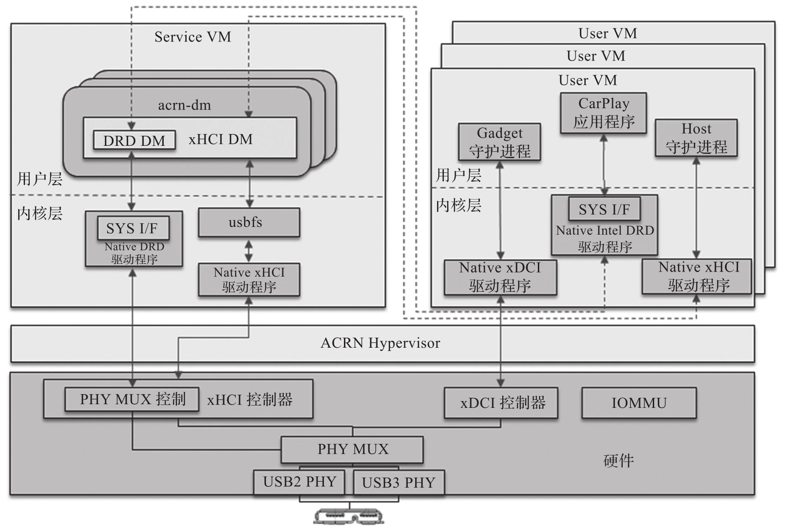
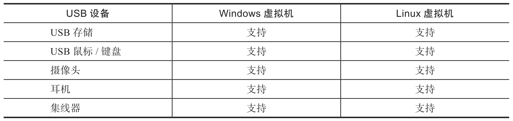
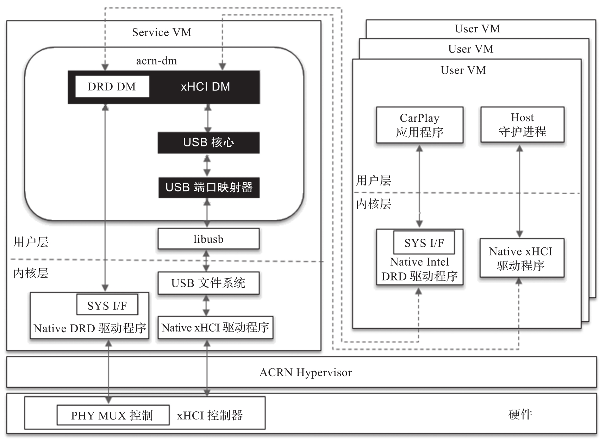
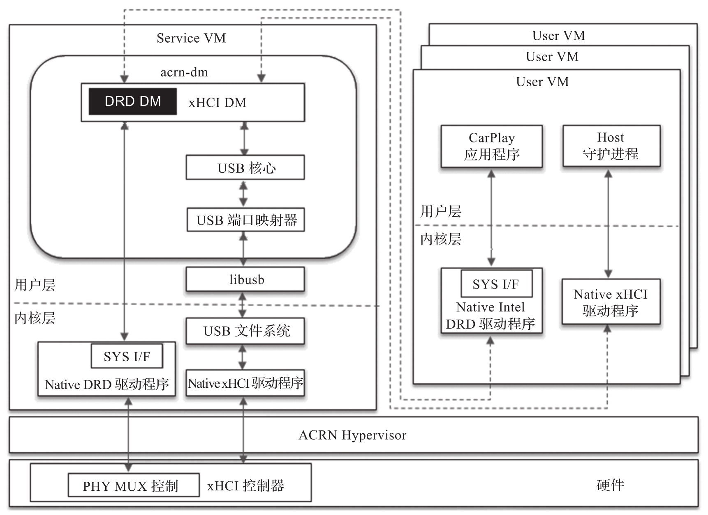

通用串行总线 (USB) 是一个行业标准, 它可以为个人计算机与其外围设备之间提供连接, 通信和供电.

ACRN USB 虚拟化架构如图所示.

其中, xHCI(Host Controller Interface)DM 提供多个虚拟 xHCI 控制器实例以在多个用户操作系统之间共享, 每个 USB 端口可以通过用户设置分配给 VM 使用. xDCI(Device Controller Interface)控制器通过 IOMMU 直通给特定的 VM.DRD(Dual Role Device)DM 模拟 PHY MUX 控制逻辑.

来自客户机的 xHCI 寄存器访问会通过 EPT 配置从客户机陷入 DM 进行模拟, xHCI DM 或 DRD DM 将模拟硬件行为以使系统运行.

# ACRN 支持的 USB 设备

下表列出了 ACRN 支持的 USB 设备, 这些设备可以运行在 Windows 虚拟机及 Linux 虚拟机上, 并且可以被多个虚拟机共享使用.

# USB Host 虚拟化

USB Host 虚拟化的原理如图所示.

支持 xHCI 的 ACRN USB 软件栈由以下组件构成:

* xHCI 设备模型驱动(xHCI DM):xHCI DM 按照 xHCI 规范模拟 xHCI 控制器.

* USB 核心(USB core):USB 核心是一个中间抽象层, 用于隔离 USB 控制器仿真器和 USB 设备仿真器.

* USB 端口映射器(USB Port Mapper):USB 端口映射器将特定的物理 USB 端口映射到虚拟 USB 端口.

根据 xHCI 规范, 来自用户 VM 的所有 USB 数据缓冲区都采用 TRB(传输请求块)的形式. 当相关的 xHCI doorbell 寄存器被设置时, xHCI DM 从数据缓冲区获取相关数据. 这些数据将被转换为 usb_data_xfer, 并通过 USB 核心转发到 USB 端口映射器模块, 该模块将通过 libusb 与主机 USB 堆栈进行通信.

# USB DRD 虚拟化

USB DRD(Dual Role Device)虚拟化的原理如图所示.

DRD 功能是作为 xHCI 供应商扩展功能实现的. ACRN 以相同的方式进行模拟, 因此可以在用户 VM 中重用物理驱动程序. 当用户 VM DRD 驱动程序读取或写入相关的 xHCI 扩展寄存器时, 这些访问将被 xHCI DM 捕获. xHCI DM 使用主机 DRD 相关的 sysfs 接口来执行 Host/Device 模式切换操作.

USB 设备相关源码: https://github.com/projectacrn/acrn-hypervisor/blob/v3.0/devicemodel/hw/pci/xhci.c