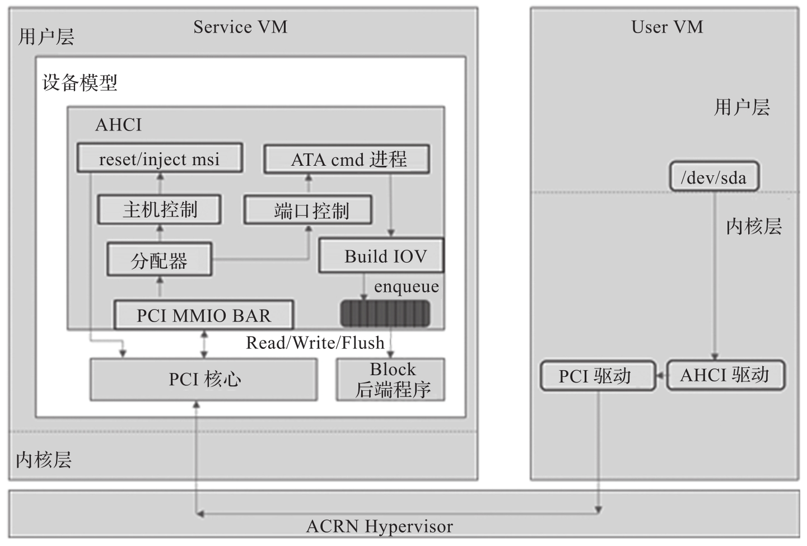

高级主机控制器接口 (AHCI) 是由英特尔制定的技术标准, 是软件与 SATA 存储设备沟通的协议规范. AHCI 为硬件制造商详细定义了存储器架构规范, 规范了如何在系统存储器与 SATA 存储设备之间传输资料.

在 ACRN 中的 AHCI 控制器模拟如图所示.

ACRN 设备模型会暴露一个 PCI 设备(厂商 ID 为 0x8086, 设备 ID 为 0x2821)​. 当客户机操作系统被加载时, 其会被加载为 / dev/sdX 块设备. 当在客户机中对 / dev/sda 进行读写访问时, 访问请求会被转发给客户机中的 AHCI 驱动, 并根据 AHCI 的规范读写 AHCI MMIO 寄存器, 最终转换为对 PCI BAR 的读写. 这些访问会被 ACRN 虚拟机监控器截获, 并转发给 ACRN 设备模型中的 AHCI 后端驱动处理, 后端驱动模拟读写完成后, 会通过 ACRN 虚拟机监控器给客户机注入中断来通知前端驱动(即客户机中的 AHCI 驱动)​, 从而完成客户机中对 / dev/sda 的读写访问请求.

AHCI 控制器相关源码: https://github.com/projectacrn/acrn-hypervisor/blob/v3.0/devicemodel/hw/pci/ahci.c
