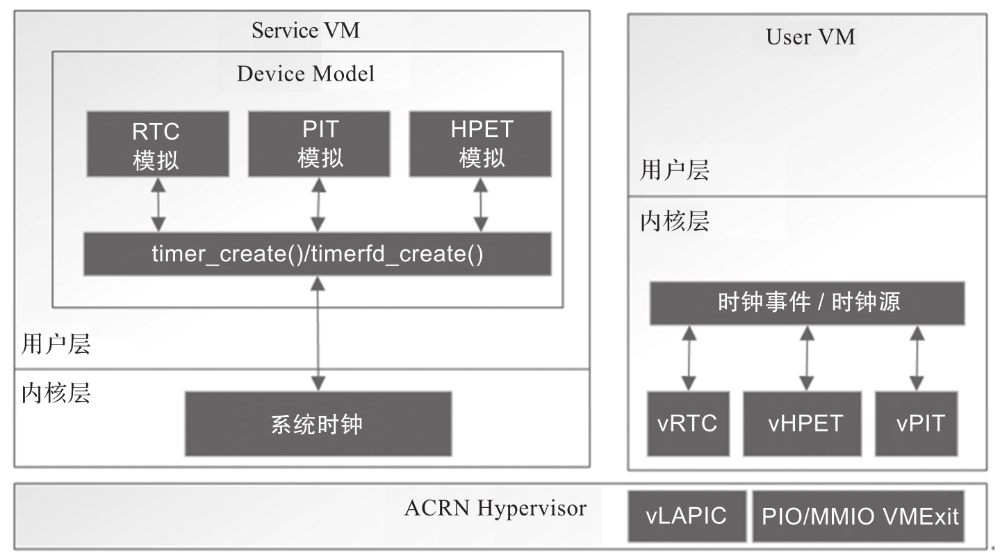

ACRN 支持实时时钟 (Real Time Clock,RTC), 可编程时钟 (Programmable Interval Timer,PIT) 和高精度事件时钟 (High Precision Event Timer,HPET) 作为系统时钟. 相比 RTC 和 PIT,HPET 有更高的分辨率.

系统时钟虚拟化架构如图所示.



通过对端口 I/O 和 MMIO 的模拟, 客户机可以看到 vRTC,vPIT 和 vHPET. 当客户机访问这些端口 I/O 和 MMIO 时, ACRN 会截获这些访问并将其转给 ACRN 设备模型来处理.

系统时钟在设备模型中的初始化在 vm_init_vdevs 函数中完成, 其初始化函数分别是 vrtc_init,vpit_init 和 vhpet_init, 代码如下所示:

```cpp
// devicemodel/core/main.c
static int
vm_init_vdevs(struct vmctx *ctx)
{
    ...
	ret = vrtc_init(ctx);

	ret = vpit_init(ctx);

	ret = vhpet_init(ctx);
    ...
}
```

# PIT 模拟

ACRN 支持对 Intel 8253 可编程计时器进行模拟. 该芯片具有三个独立的 16 位递减计数器, 它可以通过前三个端口进行即时读取, 第四个端口用来配置计时器模式. 其关键定义代码如下:

```cpp
// devicemodel/include/pit.h
#define	IO_TIMER1_PORT	0x40		/* 8253 Timer #1 */
#define	NMISC_PORT	0x61

#define	PIT_ATPIC_IRQ	0
#define	PIT_IOAPIC_IRQ	2

/*
 * The outputs of the three timers are connected as follows:
 *
 *	 timer 0 -> irq 0
 *	 timer 1 -> dma chan 0 (for dram refresh)
 * 	 timer 2 -> speaker (via keyboard controller)
 *
 * Timer 0 is used to call hardclock.
 * Timer 2 is used to generate console beeps.
 */
#define	TIMER_CNTR0	(IO_TIMER1_PORT + TIMER_REG_CNTR0)
#define	TIMER_CNTR1	(IO_TIMER1_PORT + TIMER_REG_CNTR1)
#define	TIMER_CNTR2	(IO_TIMER1_PORT + TIMER_REG_CNTR2)
#define	TIMER_MODE	(IO_TIMER1_PORT + TIMER_REG_MODE)
```

vPIT 的初始化函数和处理函数分别为 vpit_init 和 vpit_handler, 通过对上述端口的模拟, ACRN 可以给客户机呈现 vPIT.

PIT 模拟相关源码: https://github.com/projectacrn/acrn-hypervisor/blob/v3.0/devicemodel/hw/platform/pit.c

# RTC 模拟

ACRN 对 RTC 的模拟是通过对端口 0x70 和 0x71 的模拟来实现的. 其中 0x70 是 CMOS 地址寄存器, 0x71 是 CMOS 数据寄存器, 访问时应先指定地址, 然后指定数据.

```cpp
// devicemodel/hw/platform/rtc.c
int
vrtc_init(struct vmctx *ctx)
{
    ...
	/*register io port handler for rtc addr*/
	rtc_addr.name = "rtc";
	rtc_addr.port = IO_RTC;
	rtc_addr.size = 1;
	rtc_addr.flags = IOPORT_F_INOUT;
	rtc_addr.handler = vrtc_addr_handler;
	rtc_addr.arg = vrtc;
	if (register_inout(&rtc_addr) != 0) {
		err = -EINVAL;
		goto fail;
	}

	/*register io port handler for rtc data*/
	rtc_data.name = "rtc";
	rtc_data.port = IO_RTC + 1;
	rtc_data.size = 1;
	rtc_data.flags = IOPORT_F_INOUT;
	rtc_data.handler = vrtc_data_handler;
	rtc_data.arg = vrtc;
	if (register_inout(&rtc_data) != 0) {
		err = -EINVAL;
		goto fail;
	}
    ...
}
```

其初始化函数 vrtc_init 中注册了端口读写的模拟函数 vrtc_addr_handler 和 vrtc_data_handler.

RTC 模拟相关源码: https://github.com/projectacrn/acrn-hypervisor/blob/v3.0/devicemodel/hw/platform/rtc.c

# HPET 模拟

相比 RTC 和 PIT,HPET 有更高的精度, 其时钟频率为 16.7MHz.HPET 通过 MMIO 访问, 其寄存器基地址为 0xfed00000, 长度为 1024B.

```cpp
// devicemodel/include/hpet.h
#define VHPET_BASE	(0xfed00000)
#define VHPET_SIZE	(1024)

// devicemodel/hw/platform/hpet.c
#define	HPET_FREQ	(16777216)		/* 16.7 (2^24) Mhz */
```

HPET 寄存器定义如下:

```cpp
// devicemodel/include/acpi_hpet.h
/* General registers */
#define HPET_CAPABILITIES	0x0	/* General capabilities and ID */
#define	HPET_CAP_VENDOR_ID	0xffff0000
#define	HPET_CAP_LEG_RT		0x00008000
#define	HPET_CAP_COUNT_SIZE	0x00002000 /* 1 = 64-bit, 0 = 32-bit */
#define	HPET_CAP_NUM_TIM	0x00001f00
#define	HPET_CAP_REV_ID		0x000000ff
#define HPET_PERIOD		0x4	/* Period (1/hz) of timer */
#define HPET_CONFIG		0x10	/* General configuration register */
#define	HPET_CNF_LEG_RT		0x00000002
#define	HPET_CNF_ENABLE		0x00000001
#define	HPET_ISR		0x20	/* General interrupt status register */
#define HPET_MAIN_COUNTER	0xf0	/* Main counter register */

/* Timer registers */
#define	HPET_TIMER_CAP_CNF(x)	((x) * 0x20 + 0x100)
#define	HPET_TCAP_INT_ROUTE	0xffffffff00000000
#define	HPET_TCAP_FSB_INT_DEL	0x00008000
#define	HPET_TCNF_FSB_EN	0x00004000
#define	HPET_TCNF_INT_ROUTE	0x00003e00
#define	HPET_TCNF_32MODE	0x00000100
#define	HPET_TCNF_VAL_SET	0x00000040
#define	HPET_TCAP_SIZE		0x00000020 /* 1 = 64-bit, 0 = 32-bit */
#define	HPET_TCAP_PER_INT	0x00000010 /* Supports periodic interrupts */
#define	HPET_TCNF_TYPE		0x00000008 /* 1 = periodic, 0 = one-shot */
#define	HPET_TCNF_INT_ENB	0x00000004
#define	HPET_TCNF_INT_TYPE	0x00000002 /* 1 = level triggered, 0 = edge */
#define	HPET_TIMER_COMPARATOR(x) ((x) * 0x20 + 0x108)
#define	HPET_TIMER_FSB_VAL(x)	((x) * 0x20 + 0x110)
#define	HPET_TIMER_FSB_ADDR(x)	((x) * 0x20 + 0x114)

#define	HPET_MIN_CYCLES		128	/* Period considered reliable. */
```

HPET 的 ACPI 描述如下:

```cpp
// devicemodel/hw/platform/acpi/acpi.c
static int
basl_fwrite_hpet(FILE *fp, struct vmctx *ctx)
{
	EFPRINTF(fp, "/*\n");
	EFPRINTF(fp, "* dm HPET template\n");
	EFPRINTF(fp, "*/\n");
	EFPRINTF(fp, "[0004]\t\tSignature : \"HPET\"\n");
	EFPRINTF(fp, "[0004]\t\tTable Length : 00000000\n");
	EFPRINTF(fp, "[0001]\t\tRevision : 01\n");
	EFPRINTF(fp, "[0001]\t\tChecksum : 00\n");
	EFPRINTF(fp, "[0006]\t\tOem ID : \"DM \"\n");
	EFPRINTF(fp, "[0008]\t\tOem Table ID : \"DMHPET  \"\n");
	EFPRINTF(fp, "[0004]\t\tOem Revision : 00000001\n");

	/* iasl will fill in the compiler ID/revision fields */
	EFPRINTF(fp, "[0004]\t\tAsl Compiler ID : \"xxxx\"\n");
	EFPRINTF(fp, "[0004]\t\tAsl Compiler Revision : 00000000\n");
	EFPRINTF(fp, "\n");

	EFPRINTF(fp, "[0004]\t\tHardware Block ID : %08X\n",
	    (uint32_t)vhpet_capabilities());
	EFPRINTF(fp,
	    "[0012]\t\tTimer Block Register : [Generic Address Structure]\n");
	EFPRINTF(fp, "[0001]\t\tSpace ID : 00 [SystemMemory]\n");
	EFPRINTF(fp, "[0001]\t\tBit Width : 00\n");
	EFPRINTF(fp, "[0001]\t\tBit Offset : 00\n");
	EFPRINTF(fp,
		 "[0001]\t\tEncoded Access Width : 00 [Undefined/Legacy]\n");
	EFPRINTF(fp, "[0008]\t\tAddress : %016X\n", VHPET_BASE);
	EFPRINTF(fp, "\n");

	EFPRINTF(fp, "[0001]\t\tSequence Number : 00\n");
	EFPRINTF(fp, "[0002]\t\tMinimum Clock Ticks : 0000\n");
	EFPRINTF(fp, "[0004]\t\tFlags (decoded below) : 00000001\n");
	EFPRINTF(fp, "\t\t\t4K Page Protect : 1\n");
	EFPRINTF(fp, "\t\t\t64K Page Protect : 0\n");
	EFPRINTF(fp, "\n");

	EFFLUSH(fp);

	return 0;
}
```

vhpet_init 函数注册了 vHPET 相关的模拟函数 vhpet_handler 和 vhpet_timer_handler. 通过对上述寄存器的模拟, ACRN 可以给客户机呈现 vHPET.

HPET 模拟相关源码: https://github.com/projectacrn/acrn-hypervisor/blob/v3.0/devicemodel/hw/platform/hpet.c