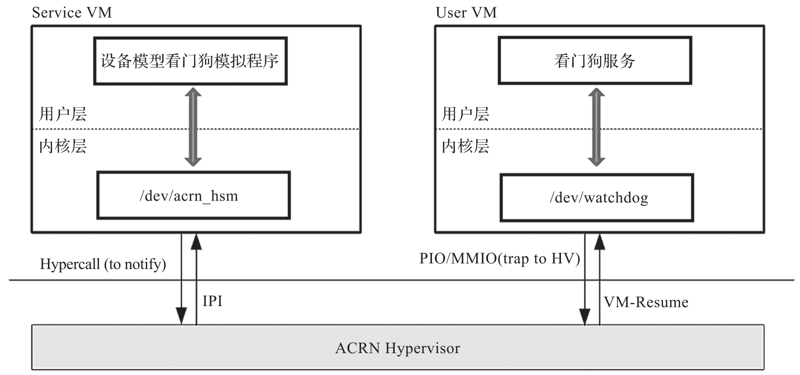
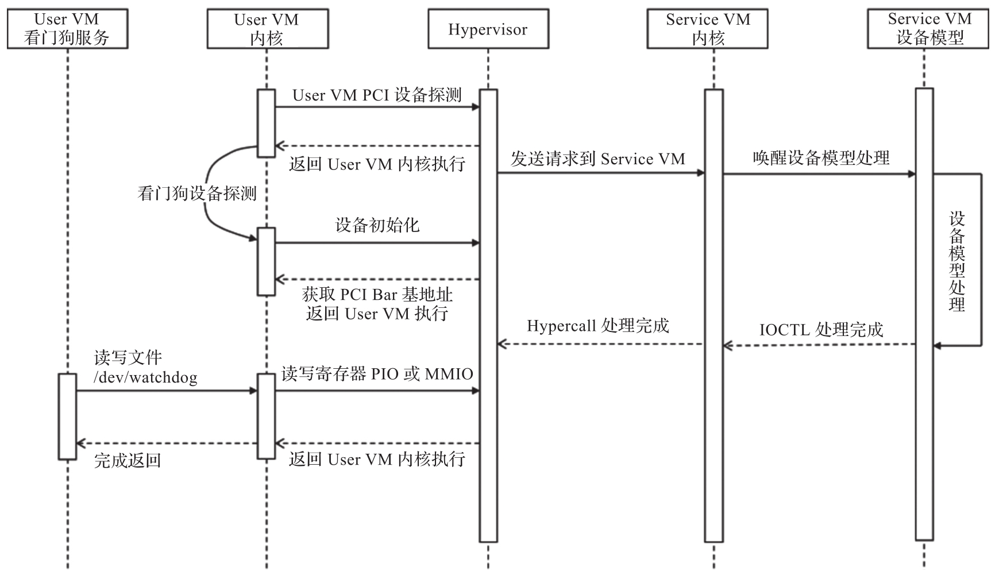

看门狗 (watchdog) 是一种硬件式的计时设备, 当系统的主程序发生某些错误事件, 如假死机或在给定的时间内未定时地清除看门狗计时器内含的计时值时, 看门狗计时器就会对系统发出重置, 重启或关闭的信号, 使系统从悬停状态恢复到正常运行状态.

ACRN 模拟了一个 I6300ESB 看门狗设备给客户机使用, 其原理如图 5-11 所示.

客户机看门狗驱动给看门狗设备发送读写命令, 这些命令会访问端口或 MMIO, 这些命令被 ACRN 截获后被转发给设备模型做相应的处理. 当设备模型完成模拟后, 会通过 IOCTL 发送消息给 Service VM 中的 HSM 驱动, 该驱动最终通过 Hypercall 通知 ACRN 虚拟机监控器. ACRN 虚拟机监控器进而根据模拟结果设置相应客户机的 vCPU 寄存器并将其恢复以完成模拟. ACRN 看门狗设备模拟流程如图 5-12 所示.

使用时通过给设备模型添加客户机启动参数 "-s pci_bdf,wdt-i6300esb"​, 来给客户机添加 I6300ESB 看门狗设备. 在客户机内核中配置 "CONFIG_I6300ESB_WDT=y" 添加看门狗驱动.

看门狗设备相关源码: https://github.com/projectacrn/acrn-hypervisor/blob/v3.0/devicemodel/hw/pci/wdt_i6300esb.c