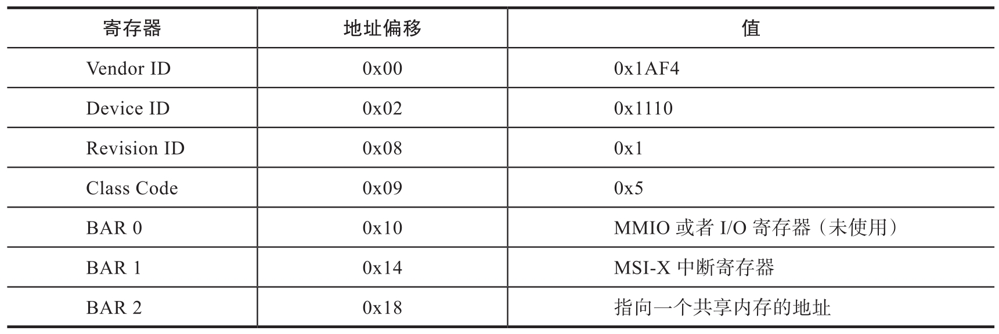
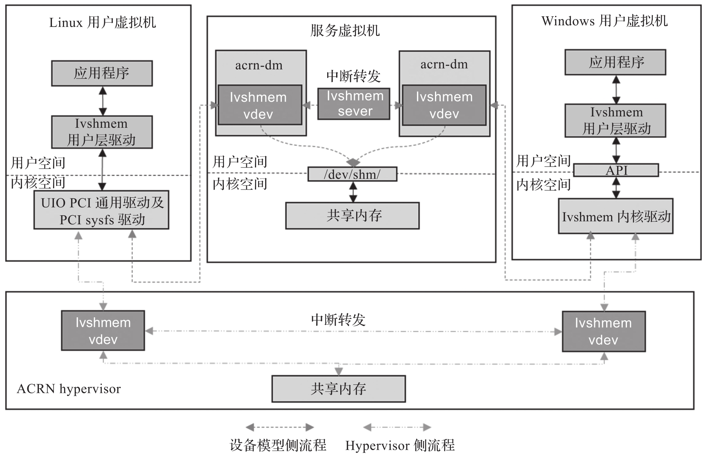

小身材, 大能耐的 ACRN 可以工作在各个不同的场合, 比如分区模式或者混合模式. 在这些模式中, 各虚拟机之间可能需要进行通信. 虚拟串口是一种简单的可以被人们接受的方法. ACRN 实现了虚拟机之间基于虚拟串口的通信, 但是基于虚拟串口的通信速度慢, 不适合进行大量的数据交换. 而 ACRN 的虚拟机之间可能存在高速, 低延时和大量的数据通信需求. 为了解决这一需求, ACRN 引入了基于 Ivshmem 的虚拟机之间的共享内存机制. Ivshmem 是虚拟机间共享内存通信 (Inter-VM Shared Memory Communication) 的缩写. 它是业界比较通用的一种 VM 间的通信方法, 例如在 Linux 的宿主机上, QEMU 项目中也采用类似的方法 [插图].Ivshmem 允许 VM 间通过共享内存机制相互通信. 例如, 在工业应用的场景中, 用户可以使用共享内存区域在 Windows VM 和运行实时任务的实时 VM 之间交换命令和响应.

QEMU 项目中 Ivshmem 的实现: https://www.qemu.org/docs/master/system/devices/ivshmem.html

ACRN 通过实现一个虚拟 PCI 设备 (称为 Ivshmem 设备) 并将此 PCI 设备的共享内存地址和大小暴露给各个虚拟机, 来支持虚拟机之间的通信. 在 ACRN 项目中分别实现了两种不同的 Ivshmem 方法: 在虚拟机监控器 (Hypervisor) 中实现; 在设备模型 (Device Model) 中实现.

# Ivshmem 设备介绍

Ivshmem 被设计成一个虚拟的标准 PCI 设备, 其配置空间定义和设备 ID 值如表 5-2 所示, 表中只列出了用到的寄存器部分.

有了这个 Ivshmem 虚拟 PCI 设备, 运行在 VM 里的驱动程序就可以找到该设备, 然后通过 BAR 2 的地址来访问和读写共享内存区域, 进而进行 VM 之间的数据通信.

# Ivshmem 设备模拟

下图所示为 Ivshmem 设备的原理图.

图中标识为 Ivshmem vdev 的设备就是用来进行 VM 之间内存共享通信的虚拟 PCI 设备. 在两个 VM 中, 应用程序通过可以访问这个标准的 PCI 设备驱动, 进而访问并操作该虚拟 PCI 设备所提供的共享内存区域. ACRN 项目中提供了以下两种不同的 Ivshmem 设备的实现方式 (用户选择其中一种即可)​.

* 在设备模型中的实现方法. 该方法通过运行在 Service VM 中的设备模型来模拟 Ivshmem 设备实现. 共享内存区域保留在 Service VM 的内存空间中. 此解决方案仅支持后启动的用户 VM 之间的通信, 并需要通过一个专门的 Ivshmem server 来进行两个虚拟 Ivshmem 设备的中断转发.

* 在 Hypervisor 中的实现方法. 该方法是在 ACRN Hypervisor 中模拟实现 Ivshmem 设备. 共享内存保留在 Hypervisor 的内存空间, 由 Hypervisor 预先分配好. 这种方式可以同时支持预启动虚拟机和后启动虚拟机.

设备模型模拟 Ivshmem 相关源码: https://github.com/projectacrn/acrn-hypervisor/blob/v3.0/devicemodel/hw/pci/ivshmem.c

Hypervisor 模拟 Ivshmem 相关源码: https://github.com/projectacrn/acrn-hypervisor/blob/v3.0/hypervisor/dm/vpci/ivshmem.c

