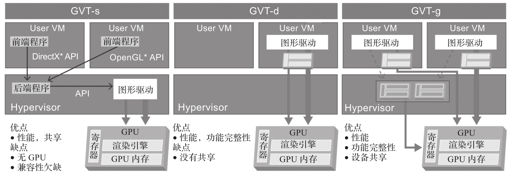

随着网络上视频流量的指数级增长, 多媒体视频在网络流量中的占比越来越高. 如果这些多媒体资源能得到有效管理与运用, 对企业来说是一个获得新收入和降低成本的机会. 如今, 在云计算上由于缺乏显卡虚拟化技术, 用户难以在云计算环境中使用 GPU 来处理这些多媒体负载并获得最佳性能.

为了应对这些挑战, 显卡虚拟化技术不断发展, 以允许多媒体负载运行在虚拟化的环境中. Intel 的显卡虚拟化技术(Intel Graphics Virtualization Technology,Intel GVT) 主要包括三种, 分别是 GVT-s,GVT-d 以及 GVT-g. 早期的 ACRN 版本采用 GVT-g 作为显示共享方案, ACRN 3.0 之后的版本已经启用 virtio-gpu 作为显卡共享方案, GVT-g 方案逐渐被 GPU 硬件虚拟化方案 SR-IOV 所替代.

* Intel GVT-s 是虚拟共享图形加速(virtual Shared Graphics Acceleration,vSGA), 允许多个虚拟机共享一个物理 GPU. 该技术也被称为虚拟共享图形适配器.

* Intel GVT-d 是虚拟专用显卡加速(virtual Dedicated Graphics Acceleration,vDGA), 一个 GPU 可以直通给一个虚拟机使用. 该技术有时也被称为虚拟直通图形适配器.

* Intel GVT-g 是虚拟图形处理单元 (virtual Graphics Processing Unit,vGPU), 允许多个虚拟机共享一个物理 GPU. 该技术采用受控直通(Mediated PassThrough,MPT) 技术实现 GPU 的共享.

对性能, 功能与共享的权衡存在于每一种图形虚拟化技术中. 如图 5-14 所示, 这三种技术也都各有特点.

GVT-d 由于直通给虚拟机使用, 能提供最好的性能, 特别适合对 GPU 敏感计算需求量大的负载. GVT-s 采用的是 API 转发技术, 理论上该技术可以支持任意多个虚拟机, 但由于没有虚拟化完整的 GPU, 因此不能给虚拟机展现完整的 GPU 功能, 而这些功能可能是某些负载需要的. GVT-g 能够虚拟化完整的 GPU 功能, 性能比 GVT-d 稍差, 可以在多个虚拟机 (最多 8 个) 之间共享硬件, 可算作一种折中考量.