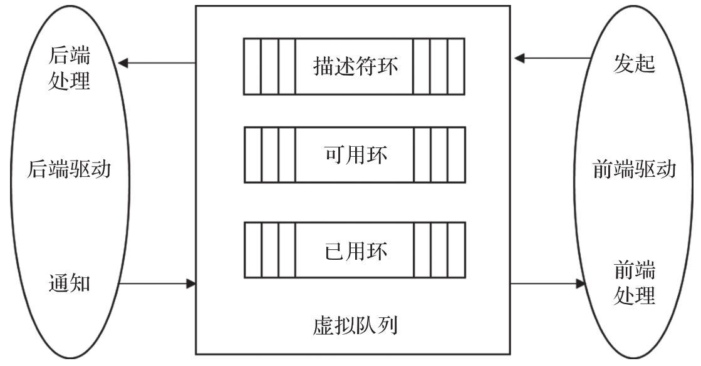
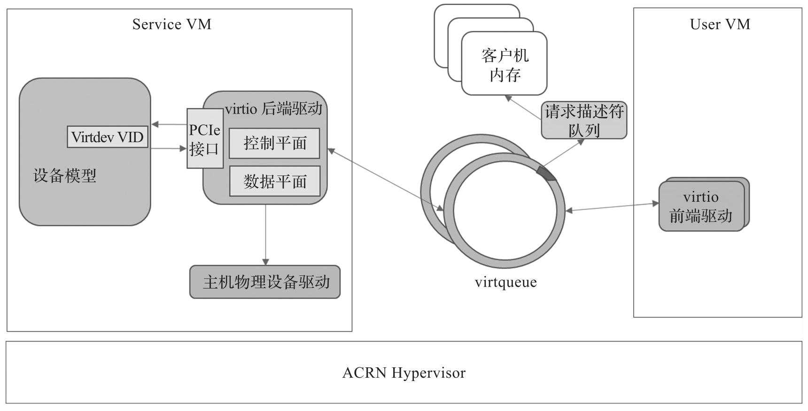
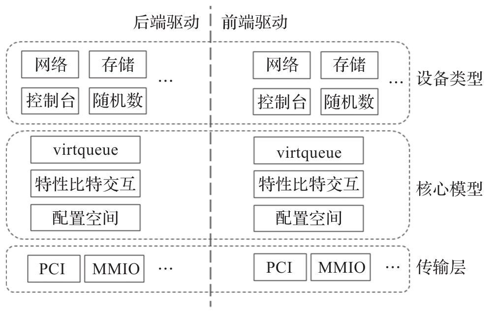
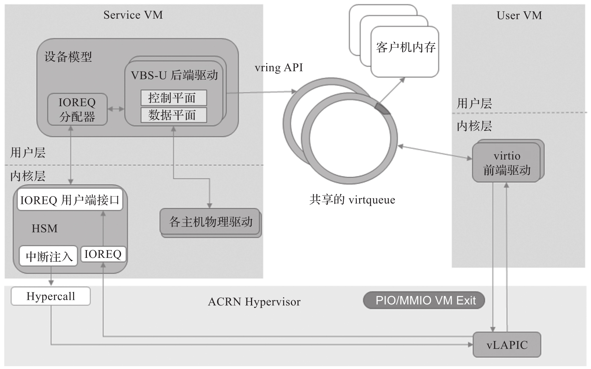
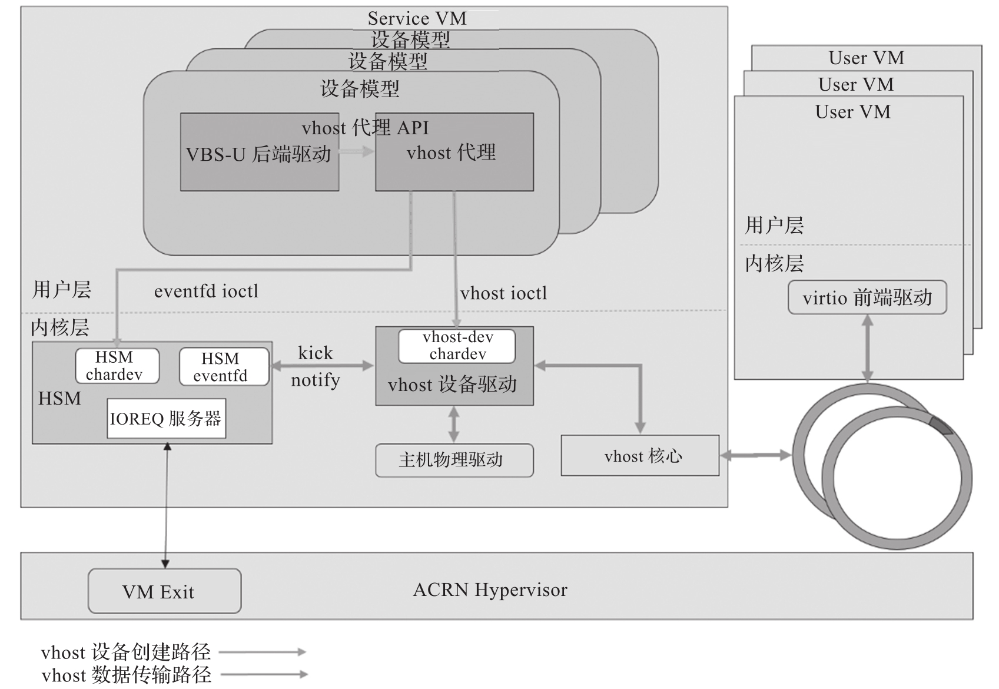

# 基本概念

为了更好地理解 virtio, 特别是 virtio 设备在 ACRN 中的实现, 首先介绍 ACRN 中用到的 virtio 基本概念.

1) 前端 virtio 驱动(frontend virtio driver):virtio 采用了前后端架构, 使前端和后端 virtio 驱动都有一个简单而灵活的框架. 前端驱动只需要提供配置接口的服务, 传递消息, 产生请求并启动后端 virtio 驱动. 因此前端驱动很容易实现, 并且消除了设备模拟的性能开销.

2) 后端 virtio 驱动(backend virtio driver): 与前端驱动类似, 后端驱动在主机操作系统的用户态或内核态运行, 处理前端驱动的请求, 并将其发送给本地主机的物理设备驱动. 一旦本地主机的设备驱动完成了请求, 后端驱动就会通知前端驱动该请求已经完成.

3) 虚拟队列 (virtqueue):virtio 设备的前后端驱动共享一个标准的环形缓冲区和描述符机制, 称为虚拟队列. 如下图所示, 虚拟队列是一个分散 / 聚集缓冲区(scatter-gather buffer) 的队列, 其主要由以下三部分构成.

* 描述符环(descriptor ring): 也称为描述符区, 是一个由若干客户机处理的缓冲区组成的数组.

* 可用环(avail ring): 也称为驱动区, 由驱动提供给设备的数据.

* 已用环 (used ring): 也称为设备区, 由设备提供给驱动的数据. 在虚拟队列上有发起(kick) 和通知 (notify) 两个重要操作.

* 前端驱动的发起操作与后端处理: 前端驱动用发起操作通知后端驱动在虚拟队列中已有可用请求, 后端驱动收到前端驱动的发起操作通知后会进行相应处理.

* 后端驱动的通知操作与前端处理: 后端驱动用通知操作回复前端驱动, 虚拟队列中请求已被处理. 通常以中断注入的方式来实现. 前端驱动收到后端驱动的通知操作后也会进行必要的处理, 以完成整个流程的闭环.

4) 特征比特位(feature bit): 每个虚拟设备和它的物理驱动程序都存在一个简单的可扩展的特征协商机制. 每个虚拟设备可以要求其设备的特定功能, 而相应的驱动程序可以用驱动程序理解的功能子集来响应设备. 该功能机制使虚拟设备和驱动程序能够向前和向后兼容.

5) virtio 设备模式: virtio 规范定义了 virtio 设备支持的三种模式: 旧式设备, 过渡设备和现代设备. 旧式设备兼容 virtio 规范 0.95 版本, 过渡设备兼容 0.95 和 1.0 规范版本, 现代设备只兼容 1.0 及之后的版本规范.

6) virtio 设备发现: virtio 设备通常被实现为 PCI 设备. 在 PCI 总线上使用 virtio 的设备必须向客户操作系统暴露一个符合 PCI 规范的接口. 按照 PCI 规范, 一个 PCI 设备由厂商 ID 号和设备 ID 号共同组成. virtio 的厂商 ID 号为 0x1AF4, 设备 ID 号的范围为 0x1000～0x107F, 这样的 PCI 设备则是一个有效的 virtio 设备. 在设备 ID 中, 旧式 / 过渡模式的 virtio 设备占据前 64 个 ID, 范围为 0x1000～0x103F, 而 0x1040～0x107F 的 ID 则属于 virtio 现代设备.

# 实现架构

ACRN 中的 virtio 实现架构如图所示.

它采用前后端实现的架构, virtio 前端驱动和 virtio 后端驱动通过 virtqueue 的共享内存相互通信. 后端驱动对设备进行模拟, 使前端驱动访问设备看起来像在访问物理的 PCI 设备一样. 后端驱动处理来自前端驱动的请求, 并在请求被处理后通知前端驱动.

除 virtio 的前后端架构外, 前端驱动和后端驱动的实现都遵循分层架构, 如图所示.

前后端驱动实现都分为三个层次: 传输层, 核心模型以及设备类型. 所有 virtio 设备共享相同的 virtio 基础设施, 包括 virtqueue 基础设施, 特性比特交互机制, 配置空间机制和总线基础设施.

ACRN 中的 virtio 的框架共有两种实现, 根据后端驱动实现的方法不同, 分别对应于用户态实现和内核态实现. 基于用户态框架的驱动开发与维护较为方便, 适用大部分情况, ACRN 中几乎所有的虚拟设备都支持用户态驱动. 基于内核态框架的驱动开发比用户态框架的驱动开发复杂, 但由于驱动在内核层, 可以减少上下文切换带来的损耗, 因此适合某些对性能要求较高的场景, 比如基于内核态框架的 virtio-net 驱动.

(1) ACRN 用户态 virtio 框架

ACRN 用户态 virtio 框架 (Virtio Backend Service in User-land,VBS-U) 的架构如图所示.

前端驱动就像在访问一个物理 PCI 设备一样. 这意味着对于 "控制面"​, 前端驱动可以通过 PIO 或 MMIO 探测设备的寄存器, 而当有事件发生时, 设备会发送虚拟中断给前端驱动. 对于 "数据面"​, 前端驱动和后端驱动之间的通信通过共享内存以 virtqueue 的形式进行.

在后端驱动所在的服务虚拟机一侧, ACRN 中有几个关键组件, 包括设备模型, 虚拟机监控器服务模块(HSM),VBS-U 框架和 vring 的用户态 API 接口.

设备模型是前端驱动和后端驱动的桥梁, 因为每个 VBS-U 模块都模拟了一个 PCI 虚拟设备. HSM 通过提供远程内存映射 API 和通知 API 来连接设备模型和管理程序. VBS-U 通过调用 vring 的用户态 API 接口来访问 virtqueue.

(2)ACRN 内核态 virtio 框架

ACRN 也支持基于 vhost 的内核态 virtio 框架实现. 当 virtio 在客户操作系统中作为前端驱动使用时, 它通常被称为 virtio; 而当其在主机操作系统中作为后端驱动使用时, 则通常被称为 vhost. 因此, vhost 是一种特殊的 virtio, 其数据平面被放入内核空间, 以减少处理 I/O 请求时的上下文切换来获取更优性能. 因此, 对性能要求高的设备可使用内核态 vhost 驱动.

ACRN 中的 vhost 架构如图所示.

虚拟设备的 VBS-U 后端驱动可通过设备模型中的 vhost 代理来配置使用对应的内核态 vhost 驱动. 之后, HSM 模块就会将前端驱动的发起 (kick) 操作请求直接转至 vhost 内核态驱动 (不再向上转至 VBS-U 用户态驱动) 处理. vhost 内核态驱动完成处理后, 会通过 HSM 模块将通知 (notify) 操作转至前端驱动, 前端驱动再进行必要的处理以完成整个闭环流程.