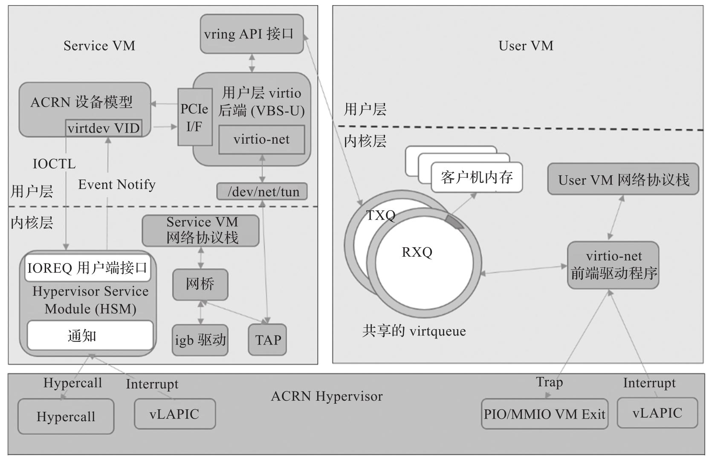

virtio-net 是 ACRN 中用于联网的半虚拟化解决方案. ACRN 设备模型可模拟虚拟网卡供前端 virtio 网卡驱动使用, 该模拟遵循 virtio 规范.

以下是 ACRN 中有关 virtio-net 的特性.

* 支持传统网卡设备, 不支持现代设备.

* 在 virtio-net 中使用两个虚拟队列: RX 队列和 TX 队列.

* 支持 indirect 描述符.

* 支持 TAP 设备桥接.

> TAP 设备可以在不需要物理网卡设备参与的情况下进行虚拟的网络层点对点通信. 参考 Linux 内核文档说明: https://www.kernel.org/doc/Documentation/networking/tuntap.txt

* 不支持控制队列.

* 不支持多网卡队列.

# 网卡虚拟化架构

ACRN 的 virtio-net 原理如图所示.

# Service VM/User VM 网络协议栈

Service VM 与 User VM 的网络协议栈与 Linux 标准网络协议栈相同, 请参考 Linux 中标准 TCP/IP 网络协议栈.

# virtio-net 前端驱动

这是 Linux 内核中用于虚拟以太网设备的标准驱动程序. 该驱动程序将匹配 PCI 供应商 ID 为 0x1AF4 和 PCI 设备 ID 为 0x1000(对于旧式设备)或 0x1041(对于现代设备)的设备. 虚拟 NIC 支持两种虚拟队列, 一种用于传输数据包, 另一种用于接收数据包. 前端驱动程序将空缓冲区放入一个用于接收数据包的虚拟队列中, 并将传出的数据包放入另一个用于传输的虚拟队列中. 每个虚拟队列的大小为 1024B, 可在 virtio-net 后端驱动程序中配置.

# ACRN Hypervisor

ACRN 虚拟机管理程序是一种一型虚拟机管理程序, 可直接在裸机硬件上运行, 适用于各种 IoT 和嵌入式设备解决方案. 它获取并分析客户机指令, 将解码后的信息作为 IOREQ 放入共享页面, 并通知 Service VM 中的 HSM 模块进行处理.

# HSM 内核模块

虚拟机监控器服务模块 (HSM) 是 Service VM 中的内核模块, 充当设备模型和虚拟机管理程序的中间层. HSM 将 IOREQ 转发到 virtio-net 后端驱动程序进行处理.

# ACRN 设备模型与 virtio-net 后端驱动程序

ACRN 设备模型从共享页面获取 IOREQ, 并调用 virtio-net 后端驱动程序来处理请求. 后端驱动程序在共享虚拟队列中接收数据, 并将其发送到 TAP 设备.

# 网桥与 TAP 设备

网桥和 TAP 是内核中标准的虚拟网络基础设施. 它们在 Service VM,User VM 和外界之间的通信中起着重要作用.

# Intel 网卡驱动程序

Intel 网卡驱动程序是物理网卡在 Linux 内核中的驱动程序, 负责向物理网卡发送数据和从物理网卡接收数据.

在 ACRN 设备模型中, Intel 物理网卡对应的虚拟网卡被实现为 virtio 旧式设备. 它注册为 User VM 的 PCI virtio 设备, 并使用 Linux 内核中的标准 virtio-net 作为其驱动程序(User VM 内核应使用 CONFIG_VIRTIO_NET=y 添加驱动程序)​.

设备模型中的 virtio-net 后端将从前端接收的数据转发到 TAP 设备, 然后将数据从 TAP 设备转发到网桥, 最后将数据从网桥转发到物理网卡驱动程序; 数据包的接收过程类似, 即将数据从物理网卡通过 TAP 设备转发到客户机中.

virtio-net 相关源码: https://github.com/projectacrn/acrn-hypervisor/blob/v3.0/devicemodel/hw/pci/virtio/virtio_net.c
