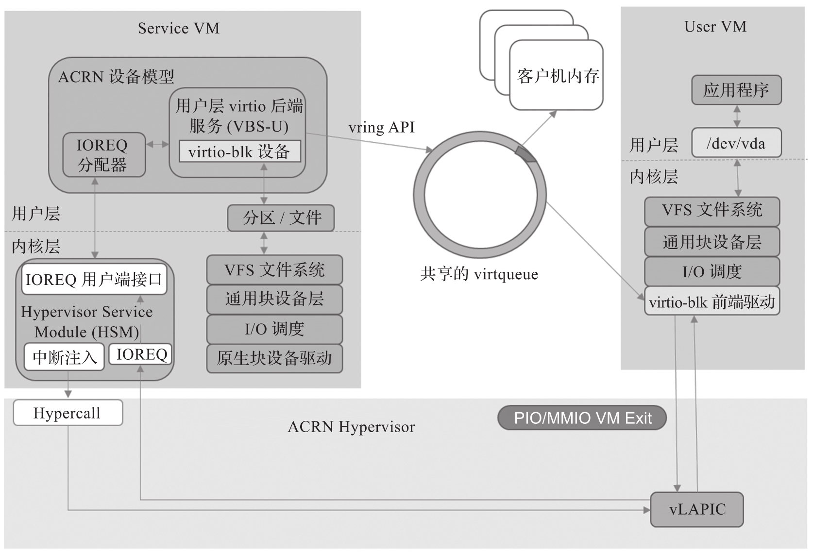

ACRN 支持 virtio-blk 块设备. ACRN 设备模型可模拟块存储设备供前端 virtio 存储驱动使用, 该模拟遵循 virtio 规范.

virtio-blk 支持如下特性.

* VIRTIO_BLK_F_SEG_MAX: 一个请求中的最大分片数.

* VIRTIO_BLK_F_BLK_SIZE:Block Size 配置.

* VIRTIO_BLK_F_TOPOLOGY: 设备最佳 I/O 对齐的信息导出.

* VIRTIO_RING_F_INDIRECT_DESC: 支持 indirect 描述符.

* VIRTIO_BLK_F_FLUSH: 支持 Cache Flush 命令.

* VIRTIO_BLK_F_CONFIG_WC: 设备可以在写回 (writeback) 模式和透写 (write-through) 模式之间切换缓存.

ACRN 的 virtio-blk 原理如图所示.

virtio-blk 相关源码: https://github.com/projectacrn/acrn-hypervisor/blob/v3.0/devicemodel/hw/pci/virtio/virtio_block.c
