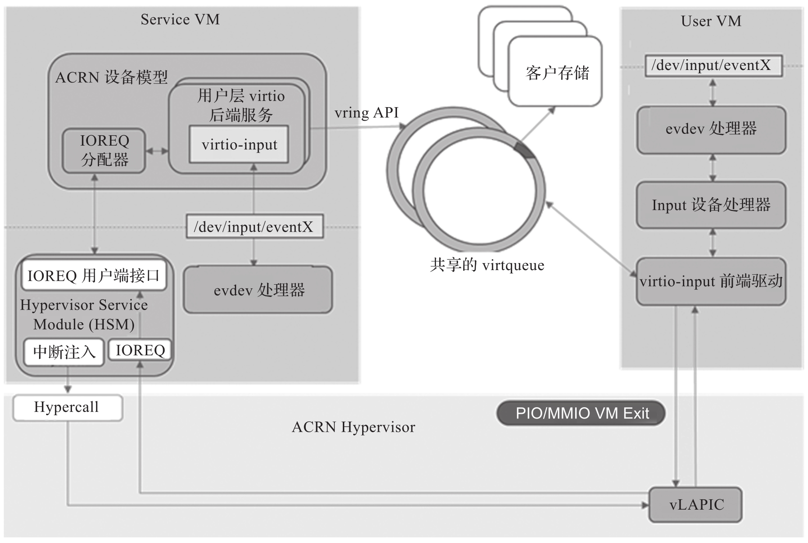

virtio-input 输入设备可用于创建虚拟人机界面设备, 如键盘, 鼠标和平板计算机. 前端驱动通过 virtio 发送输入层事件给后端.

ACRN virtio-input 模拟原理如图所示.



在 ACRN 设备模型中, virtio-input 被实现为 virtio 现代设备. 它注册为客户机操作系统的 PCI 虚拟设备. 前端 Linux virtio-input 不需要进行任何更改, 内核必须使用 CONFIG_VIRTIO_INPUT=y 构建.

两个 virtqueue 用于在前端驱动和后端驱动之间传输输入事件. 一个用于将后端驱动从硬件接收到的输入事件传给前端程序, 另一个用于将状态信息从前端驱动传给后端驱动, 最终将它发送到后端物理硬件设备.

在前端 virtio-input 输入驱动程序的探测阶段, 一个缓冲区 (用于容纳 64 个输入事件) 与驱动程序数据一起分配. 64 个描述符被添加到事件 virtqueue 中. 一个描述符指向缓冲区中的一个条目.

设备模型中的 virtio-input 后端驱动使用 mevent 通过 evdev 字符设备轮询来自输入设备的输入事件的可用性. 当有输入事件时, 后端驱动程序从字符设备中读取该事件并将其缓存到内部缓冲区中, 直到接收到带有 SYN_REPORT 的 EV_SYN input 事件. 后端驱动程序再将所有缓存的输入事件逐个复制到事件 virtqueue, 然后注入中断到 User VM.

对于与状态更改有关的输入事件, 前端驱动程序为输入事件分配一个缓冲区, 并将其添加到状态 virtqueue 中, 然后进行 kick 操作. 后端驱动程序从状态 virtqueue 读取输入事件, 并将其写入 evdev 字符设备.

前端和后端之间传输的数据被定义为如下输入事件:

```cpp
// devicemodel/hw/pci/virtio/virtio_input.c
struct virtio_input_event {
	uint16_t type;
	uint16_t code;
	uint32_t value;
};
```

virtio_input_config 用于定义配置信息, 前端驱动可以设置 select 和 subsel 来查询配置信息.

```cpp
// devicemodel/hw/pci/virtio/virtio_input.c
struct virtio_input_config {
	uint8_t    select;
	uint8_t    subsel;
	uint8_t    size;
	uint8_t    reserved[5];
	union {
		char string[128];
		uint8_t bitmap[128];
		struct virtio_input_absinfo abs;
		struct virtio_input_devids ids;
	} u;
};
```

前端驱动对上述配置的读写会造成 VM Exit, 后端程序根据 select 和 subsel 查询真实的硬件信息并将其发送给前端. 所有这些配置都是在探测阶段由前端驱动 probe 阶段获得的. 基于这些信息, 前端驱动将该 input 设备注册到内核 input 子系统.

virtio-input 相关源码: https://github.com/projectacrn/acrn-hypervisor/blob/v3.0/devicemodel/hw/pci/virtio/virtio_input.c

