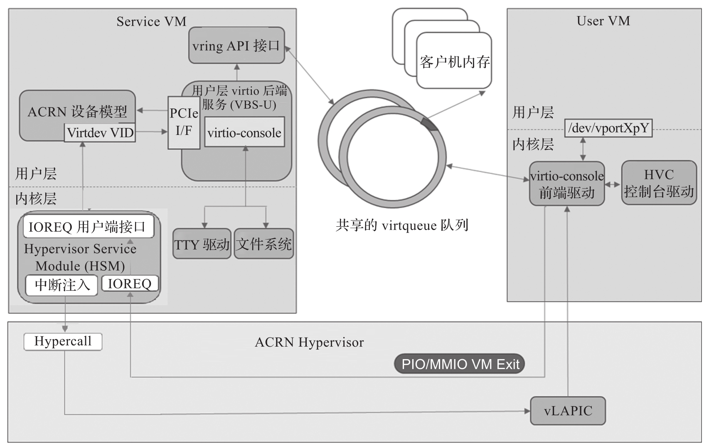

virtio-console 是用于数据输入和输出的简单设备. 控制台的 virtio 设备 ID 为 3, 可以有 1～16 个端口. 每个端口都有一对输入和输出虚拟队列, 用于在前端驱动和后端驱动驱动程序之间传递信息. 默认情况下, 每个虚拟队列的大小为 64 条消息 (可在源代码中配置)​. 前端驱动程序将空的缓冲区用于输入数据到接收虚拟机上, 并将传出的字符排队到发送虚拟机上.

virtio-console 设备拥有一对控制 I/O 虚拟队列. 控制状态用于在设备和驱动程序之间传递信息, 包括: 在连接的任一侧打开和关闭的端口, 来自主机的有关特定端口是否为控制台端口的指示, 添加新端口, 插入或拔出, 来自客户机的有关端口或设备是否已成功添加.

ACRN virtio-console 模拟原理如图 5-23 所示.

virtio-console 在 ACRN 设备模型中被实现为 virtio 旧式设备, 并已作为 User VM 的 PCI virtio 设备注册. 前端 Linux virtio-console 不需要进行任何更改. 使用 CONFIG_VIRTIO_CONSOLE=y 来添加驱动.

如果端口配置为控制台, 则 virtio-console 前端驱动程序会将 HVC 控制台注册到内核; 否则, 它将向内核注册一个名为 / dev/vportXpY 的字符设备, 并且可以从用户空间进行读写. 一个端口有两个虚拟队列, 一个用于发送数据, 另一个用于接收数据. 前端驱动程序将空缓冲区放置在接收数据的虚拟队列中, 并将传出字符放入发送数据的虚拟队列中.

virtio-console 前端驱动程序将数据复制到虚拟队列并通知后端程序, 后端驱动程序再将数据写入后端设备, 该后端设备可以是 PTY,TTY,STDIO 和常规文件. 后端驱动程序使用 mevent 事件从后端文件描述符中轮询可用数据. 当有新数据可用时, 后端驱动程序将其读取到虚拟队列, 然后通过给客户机注入中断来通知前端驱动.

virtio-console 支持如下比特特性.

* VTCON_F_SIZE(bit 0): 行 / 列配置有效.

* VTCON_F_MULTIPORT(bit 1): 设备支持多个端口, 支持控制虚拟队列.

* VTCON_F_EMERG_WRITE(bit 2): 设备支持紧急写入.

virtio-console 相关源码: https://github.com/projectacrn/acrn-hypervisor/blob/v3.0/devicemodel/hw/pci/virtio/virtio_console.c

