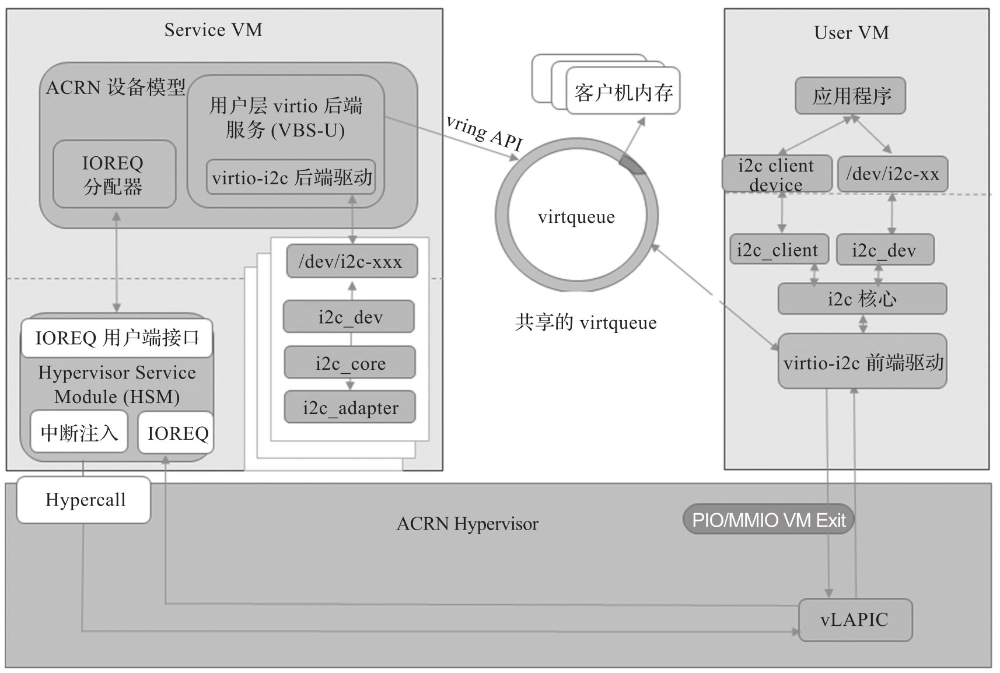
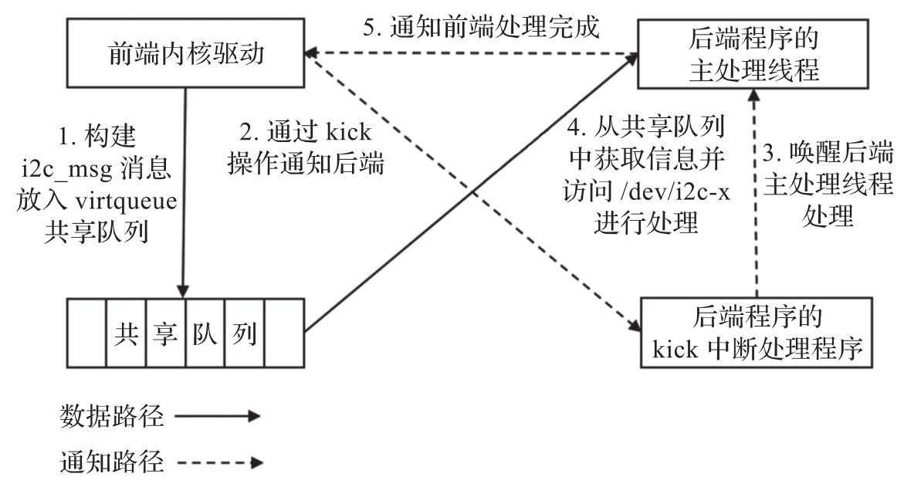
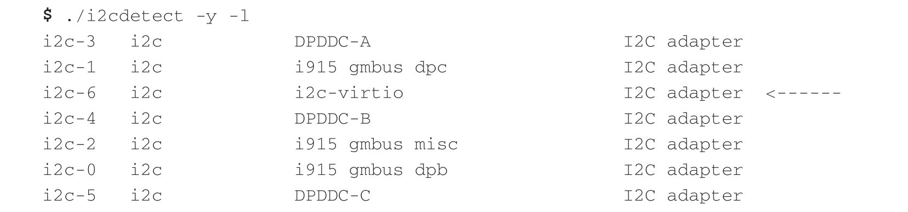
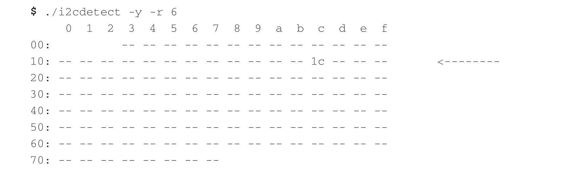
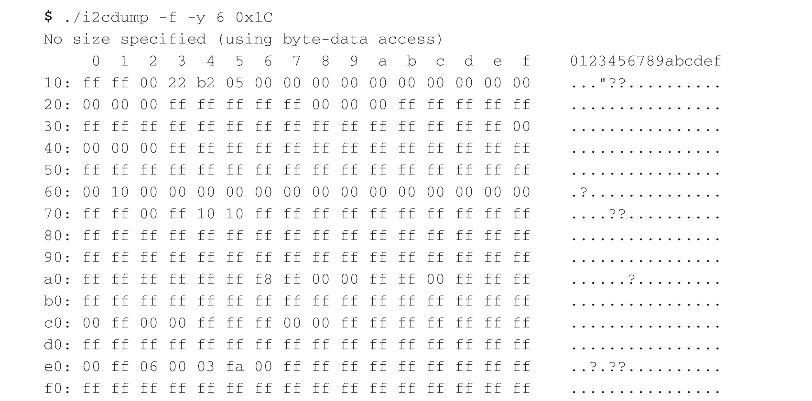

virtio-i2c 提供了一个虚拟 I2C 适配器, 该适配器支持将主机 I2C 适配器下的多个从设备映射到一个 virtio I2C 适配器. virtio-i2c 还提供了为客户端设备添加 ACPI 节点的接口, 因此无须更改 User VM 中的客户端设备驱动程序.

virtio-i2c 模拟原理如图 5-24 所示.

virtio-i2c 在 ACRN 设备模型中被实现为 virtio 旧式设备, 并已作为 User VM 的 PCI virtio 设备注册. virtio-i2c 的设备 ID 为 0x860A, 子设备 ID 为 0xFFF6.

virtio-i2c 使用一个虚拟队列来传输从 I2C 核心层接收到的 I2C 消息.

每个 I2C 消息都被翻译成以下三个部分.

* 标头: 包括地址, 标志比特位和消息长度.

* 数据缓冲区: 包括指向数据的指针.

* 状态: 包括后端的处理结果.

后端处理程序从虚拟队列中获取数据, 该虚拟队列将数据重新格式化为标准 I2C 消息, 然后将其发送到后端驱动维护的消息队列. 在启动阶段会创建一个工作线程, 该线程从队列中接收 I2C 消息, 然后调用 I2C API 将其发送到主机 I2C 适配器.

请求完成后, 后端驱动程序将更新结果并通知前端驱动程序. virtio-i2c 消息处理流程如图 5-25 所示.

虚拟 I2C 适配器将出现在 User VM 中, 可通过如下命令查看.

可以在 virtio I2C 适配器 i2c-6 下找到客户端设备 0x1C.

(如果设备支持) 可以导出 I2C 设备信息.

virtio-i2c 是一个 ACRN 项目原创的新设备, 社区已有基于 Rust 语言编写的后端模拟程序.

Linaro 基于 Rust 的虚拟机上 I2C 后端驱动: https://www.linaro.org/blog/linaro-s-rust-based-hypervisor-agnostic-vhost-user-i2c-backend

irtio-i2c 相关源码: https://github.com/projectacrn/acrn-hypervisor/blob/v3.0/devicemodel/hw/pci/virtio/virtio_i2c.c

